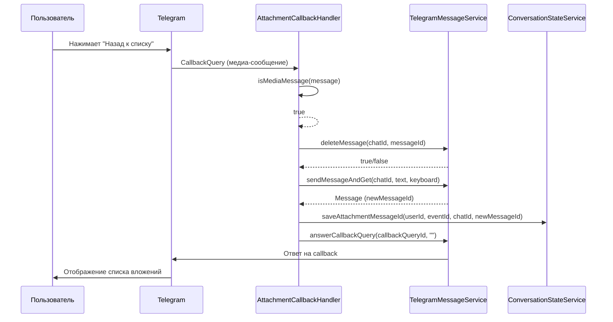
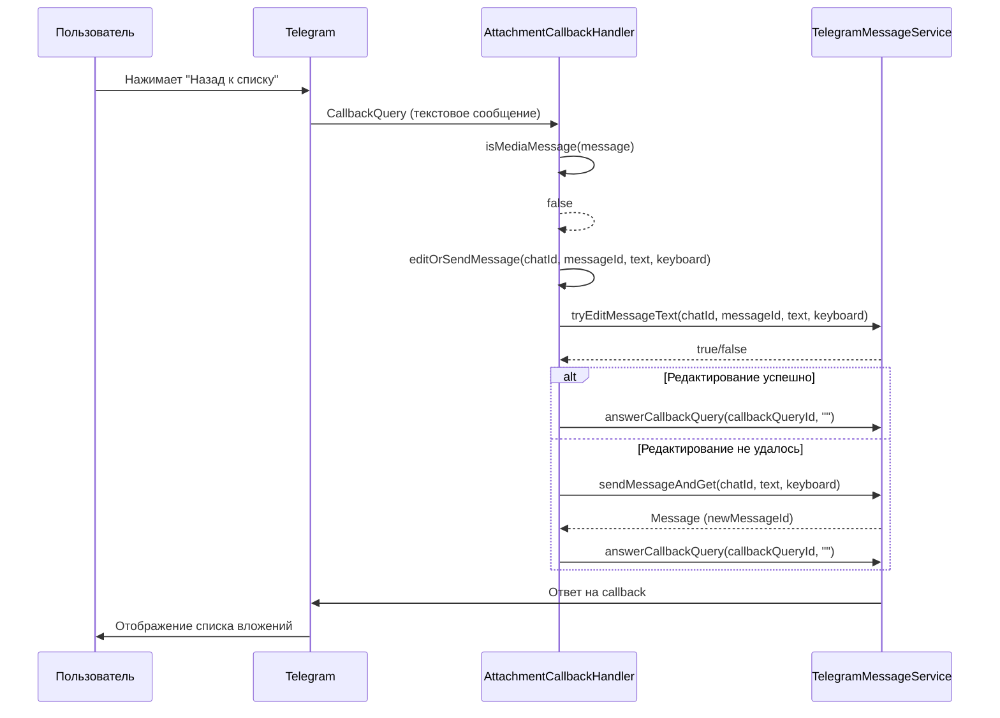
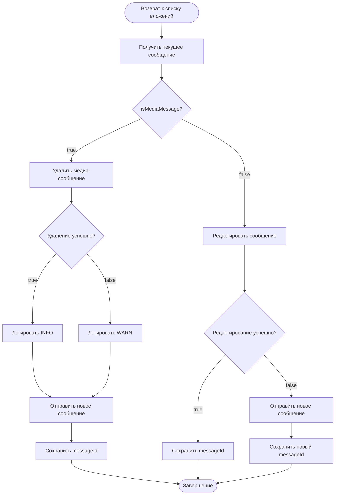

# Документ проектирования

## Обзор

Данный документ описывает проектное решение для исправления ошибки при возврате из просмотра вложения к списку вложений. Проблема возникает из-за попытки редактирования медиа-сообщения (фото/документ) методом `EditMessageText`, что не поддерживается Telegram API.

### Текущая проблема

При просмотре вложения отправляется медиа-сообщение через метод `sendFileWithKeyboardAndGet`. Когда пользователь нажимает кнопку "Назад к списку вложений", метод `handleBackToAttachments` вызывает `editOrSendMessage`, который пытается отредактировать медиа-сообщение через `tryEditMessageText`. Telegram API возвращает ошибку:

```
Error executing EditMessageText query: [400] Bad Request: there is no text in the message to edit
```

### Решение

Перед попыткой редактирования сообщения необходимо определить его тип. Если сообщение содержит медиа-контент, следует удалить его и отправить новое текстовое сообщение. Если сообщение текстовое, можно использовать существующий механизм редактирования.

## Архитектура

### Компоненты системы

1. **AttachmentCallbackHandler** - обработчик callback-запросов для работы с вложениями
2. **TelegramMessageService** - сервис для отправки и редактирования сообщений
3. **ConversationStateService** - сервис для управления состоянием диалога
4. **Message** (Telegram API) - объект сообщения, содержащий информацию о типе контента

### Взаимодействие компонентов

```
Пользователь нажимает "Назад к списку"
         ↓
AttachmentCallbackHandler.handleBackToAttachments()
         ↓
Проверка типа сообщения (hasPhoto() || hasDocument() || hasVideo() || hasAudio())
         ↓
    ┌────┴────┐
    │         │
Медиа      Текст
    │         │
    ↓         ↓
Удалить   Редактировать
    +         │
Отправить     │
новое         │
    └────┬────┘
         ↓
Обновить ConversationState
```

## Компоненты и интерфейсы

### Изменения в AttachmentCallbackHandler

#### Новый метод: isMediaMessage

```java
/**
 * Проверяет, является ли сообщение медиа-сообщением.
 * 
 * <p>Медиа-сообщением считается сообщение, содержащее:</p>
 * <ul>
 *   <li>Фото (hasPhoto())</li>
 *   <li>Документ (hasDocument())</li>
 *   <li>Видео (hasVideo())</li>
 *   <li>Аудио (hasAudio())</li>
 * </ul>
 * 
 * @param message объект сообщения из Telegram API
 * @return true если сообщение содержит медиа-контент, false в противном случае
 */
private boolean isMediaMessage(org.telegram.telegrambots.meta.api.objects.Message message) {
    if (message == null) {
        return false;
    }
    
    return message.hasPhoto() || 
           message.hasDocument() || 
           message.hasVideo() || 
           message.hasAudio();
}
```

#### Модификация метода: handleBackToAttachments

Текущая реализация:
```java
private void handleBackToAttachments(Long eventId, User user, Long chatId, 
                                    Integer messageId, String callbackQueryId) throws Exception {
    // ... формирование сообщения и клавиатуры ...
    
    // Используем editOrSendMessage для редактирования или отправки нового сообщения
    Integer resultMessageId = editOrSendMessage(chatId, messageId, message.toString(), 
            keyboard, user.getId(), eventId);
    
    // ...
}
```

Новая реализация:
```java
private void handleBackToAttachments(Long eventId, User user, Long chatId, 
                                    Integer messageId, String callbackQueryId) throws Exception {
    log.debug("Возврат к списку вложений для события ID={}, пользователь ID={}", 
            eventId, user.getId());
    
    try {
        // Получаем событие для проверки прав доступа
        Event event = eventService.getEventById(eventId);
        
        // Получаем список вложений
        List<Attachment> attachments = attachmentService.getEventAttachments(eventId);
        
        // Формируем сообщение (существующая логика)
        StringBuilder message = new StringBuilder();
        // ... формирование сообщения ...
        
        // Проверяем, является ли пользователь создателем события
        boolean isCreator = event.belongsToUser(user.getId());
        
        // Создаем клавиатуру
        var keyboard = keyboardService.createAttachmentsListKeyboard(eventId, attachments, isCreator);
        
        // Получаем текущее сообщение из callback query
        org.telegram.telegrambots.meta.api.objects.Message currentMessage = 
                callbackQuery.getMessage();
        
        Integer resultMessageId;
        
        // Проверяем тип сообщения
        if (isMediaMessage(currentMessage)) {
            log.debug("Текущее сообщение является медиа-сообщением, удаляем и отправляем новое: " +
                    "chatId={}, messageId={}, eventId={}", chatId, messageId, eventId);
            
            // Удаляем медиа-сообщение
            boolean deleted = messageService.deleteMessage(chatId, messageId);
            
            if (deleted) {
                log.info("Медиа-сообщение успешно удалено: chatId={}, messageId={}", 
                        chatId, messageId);
            } else {
                log.warn("Не удалось удалить медиа-сообщение (возможно, уже удалено): " +
                        "chatId={}, messageId={}", chatId, messageId);
            }
            
            // Отправляем новое текстовое сообщение
            org.telegram.telegrambots.meta.api.objects.Message sentMessage = 
                    messageService.sendMessageAndGet(chatId, message.toString(), keyboard);
            
            resultMessageId = sentMessage.getMessageId();
            
            log.info("Новое текстовое сообщение отправлено после удаления медиа: " +
                    "chatId={}, newMessageId={}, eventId={}", chatId, resultMessageId, eventId);
            
            // Сохраняем новый messageId в ConversationState
            conversationStateService.saveAttachmentMessageId(user.getId(), eventId, 
                    chatId, resultMessageId);
            
        } else {
            log.debug("Текущее сообщение является текстовым, используем редактирование: " +
                    "chatId={}, messageId={}, eventId={}", chatId, messageId, eventId);
            
            // Используем существующий механизм редактирования
            resultMessageId = editOrSendMessage(chatId, messageId, message.toString(), 
                    keyboard, user.getId(), eventId);
        }
        
        log.debug("Список вложений отображен при возврате: eventId={}, userId={}, messageId={}", 
                eventId, user.getId(), resultMessageId);
        
        messageService.answerCallbackQuery(callbackQueryId, "");
        
    } catch (Exception e) {
        log.error("Ошибка при возврате к списку вложений: eventId={}, userId={}, error={}", 
                eventId, user.getId(), e.getMessage(), e);
        messageService.answerCallbackQuery(callbackQueryId, "❌ Произошла ошибка");
        throw e;
    }
}
```

### Изменения в сигнатуре метода

Метод `handleBackToAttachments` должен принимать дополнительный параметр `CallbackQuery` для доступа к объекту сообщения:

```java
private void handleBackToAttachments(Long eventId, User user, Long chatId, 
                                    Integer messageId, String callbackQueryId,
                                    CallbackQuery callbackQuery) throws Exception
```

Соответственно, вызов метода в `handle()` должен быть обновлен:

```java
case "list" -> {
    // Формат: list_{eventId}
    if (parts.length < 2) {
        log.warn("Недостаточно частей для действия 'list': callbackData='{}', parts={}, userId={}", 
                callbackData, java.util.Arrays.toString(parts), user.getId());
        messageService.answerCallbackQuery(callbackQueryId, "❌ Ошибка: не указан ID события");
        return;
    }
    Long eventId = Long.parseLong(parts[1]);
    log.debug("Обработка действия 'list': eventId={}", eventId);
    handleBackToAttachments(eventId, user, chatId, messageId, callbackQueryId, callbackQuery);
}
```

## Модели данных

### Message (Telegram API)

Используется существующий класс `org.telegram.telegrambots.meta.api.objects.Message` из Telegram Bot API.

Релевантные методы:
- `hasPhoto()` - проверяет наличие фото
- `hasDocument()` - проверяет наличие документа
- `hasVideo()` - проверяет наличие видео
- `hasAudio()` - проверяет наличие аудио

### CallbackQuery (Telegram API)

Используется существующий класс `org.telegram.telegrambots.meta.api.objects.CallbackQuery`.

Релевантный метод:
- `getMessage()` - возвращает объект Message, связанный с callback query

## Свойства корректности


*Свойство (property) — это характеристика или поведение, которое должно выполняться для всех допустимых выполнений системы. По сути, это формальное утверждение о том, что должна делать система. Свойства служат мостом между человекочитаемыми спецификациями и машинно-проверяемыми гарантиями корректности.*

### Property Reflection

После анализа критериев приемки выявлены следующие потенциально избыточные свойства:

1. **Критерии 1.2, 1.3, 1.4** являются частными случаями критерия 1.1 и будут покрыты одним общим property-тестом для определения типа сообщения
2. **Критерий 2.4** является общим требованием, которое проверяется в рамках других тестов
3. **Критерий 3.3** проверяется в рамках других тестов редактирования
4. **Критерий 4.4** является общим требованием о стабильности

Таким образом, будут созданы следующие уникальные свойства:

### Свойство 1: Определение типа сообщения

*Для любого* объекта Message из Telegram API, метод `isMediaMessage` должен возвращать `true` тогда и только тогда, когда сообщение содержит хотя бы один тип медиа-контента (фото, документ, видео или аудио), и `false` для текстовых сообщений.

**Проверяет: Требования 1.1, 1.2, 1.3, 1.4**

### Свойство 2: Удаление медиа-сообщения при возврате

*Для любого* медиа-сообщения, при вызове `handleBackToAttachments` система должна вызвать метод `deleteMessage` с корректными параметрами (chatId, messageId) перед отправкой нового сообщения.

**Проверяет: Требования 2.1**

### Свойство 3: Отправка нового сообщения после удаления медиа

*Для любого* медиа-сообщения, после успешного удаления система должна вызвать метод `sendMessageAndGet` для отправки нового текстового сообщения со списком вложений.

**Проверяет: Требования 2.2**

### Свойство 4: Содержимое списка вложений

*Для любого* списка вложений события, отправленное сообщение должно содержать информацию о каждом вложении (имя файла, размер, дата загрузки) и inline-клавиатуру с кнопками навигации.

**Проверяет: Требования 2.3, 5.2**

### Свойство 5: Редактирование текстового сообщения

*Для любого* текстового сообщения, при вызове `handleBackToAttachments` система должна использовать метод `editOrSendMessage` для редактирования существующего сообщения вместо удаления и отправки нового.

**Проверяет: Требования 3.1**

### Свойство 6: Сохранение контекста навигации

*Для любого* успешно отправленного или отредактированного сообщения со списком вложений, система должна вызвать `saveAttachmentMessageId` с корректными параметрами (userId, eventId, chatId, messageId).

**Проверяет: Требования 5.1**

## Обработка ошибок

### Стратегия обработки ошибок

1. **Ошибка удаления медиа-сообщения**
   - Логирование предупреждения (WARN level)
   - Продолжение выполнения - отправка нового сообщения
   - Причина: сообщение могло быть удалено пользователем

2. **Ошибка отправки нового сообщения**
   - Логирование ошибки (ERROR level)
   - Отправка callback ответа с сообщением об ошибке
   - Пробрасывание исключения для обработки на верхнем уровне

3. **Ошибка сохранения контекста**
   - Логирование ошибки (ERROR level)
   - Продолжение выполнения (не критично)
   - Причина: основная функциональность уже выполнена

### Логирование

Все операции должны логироваться на соответствующих уровнях:

- **DEBUG**: начало операции, определение типа сообщения, промежуточные шаги
- **INFO**: успешное удаление, отправка нового сообщения, редактирование
- **WARN**: неудачное удаление (возможно, уже удалено)
- **ERROR**: критические ошибки API, неожиданные исключения

### Примеры сообщений логов

```java
log.debug("Проверка типа сообщения: chatId={}, messageId={}, isMedia={}", 
        chatId, messageId, isMedia);

log.info("Медиа-сообщение успешно удалено: chatId={}, messageId={}", 
        chatId, messageId);

log.warn("Не удалось удалить медиа-сообщение (возможно, уже удалено): " +
        "chatId={}, messageId={}", chatId, messageId);

log.error("Ошибка при отправке нового сообщения: chatId={}, eventId={}, error={}", 
        chatId, eventId, e.getMessage(), e);
```

## Стратегия тестирования

### Двойной подход к тестированию

Для обеспечения полного покрытия функциональности используется комбинация unit-тестов и property-based тестов:

#### Unit-тесты

Unit-тесты фокусируются на конкретных примерах и граничных случаях:

1. **Тест определения типа медиа-сообщения**
   - Сообщение с фото → isMediaMessage = true
   - Сообщение с документом → isMediaMessage = true
   - Сообщение с видео → isMediaMessage = true
   - Сообщение с аудио → isMediaMessage = true
   - Текстовое сообщение → isMediaMessage = false
   - null сообщение → isMediaMessage = false

2. **Тест обработки возврата из медиа-сообщения**
   - Проверка вызова deleteMessage
   - Проверка вызова sendMessageAndGet
   - Проверка вызова saveAttachmentMessageId
   - Проверка формирования корректного сообщения

3. **Тест обработки возврата из текстового сообщения**
   - Проверка вызова editOrSendMessage
   - Проверка отсутствия вызова deleteMessage
   - Проверка формирования корректного сообщения

4. **Тесты обработки ошибок**
   - Неудачное удаление медиа-сообщения → продолжение работы
   - Неудачная отправка нового сообщения → исключение
   - Ошибка сохранения контекста → продолжение работы

#### Property-based тесты

Property-based тесты проверяют универсальные свойства на большом количестве сгенерированных входных данных:

1. **Property 1: Определение типа сообщения**
   - Генерация: различные типы Message объектов
   - Проверка: корректность классификации для всех типов
   - Итерации: минимум 100

2. **Property 2: Удаление медиа-сообщения**
   - Генерация: различные медиа-сообщения и параметры событий
   - Проверка: вызов deleteMessage для всех медиа-сообщений
   - Итерации: минимум 100

3. **Property 3: Отправка после удаления**
   - Генерация: различные списки вложений
   - Проверка: вызов sendMessageAndGet после deleteMessage
   - Итерации: минимум 100

4. **Property 4: Содержимое сообщения**
   - Генерация: различные списки вложений (пустые, с 1-10 элементами)
   - Проверка: наличие информации о всех вложениях в сообщении
   - Итерации: минимум 100

5. **Property 5: Редактирование текстовых сообщений**
   - Генерация: различные текстовые сообщения
   - Проверка: использование editOrSendMessage вместо delete+send
   - Итерации: минимум 100

6. **Property 6: Сохранение контекста**
   - Генерация: различные комбинации userId, eventId, chatId
   - Проверка: вызов saveAttachmentMessageId с правильными параметрами
   - Итерации: минимум 100

### Конфигурация тестов

Для property-based тестирования будет использоваться библиотека **jqwik** (рекомендуемая для Java):

```xml
<dependency>
    <groupId>net.jqwik</groupId>
    <artifactId>jqwik</artifactId>
    <version>1.8.2</version>
    <scope>test</scope>
</dependency>
```

Каждый property-тест должен быть помечен комментарием:

```java
/**
 * Feature: attachment-list-return-media-handling, Property 1: Определение типа сообщения
 * 
 * Для любого объекта Message из Telegram API, метод isMediaMessage должен возвращать 
 * true тогда и только тогда, когда сообщение содержит хотя бы один тип медиа-контента.
 */
@Property
void messageTypeDetection_shouldCorrectlyIdentifyMediaMessages(
        @ForAll("messages") Message message) {
    // тест
}
```

### Баланс между unit и property тестами

- **Unit-тесты**: фокус на конкретных сценариях, интеграционных точках, граничных случаях
- **Property-тесты**: фокус на универсальных свойствах, покрытие широкого диапазона входных данных
- Избегать дублирования: не писать unit-тесты для случаев, уже покрытых property-тестами
- Property-тесты обеспечивают уверенность в корректности для всех возможных входных данных

## Диаграммы

### Диаграмма последовательности: Возврат из медиа-сообщения



### Диаграмма последовательности: Возврат из текстового сообщения



### Диаграмма принятия решений



## Примечания по реализации

### Важные моменты

1. **Доступ к объекту Message**: Метод `handleBackToAttachments` должен получать объект `CallbackQuery` для доступа к `getMessage()`

2. **Обратная совместимость**: Изменение сигнатуры метода требует обновления всех мест вызова

3. **Производительность**: Проверка типа сообщения через методы `hasPhoto()`, `hasDocument()` и т.д. выполняется быстро и не требует дополнительных запросов к API

4. **Идемпотентность**: Если удаление медиа-сообщения не удалось (уже удалено), система продолжает работу и отправляет новое сообщение

5. **Сохранение состояния**: Новый messageId всегда сохраняется в ConversationState для корректной работы последующих операций

### Альтернативные подходы (не выбраны)

1. **Попытка редактирования с обработкой ошибки**
   - Минусы: генерирует ошибку API, загрязняет логи, менее эффективно
   
2. **Всегда удалять и отправлять новое сообщение**
   - Минусы: неэффективно для текстовых сообщений, хуже UX (мерцание)

3. **Использование EditMessageMedia для медиа-сообщений**
   - Минусы: сложнее реализация, требует преобразования текста в медиа-формат
