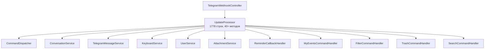
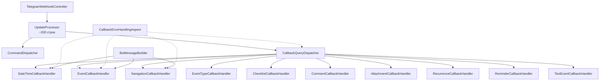

# Design Document: Code Quality Refactoring

## Overview

Данный документ описывает архитектурный дизайн рефакторинга кодовой базы Family Calendar Bot. Основная цель — декомпозиция God-класса UpdateProcessor (1778 строк) на модульные компоненты, устранение дублирования кода, типизация callback data и оптимизация работы с БД.

### Ключевые изменения

1. **Декомпозиция UpdateProcessor** — выделение CallbackQueryDispatcher и специализированных CallbackHandler
2. **AOP для обработки ошибок** — единый аспект вместо 30+ дублирующихся try-catch блоков
3. **CallbackPrefix enum** — типизация callback data вместо магических строк
4. **BotMessageBuilder** — централизованное форматирование сообщений
5. **EntityGraph оптимизация** — устранение N+1 проблемы
6. **Оптимизация логирования** — правильные уровни, без отладочных блоков
7. **Исправление транзакций** — вынос Telegram API вызовов за пределы @Transactional
8. **Bean Validation** — валидация входных данных

## Architecture

### Текущая архитектура (Before)



### Целевая архитектура (After)



## Components and Interfaces

### 1. CallbackHandler Interface

```java
package ru.golubyatnikov.family.calendar.bot.handler.callback;

import org.telegram.telegrambots.meta.api.objects.CallbackQuery;
import ru.golubyatnikov.family.calendar.bot.model.CallbackPrefix;
import ru.golubyatnikov.family.calendar.bot.model.User;

/**
 * Интерфейс для обработчиков callback queries.
 * Каждый обработчик отвечает за определённую функциональную область.
 */
public interface CallbackHandler {
    
    /**
     * Возвращает префикс callback data, который обрабатывает данный handler.
     * @return префикс из enum CallbackPrefix
     */
    CallbackPrefix getPrefix();
    
    /**
     * Обрабатывает callback query.
     * @param callbackQuery объект callback query от Telegram
     * @param user авторизованный пользователь
     */
    void handle(CallbackQuery callbackQuery, User user);
    
    /**
     * Проверяет, может ли handler обработать данный callback.
     * По умолчанию проверяет соответствие префикса.
     */
    default boolean canHandle(String callbackData) {
        return getPrefix().matches(callbackData);
    }
}
```

### 2. CallbackQueryDispatcher

```java
package ru.golubyatnikov.family.calendar.bot.service;

import lombok.RequiredArgsConstructor;
import lombok.extern.slf4j.Slf4j;
import org.springframework.stereotype.Service;
import org.telegram.telegrambots.meta.api.objects.CallbackQuery;
import ru.golubyatnikov.family.calendar.bot.handler.callback.CallbackHandler;
import ru.golubyatnikov.family.calendar.bot.model.User;

import java.util.List;
import java.util.Optional;

/**
 * Диспетчер для маршрутизации callback queries к соответствующим обработчикам.
 * Использует паттерн Chain of Responsibility.
 */
@Service
@RequiredArgsConstructor
@Slf4j
public class CallbackQueryDispatcher {
    
    private final List<CallbackHandler> handlers;
    private final TelegramMessageService messageService;
    private final UserService userService;
    
    /**
     * Обрабатывает callback query, маршрутизируя его к соответствующему handler.
     */
    public void dispatch(CallbackQuery callbackQuery) {
        String callbackData = callbackQuery.getData();
        Long telegramId = callbackQuery.getFrom().getId();
        
        // Игнорируем неактивные кнопки
        if (isIgnoredCallback(callbackData)) {
            messageService.answerCallbackQuery(callbackQuery.getId(), "");
            return;
        }
        
        // Проверяем авторизацию
        Optional<User> userOpt = userService.findByTelegramId(telegramId);
        if (userOpt.isEmpty()) {
            handleUnauthorizedUser(callbackQuery);
            return;
        }
        
        User user = userOpt.get();
        
        // Находим подходящий handler
        Optional<CallbackHandler> handler = findHandler(callbackData);
        
        if (handler.isPresent()) {
            handler.get().handle(callbackQuery, user);
        } else {
            handleUnknownCallback(callbackQuery, callbackData);
        }
    }
    
    private Optional<CallbackHandler> findHandler(String callbackData) {
        return handlers.stream()
            .filter(h -> h.canHandle(callbackData))
            .findFirst();
    }
    
    private boolean isIgnoredCallback(String callbackData) {
        return "calendar_ignore".equals(callbackData) || 
               "time_ignore".equals(callbackData);
    }
    
    private void handleUnauthorizedUser(CallbackQuery callbackQuery) {
        messageService.answerCallbackQuery(callbackQuery.getId(), 
            "❌ Пользователь не найден. Используйте /start для регистрации.");
    }
    
    private void handleUnknownCallback(CallbackQuery callbackQuery, String callbackData) {
        log.warn("Неизвестный callback data: '{}'", callbackData);
        messageService.answerCallbackQuery(callbackQuery.getId(), "❌ Неизвестная команда");
    }
}
```

### 3. CallbackPrefix Enum

```java
package ru.golubyatnikov.family.calendar.bot.model;

import lombok.Getter;
import lombok.RequiredArgsConstructor;

/**
 * Enum для типизации callback data prefixes.
 * Устраняет магические строки и обеспечивает type-safety.
 */
@Getter
@RequiredArgsConstructor
public enum CallbackPrefix {
    // Дата и время
    DATE("date_"),
    CALENDAR("calendar_"),
    HOUR("hour_"),
    TIME("time_"),
    
    // События
    VIEW_EVENT("view_event_"),
    EDIT_EVENT("edit_event_"),
    DELETE_EVENT("delete_event_"),
    EDIT_FIELD("edit_field_"),
    EVENT_TYPE("event_type_"),
    
    // Фильтры и корзина
    FILTER("filter_"),
    TRASH("trash_"),
    
    // Напоминания
    SETUP_REMINDERS("setup_reminders_"),
    TOGGLE_REMINDER("toggle_reminder_"),
    CONFIRM_REMINDERS("confirm_reminders_"),
    VIEW_REMINDERS("view_reminders_"),
    DELETE_REMINDER("delete_reminder_"),
    REMINDER("reminder_"),
    
    // Повторения
    RECURRENCE("recurrence_"),
    SERIES_ACTION("series_action_"),
    
    // Дополнительные функции
    DATE_ACTIONS("date_actions_"),
    ATTACH_FILE("attach_file_"),
    CHECKLIST("checklist_"),
    COMMENT("comment_"),
    ADD_COMPLETION_NOTE("add_completion_note_"),
    
    // Создание события из текста
    CONFIRM_TEXT_EVENT("confirm_text_event:"),
    CANCEL_TEXT_EVENT("cancel_text_event"),
    
    // Специальные
    SKIP_DESCRIPTION("skip_description"),
    TIME_BACK("time_back"),
    TIME_CANCEL("time_cancel");
    
    private final String prefix;
    
    /**
     * Проверяет, соответствует ли callback data данному префиксу.
     */
    public boolean matches(String callbackData) {
        if (callbackData == null) return false;
        
        // Для префиксов без параметров проверяем точное совпадение
        if (this == CANCEL_TEXT_EVENT || this == SKIP_DESCRIPTION || 
            this == TIME_BACK || this == TIME_CANCEL) {
            return callbackData.equals(prefix);
        }
        
        return callbackData.startsWith(prefix);
    }
    
    /**
     * Извлекает payload из callback data (часть после префикса).
     */
    public String extractPayload(String callbackData) {
        if (!matches(callbackData)) {
            throw new IllegalArgumentException(
                "Callback data '" + callbackData + "' не соответствует префиксу '" + prefix + "'");
        }
        return callbackData.substring(prefix.length());
    }
    
    /**
     * Создаёт callback data с данным payload.
     */
    public String withPayload(String payload) {
        return prefix + payload;
    }
    
    /**
     * Находит CallbackPrefix по callback data.
     */
    public static CallbackPrefix fromCallbackData(String callbackData) {
        for (CallbackPrefix prefix : values()) {
            if (prefix.matches(callbackData)) {
                return prefix;
            }
        }
        return null;
    }
}
```

### 4. CallbackErrorHandlingAspect

```java
package ru.golubyatnikov.family.calendar.bot.aspect;

import lombok.RequiredArgsConstructor;
import lombok.extern.slf4j.Slf4j;
import org.aspectj.lang.ProceedingJoinPoint;
import org.aspectj.lang.annotation.Around;
import org.aspectj.lang.annotation.Aspect;
import org.springframework.stereotype.Component;
import org.telegram.telegrambots.meta.api.objects.CallbackQuery;
import ru.golubyatnikov.family.calendar.bot.service.TelegramMessageService;

/**
 * AOP-аспект для централизованной обработки ошибок в callback handlers.
 * Устраняет дублирование try-catch блоков.
 */
@Aspect
@Component
@RequiredArgsConstructor
@Slf4j
public class CallbackErrorHandlingAspect {
    
    private final TelegramMessageService messageService;
    
    /**
     * Перехватывает исключения в методах, помеченных @HandleCallbackErrors.
     */
    @Around("@annotation(ru.golubyatnikov.family.calendar.bot.annotation.HandleCallbackErrors)")
    public Object handleCallbackErrors(ProceedingJoinPoint joinPoint) throws Throwable {
        CallbackQuery callbackQuery = extractCallbackQuery(joinPoint.getArgs());
        
        try {
            return joinPoint.proceed();
        } catch (Exception e) {
            handleException(e, callbackQuery, joinPoint);
            return null;
        }
    }
    
    private CallbackQuery extractCallbackQuery(Object[] args) {
        for (Object arg : args) {
            if (arg instanceof CallbackQuery) {
                return (CallbackQuery) arg;
            }
        }
        return null;
    }
    
    private void handleException(Exception e, CallbackQuery callbackQuery, 
                                 ProceedingJoinPoint joinPoint) {
        String callbackData = callbackQuery != null ? callbackQuery.getData() : "unknown";
        Long userId = callbackQuery != null ? callbackQuery.getFrom().getId() : null;
        Long chatId = callbackQuery != null ? callbackQuery.getMessage().getChatId() : null;
        
        // Логируем с полным контекстом
        log.error("Ошибка при обработке callback: data='{}', userId={}, chatId={}, " +
                  "handler={}, errorType={}, errorMessage={}", 
                  callbackData, userId, chatId,
                  joinPoint.getSignature().toShortString(),
                  e.getClass().getSimpleName(), e.getMessage(), e);
        
        // Отправляем сообщение пользователю
        if (callbackQuery != null) {
            try {
                messageService.answerCallbackQuery(callbackQuery.getId(), 
                    "❌ Произошла ошибка. Попробуйте еще раз.");
            } catch (Exception ex) {
                log.error("Ошибка при ответе на callback query: {}", ex.getMessage());
            }
        }
    }
}
```

### 5. HandleCallbackErrors Annotation

```java
package ru.golubyatnikov.family.calendar.bot.annotation;

import java.lang.annotation.ElementType;
import java.lang.annotation.Retention;
import java.lang.annotation.RetentionPolicy;
import java.lang.annotation.Target;

/**
 * Аннотация для маркировки методов, в которых нужна централизованная обработка ошибок.
 */
@Target(ElementType.METHOD)
@Retention(RetentionPolicy.RUNTIME)
public @interface HandleCallbackErrors {
}
```

### 6. BotMessageBuilder

```java
package ru.golubyatnikov.family.calendar.bot.util;

import lombok.RequiredArgsConstructor;
import org.springframework.stereotype.Component;
import ru.golubyatnikov.family.calendar.bot.model.Event;

import static ru.golubyatnikov.family.calendar.bot.util.MarkdownFormatter.*;

/**
 * Централизованный компонент для формирования сообщений бота.
 * Обеспечивает консистентный стиль и корректное экранирование.
 */
@Component
@RequiredArgsConstructor
public class BotMessageBuilder {
    
    /**
     * Формирует сообщение об успешном создании события.
     */
    public String buildEventCreatedMessage(Event event) {
        StringBuilder sb = new StringBuilder();
        sb.append("✅ ").append(bold("Событие успешно создано!")).append("\n\n");
        sb.append("📅 Дата: ").append(escape(event.getFormattedDate())).append("\n");
        sb.append("🕐 Время: ").append(escape(event.getFormattedTime())).append("\n");
        sb.append("📝 Название: ").append(escape(event.getTitle()));
        
        if (event.getDescription() != null && !event.getDescription().isBlank()) {
            sb.append("\n📄 Описание: ").append(escape(event.getDescription()));
        }
        
        return sb.toString();
    }
    
    /**
     * Формирует сообщение об ошибке.
     */
    public String buildErrorMessage(String errorText) {
        return "❌ " + bold("Произошла ошибка") + "\\. " + italic(escape(errorText));
    }
    
    /**
     * Формирует сообщение об ошибке с предложением действия.
     */
    public String buildErrorMessageWithAction(String errorText, String actionHint) {
        return buildErrorMessage(errorText) + "\n\n" + italic(escape(actionHint));
    }
    
    /**
     * Формирует сообщение о выборе даты.
     */
    public String buildDateSelectedMessage(String formattedDate) {
        return formatMessage("✅ Дата выбрана: %s\n\nТеперь выберите час:", formattedDate);
    }
    
    /**
     * Формирует сообщение о выборе времени.
     */
    public String buildTimeSelectedMessage(String formattedTime) {
        return formatMessage("✅ Время выбрано: %s\n\nТеперь отправьте название события:", 
                            formattedTime);
    }
    
    /**
     * Формирует сообщение о выборе часа.
     */
    public String buildHourSelectedMessage(int hour) {
        return formatMessage("✅ Час выбран: %02d:00\n\nТеперь выберите минуты:", hour);
    }
    
    /**
     * Формирует сообщение предпросмотра события из текста.
     */
    public String buildTextEventPreviewMessage(String title, String date, String time) {
        return formatMessage(
            "✅ *Распознано событие из текста:*\n\n" +
            "📝 Название: %s\n" +
            "📅 Дата: %s\n" +
            "🕐 Время: %s\n\n" +
            "Подтвердите создание события:",
            title, date, time
        );
    }
    
    /**
     * Формирует сообщение об отмене создания события.
     */
    public String buildEventCancelledMessage() {
        return "❌ Создание события отменено";
    }
    
    /**
     * Формирует сообщение о выборе типа события.
     */
    public String buildEventTypeSelectedMessage(boolean isPersonal) {
        if (isPersonal) {
            return "✅ " + bold("Выбрано: Персональное событие") + "\n\n" +
                   italic("Только вы будете видеть это событие.") + "\n\n" +
                   "📅 " + escape("Теперь выберите дату события:");
        } else {
            return "✅ " + bold("Выбрано: Семейное событие") + "\n\n" +
                   italic("Все члены семьи будут видеть это событие.") + "\n\n" +
                   "📅 " + escape("Теперь выберите дату события:");
        }
    }
    
    /**
     * Формирует сообщение о прикреплении файла.
     */
    public String buildFileAttachedMessage(String fileName, double fileSizeMb) {
        return formatMessage(
            "✅ *Файл успешно прикреплен!*\n\n" +
            "📎 Название: %s\n" +
            "📊 Размер: %.2f МБ\n\n" +
            "Вы можете продолжить прикреплять файлы или завершить создание события.",
            fileName, fileSizeMb
        );
    }
}
```


### 7. Пример CallbackHandler (DateTimeCallbackHandler)

```java
package ru.golubyatnikov.family.calendar.bot.handler.callback;

import lombok.RequiredArgsConstructor;
import lombok.extern.slf4j.Slf4j;
import org.springframework.stereotype.Component;
import org.telegram.telegrambots.meta.api.objects.CallbackQuery;
import ru.golubyatnikov.family.calendar.bot.annotation.HandleCallbackErrors;
import ru.golubyatnikov.family.calendar.bot.model.CallbackPrefix;
import ru.golubyatnikov.family.calendar.bot.model.User;
import ru.golubyatnikov.family.calendar.bot.service.ConversationService;
import ru.golubyatnikov.family.calendar.bot.service.KeyboardService;
import ru.golubyatnikov.family.calendar.bot.service.TelegramMessageService;
import ru.golubyatnikov.family.calendar.bot.util.BotMessageBuilder;

import java.time.LocalDate;
import java.time.LocalTime;
import java.time.format.DateTimeFormatter;

/**
 * Обработчик callback queries для выбора даты и времени.
 */
@Component
@RequiredArgsConstructor
@Slf4j
public class DateTimeCallbackHandler implements CallbackHandler {
    
    private final ConversationService conversationService;
    private final TelegramMessageService messageService;
    private final KeyboardService keyboardService;
    private final BotMessageBuilder messageBuilder;
    
    @Override
    public CallbackPrefix getPrefix() {
        return CallbackPrefix.DATE;
    }
    
    @Override
    public boolean canHandle(String callbackData) {
        return CallbackPrefix.DATE.matches(callbackData) ||
               CallbackPrefix.HOUR.matches(callbackData) ||
               CallbackPrefix.TIME.matches(callbackData) ||
               CallbackPrefix.TIME_BACK.matches(callbackData) ||
               CallbackPrefix.TIME_CANCEL.matches(callbackData);
    }
    
    @Override
    @HandleCallbackErrors
    public void handle(CallbackQuery callbackQuery, User user) {
        String callbackData = callbackQuery.getData();
        Long chatId = callbackQuery.getMessage().getChatId();
        Integer messageId = callbackQuery.getMessage().getMessageId();
        String callbackQueryId = callbackQuery.getId();
        
        if (CallbackPrefix.DATE.matches(callbackData)) {
            handleDateSelection(callbackData, user.getId(), chatId, messageId, callbackQueryId);
        } else if (CallbackPrefix.HOUR.matches(callbackData)) {
            handleHourSelection(callbackData, chatId, messageId, callbackQueryId);
        } else if (callbackData.startsWith("time_") && callbackData.contains(":")) {
            handleTimeSelection(callbackData, user.getId(), chatId, messageId, callbackQueryId);
        } else if (CallbackPrefix.TIME_BACK.matches(callbackData)) {
            handleTimeBack(chatId, messageId, callbackQueryId);
        } else if (CallbackPrefix.TIME_CANCEL.matches(callbackData)) {
            handleTimeCancel(user.getId(), chatId, messageId, callbackQueryId);
        }
    }
    
    private void handleDateSelection(String callbackData, Long userId, Long chatId, 
                                     Integer messageId, String callbackQueryId) {
        String dateStr = CallbackPrefix.DATE.extractPayload(callbackData);
        LocalDate date = LocalDate.parse(dateStr);
        
        conversationService.updateEventDate(userId, date);
        
        var keyboard = keyboardService.createHourSelectionKeyboard();
        String formattedDate = date.format(DateTimeFormatter.ofPattern("dd.MM.yyyy"));
        String message = messageBuilder.buildDateSelectedMessage(formattedDate);
        
        messageService.editMessageText(chatId, messageId, message, keyboard);
        messageService.answerCallbackQuery(callbackQueryId, "Дата выбрана");
        
        log.info("Дата выбрана для пользователя {}: {}", userId, date);
    }
    
    private void handleHourSelection(String callbackData, Long chatId, 
                                     Integer messageId, String callbackQueryId) {
        String hourStr = CallbackPrefix.HOUR.extractPayload(callbackData);
        int hour = Integer.parseInt(hourStr);
        
        var keyboard = keyboardService.createMinuteSelectionKeyboard(hour);
        String message = messageBuilder.buildHourSelectedMessage(hour);
        
        messageService.editMessageText(chatId, messageId, message, keyboard);
        messageService.answerCallbackQuery(callbackQueryId, "Час выбран");
    }
    
    private void handleTimeSelection(String callbackData, Long userId, Long chatId, 
                                     Integer messageId, String callbackQueryId) {
        String timeStr = callbackData.substring(5); // Убираем "time_"
        LocalTime time = LocalTime.parse(timeStr);
        
        conversationService.updateEventTime(userId, time);
        
        String formattedTime = time.format(DateTimeFormatter.ofPattern("HH:mm"));
        String message = messageBuilder.buildTimeSelectedMessage(formattedTime);
        
        messageService.editMessageText(chatId, messageId, message, null);
        messageService.answerCallbackQuery(callbackQueryId, "Время выбрано");
        
        log.info("Время выбрано для пользователя {}: {}", userId, time);
    }
    
    private void handleTimeBack(Long chatId, Integer messageId, String callbackQueryId) {
        var keyboard = keyboardService.createHourSelectionKeyboard();
        messageService.editMessageText(chatId, messageId, "🕐 Выберите час:", keyboard);
        messageService.answerCallbackQuery(callbackQueryId, "");
    }
    
    private void handleTimeCancel(Long userId, Long chatId, Integer messageId, 
                                  String callbackQueryId) {
        conversationService.cancelEventCreation(userId);
        messageService.editMessageText(chatId, messageId, 
            messageBuilder.buildEventCancelledMessage(), null);
        messageService.answerCallbackQuery(callbackQueryId, "Отменено");
        
        log.info("Создание события отменено пользователем {}", userId);
    }
}
```

## Data Models

### Изменения в EventRepository

Добавление `@EntityGraph` к методам, которые требуют загрузки связанных сущностей:

```java
@Repository
public interface EventRepository extends JpaRepository<Event, Long> {
    
    // Уже есть @EntityGraph
    @EntityGraph(attributePaths = {"user", "family"})
    List<Event> findByFamilyIdAndEventDateBetween(...);
    
    // Нужно добавить @EntityGraph
    @EntityGraph(attributePaths = {"user", "family"})
    List<Event> findByUserIdOrderByEventDateAsc(Long userId);
    
    @EntityGraph(attributePaths = {"user", "family"})
    List<Event> findAllByUserIdAndStatus(Long userId, Event.EventStatus status);
    
    @EntityGraph(attributePaths = {"user", "family"})
    List<Event> findByUserIdAndStatusOrderByDeletedAtDesc(Long userId, Event.EventStatus status);
    
    @EntityGraph(attributePaths = {"user", "family"})
    @Query("""
        SELECT e FROM Event e
        WHERE e.family.id = :familyId
        AND e.status = 'ACTIVE'
        AND (
            (e.isPersonal = false)
            OR (e.isPersonal = true AND e.user.id = :userId)
        )
        AND (
            LOWER(e.title) LIKE LOWER(CONCAT('%', :query, '%'))
            OR LOWER(e.description) LIKE LOWER(CONCAT('%', :query, '%'))
        )
        ORDER BY e.eventDate DESC, e.eventTime DESC
    """)
    List<Event> searchByTitleOrDescription(...);
    
    @EntityGraph(attributePaths = {"user", "family"})
    @Query("""
        SELECT e FROM Event e
        WHERE e.family.id = :familyId
        AND e.status = 'ACTIVE'
        AND e.eventDate >= :currentDate
        AND (
            (e.isPersonal = false)
            OR (e.isPersonal = true AND e.user.id = :userId)
        )
        ORDER BY e.eventDate ASC, e.eventTime ASC
    """)
    List<Event> findUpcomingEvents(...);
    
    @EntityGraph(attributePaths = {"user", "family"})
    List<Event> findBySeriesIdAndStatus(String seriesId, Event.EventStatus status);
}
```

### Bean Validation на EventService

```java
@Service
@Validated
@RequiredArgsConstructor
@Slf4j
public class EventService {
    
    public Event createEvent(
            @NotNull(message = "userId не может быть null") Long userId,
            @NotBlank(message = "Название события не может быть пустым") 
            @Size(max = 255, message = "Название события не может превышать 255 символов") String title,
            @Size(max = 2000, message = "Описание события не может превышать 2000 символов") String description,
            @NotNull(message = "Дата события не может быть null") LocalDate eventDate,
            @NotNull(message = "Время события не может быть null") LocalTime eventTime) {
        // ...
    }
}
```

## Correctness Properties

*A property is a characteristic or behavior that should hold true across all valid executions of a system—essentially, a formal statement about what the system should do. Properties serve as the bridge between human-readable specifications and machine-verifiable correctness guarantees.*

### Property 1: Callback Routing Correctness

*For any* callback data с известным префиксом из CallbackPrefix enum, CallbackQueryDispatcher SHALL маршрутизировать его к handler, у которого `canHandle(callbackData)` возвращает `true`.

**Validates: Requirements 1.2**

### Property 2: CallbackPrefix Matching Consistency

*For any* callback data, созданный через `CallbackPrefix.withPayload(payload)`, метод `matches()` того же префикса SHALL возвращать `true`, и `extractPayload()` SHALL возвращать исходный payload.

**Validates: Requirements 3.2**

### Property 3: Error Handling Completeness

*For any* исключение, возникающее в методе с аннотацией `@HandleCallbackErrors`, аспект SHALL логировать ошибку с контекстом (callbackData, userId, chatId) И отправлять пользователю сообщение об ошибке.

**Validates: Requirements 2.2, 2.3, 2.4**

### Property 4: BotMessageBuilder Escaping

*For any* текст, содержащий специальные символы Markdown V2 (`_`, `*`, `[`, `]`, `(`, `)`, `~`, `` ` ``, `>`, `#`, `+`, `-`, `=`, `|`, `{`, `}`, `.`, `!`), BotMessageBuilder SHALL корректно экранировать их в результирующем сообщении.

**Validates: Requirements 4.4**

### Property 5: EntityGraph N+1 Prevention

*For any* вызов метода репозитория с `@EntityGraph`, количество SQL-запросов SHALL быть равно 1 (без дополнительных запросов для загрузки связанных сущностей).

**Validates: Requirements 5.2**

### Property 6: Transaction and External API Separation

*For any* метод с `@Transactional`, вызовы TelegramMessageService SHALL происходить только после коммита транзакции ИЛИ в отдельном методе без `@Transactional`.

**Validates: Requirements 7.3, 7.4**

### Property 7: Bean Validation Enforcement

*For any* невалидные входные данные (пустой title, null eventDate, слишком длинное description), сервис SHALL выбрасывать `ConstraintViolationException`.

**Validates: Requirements 8.2**

## Error Handling

### Централизованная обработка через AOP

1. **CallbackErrorHandlingAspect** перехватывает все исключения в методах с `@HandleCallbackErrors`
2. Логирует с полным контекстом: callbackData, userId, chatId, handler, errorType, errorMessage
3. Отправляет пользователю информативное сообщение об ошибке
4. Отвечает на callback query с текстом ошибки

### GlobalExceptionHandler расширения

```java
@ExceptionHandler(ConstraintViolationException.class)
public ResponseEntity<ErrorResponse> handleConstraintViolation(ConstraintViolationException ex) {
    String message = ex.getConstraintViolations().stream()
        .map(ConstraintViolation::getMessage)
        .collect(Collectors.joining(", "));
    
    log.warn("Ошибка валидации: {}", message);
    
    return ResponseEntity.badRequest()
        .body(new ErrorResponse("VALIDATION_ERROR", message));
}
```

## Testing Strategy

### Unit Tests

- **CallbackPrefix**: тесты для `matches()`, `extractPayload()`, `withPayload()`, `fromCallbackData()`
- **CallbackQueryDispatcher**: тесты маршрутизации к правильным handlers
- **BotMessageBuilder**: тесты форматирования всех типов сообщений
- **CallbackHandlers**: тесты каждого handler с mock зависимостями

### Property-Based Tests (jqwik)

Библиотека: **jqwik** (Java property-based testing framework)

Конфигурация: минимум 100 итераций на тест

```java
@Property(tries = 100)
void callbackPrefixRoundTrip(@ForAll @StringLength(min = 1, max = 50) String payload) {
    // Property 2: CallbackPrefix Matching Consistency
    for (CallbackPrefix prefix : CallbackPrefix.values()) {
        if (prefix != CallbackPrefix.CANCEL_TEXT_EVENT && 
            prefix != CallbackPrefix.SKIP_DESCRIPTION &&
            prefix != CallbackPrefix.TIME_BACK && 
            prefix != CallbackPrefix.TIME_CANCEL) {
            
            String callbackData = prefix.withPayload(payload);
            assertThat(prefix.matches(callbackData)).isTrue();
            assertThat(prefix.extractPayload(callbackData)).isEqualTo(payload);
        }
    }
}

@Property(tries = 100)
void botMessageBuilderEscapesSpecialChars(
        @ForAll @StringLength(min = 1, max = 100) String text) {
    // Property 4: BotMessageBuilder Escaping
    String escaped = MarkdownFormatter.escape(text);
    
    // Проверяем, что все специальные символы экранированы
    for (char special : "_*[]()~`>#+-=|{}.!".toCharArray()) {
        if (text.contains(String.valueOf(special))) {
            assertThat(escaped).contains("\\" + special);
        }
    }
}
```

### Integration Tests

- **EntityGraph**: тесты с реальной БД (Testcontainers) для проверки отсутствия N+1
- **Transaction separation**: тесты с mock TelegramMessageService для проверки порядка вызовов
- **Bean Validation**: тесты с реальным Spring контекстом для проверки валидации

## Migration Plan

### Фаза 1: Подготовка инфраструктуры
1. Создать `CallbackPrefix` enum
2. Создать `CallbackHandler` интерфейс
3. Создать `@HandleCallbackErrors` аннотацию
4. Создать `CallbackErrorHandlingAspect`
5. Создать `BotMessageBuilder`

### Фаза 2: Создание CallbackHandlers
1. `DateTimeCallbackHandler`
2. `EventCallbackHandler`
3. `NavigationCallbackHandler`
4. `EventTypeCallbackHandler`
5. `ChecklistCallbackHandler`
6. `CommentCallbackHandler`
7. `AttachmentCallbackHandler`
8. `RecurrenceCallbackHandler`
9. `TextEventCallbackHandler`

### Фаза 3: Создание CallbackQueryDispatcher
1. Реализовать диспетчер
2. Интегрировать с UpdateProcessor

### Фаза 4: Рефакторинг UpdateProcessor
1. Удалить методы обработки callback (перенесены в handlers)
2. Делегировать обработку в CallbackQueryDispatcher
3. Сократить до ~200-300 строк

### Фаза 5: Оптимизация БД и валидация
1. Добавить `@EntityGraph` к методам репозитория
2. Добавить `@Validated` и Bean Validation аннотации
3. Расширить GlobalExceptionHandler

### Фаза 6: Оптимизация логирования и транзакций
1. Удалить отладочные блоки логирования
2. Исправить уровни логирования
3. Рефакторить методы с транзакциями и внешними вызовами
