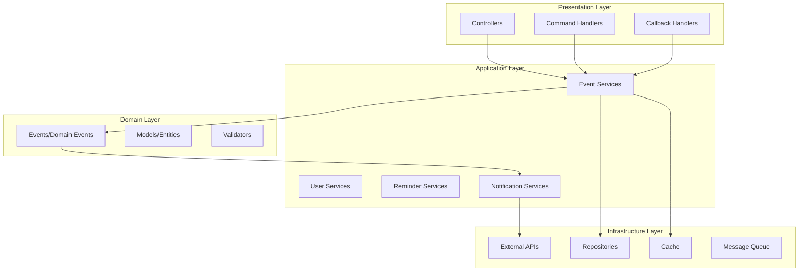

# Дизайн комплексного рефакторинга проекта

## Обзор

Данный документ описывает архитектурное решение для комплексного рефакторинга Spring Boot приложения семейного календаря. Основная цель - устранить критические проблемы, выявленные в ходе аудита, и привести код к production-ready состоянию с соблюдением всех best practices.

Рефакторинг будет выполнен поэтапно, начиная с критических проблем безопасности и архитектуры, затем переходя к оптимизации производительности и качества кода.

## Архитектура

### Текущие проблемы архитектуры

1. **Множественные God Services**: 
   - KeyboardService: 2293 строки - создание всех типов клавиатур
   - EventService: 2250 строк - управление событиями
   - TelegramMessageService: 2237 строк - отправка сообщений
   - ReminderService: 1893 строки - управление напоминаниями
   - UpdateProcessor: 1620 строк - обработка всех типов обновлений
   - AttachmentCallbackHandler: 1341 строка - обработка вложений
   - EventCallbackHandler: 1223 строки - обработка событий
   - MyEventsCommandHandler: 1032 строки - команды "Мои события"

2. **Циклические зависимости**: EventService ↔ MyEventsCommandHandler через @Lazy
3. **Неправильные транзакции**: @Transactional на уровне класса для смешанных операций
4. **Отсутствие событийной архитектуры**: Прямые вызовы между слоями
5. **Нарушение Single Responsibility**: Каждый God Service выполняет множество несвязанных функций
6. **Технический долг**: TODO/FIXME комментарии, System.out.println, wildcard импорты, неиспользуемый код

### Целевая архитектура



### Новая структура сервисов

Разделим все God Services на специализированные компоненты:

#### 1. EventService (2250 строк) → Разделить на:
- **EventQueryService** - только чтение данных
- **EventCommandService** - создание и изменение событий  
- **EventDeletionService** - удаление и восстановление
- **EventValidationService** - валидация бизнес-правил
- **EventNotificationService** - уведомления о событиях

#### 2. KeyboardService (2293 строки) → Разделить на:
- **ReplyKeyboardService** - создание обычных клавиатур
- **InlineKeyboardService** - создание inline клавиатур
- **KeyboardButtonFactory** - фабрика кнопок
- **KeyboardLayoutService** - компоновка клавиатур

#### 3. TelegramMessageService (2237 строк) → Разделить на:
- **MessageSender** - базовая отправка сообщений
- **MessageFormatter** - форматирование сообщений
- **MessageRetryService** - retry логика
- **CallbackQueryService** - обработка callback queries

#### 4. ReminderService (1893 строки) → Разделить на:
- **ReminderCreationService** - создание напоминаний
- **ReminderSchedulingService** - планирование отправки
- **ReminderNotificationService** - отправка уведомлений
- **ReminderConfigurationService** - настройка типов напоминаний

#### 5. UpdateProcessor (1621 строк, 14 зависимостей) → Разделить на:

**Текущие проблемы:**
- 14 зависимостей (критично!)
- Обрабатывает: команды, callback queries, файлы, текстовые события, редактирование, поиск, заметки
- Нарушает принцип единственной ответственности

**Новая структура:**
- **MessageRouter** - маршрутизация входящих сообщений (~150 строк, 4 зависимости)
- **ConversationMessageHandler** - диалоги создания событий (~300 строк, 6 зависимостей)
- **FileMessageHandler** - обработка файлов и вложений (~250 строк, 5 зависимостей)
- **TextEventMessageHandler** - парсинг событий из текста (~200 строк, 6 зависимостей)
- **EventEditingMessageHandler** - редактирование событий (~250 строк, 6 зависимостей)
- **CompletionNoteMessageHandler** - заметки к событиям (~150 строк, 4 зависимости)
- **SearchQueryMessageHandler** - поисковые запросы (~150 строк, 4 зависимости)
- **UpdateProcessor (обновленный)** - координатор (~200 строк, 5 зависимостей)

#### 6. AttachmentCallbackHandler (1341 строк, 7 зависимостей) → Разделить на:

**Текущие проблемы:**
- Обрабатывает множество различных операций с вложениями
- Сложная логика парсинга callback данных

**Новая структура:**
- **AttachmentCallbackRouter** - маршрутизация callback запросов (~150 строк, 5 зависимостей)
- **AttachmentListHandler** - просмотр списка вложений (~250 строк, 5 зависимостей)
- **AttachmentUploadHandler** - добавление файлов (~150 строк, 4 зависимости)
- **AttachmentViewHandler** - просмотр файлов (~200 строк, 5 зависимостей)
- **AttachmentDeleteHandler** - удаление файлов (~200 строк, 5 зависимостей)
- **AttachmentNavigationHandler** - навигация между экранами (~150 строк, 4 зависимости)

#### 7. EventCallbackHandler (1225 строк, 9 зависимостей) → Разделить на:

**Текущие проблемы:**
- 19 методов (слишком много)
- Обрабатывает разные типы операций с событиями

**Новая структура:**
- **EventCallbackRouter** - маршрутизация callback запросов (~150 строк, 6 зависимостей)
- **EventViewHandler** - просмотр событий (~250 строк, 5 зависимостей)
- **EventEditHandler** - редактирование событий (~200 строк, 5 зависимостей)
- **EventDeleteHandler** - удаление событий (~200 строк, 5 зависимостей)
- **EventCompletionHandler** - завершение событий (~250 строк, 6 зависимостей)
- **EventFieldEditHandler** - редактирование полей (~200 строк, 5 зависимостей)
- **EventReminderNavigationHandler** - навигация с напоминаниями (~150 строк, 5 зависимостей)

#### 8. MyEventsCommandHandler (1024 строк, 6 зависимостей) → Разделить на:

**Текущие проблемы:**
- Смешивает логику запросов, форматирования и навигации
- 17 методов

**Новая структура:**
- **MyEventsQueryService** - получение данных о событиях (~150 строк, 2 зависимости)
- **MyEventsFormattingService** - форматирование событий (~200 строк, 2 зависимости)
- **MyEventsNavigationService** - навигация между событиями (~150 строк, 2 зависимости)
- **MyEventsCommandHandler (обновленный)** - координатор (~200 строк, 4 зависимости)

#### 9. InlineKeyboardService (871 строк, 21 метод) → Разделить на:

**Текущие проблемы:**
- 21 метод (критично!)
- Создает клавиатуры для разных контекстов

**Новая структура:**
- **EventInlineKeyboardFactory** - клавиатуры для событий (~200 строк, 2 зависимости)
- **AttachmentInlineKeyboardFactory** - клавиатуры для вложений (~150 строк, 1 зависимость)
- **ReminderInlineKeyboardFactory** - клавиатуры для напоминаний (~150 строк, 1 зависимость)
- **NavigationInlineKeyboardFactory** - клавиатуры навигации (~100 строк, 0 зависимостей)
- **ConfirmationInlineKeyboardFactory** - клавиатуры подтверждений (~100 строк, 0 зависимостей)
- **InlineKeyboardService (обновленный)** - фасад (~150 строк, 5 зависимостей)

### Структура пакетов после рефакторинга God Objects

```
bot/
├── service/
│   ├── UpdateProcessor.java (координатор, ~200 строк)
│   ├── message/
│   │   ├── MessageRouter.java
│   │   ├── ConversationMessageHandler.java
│   │   ├── FileMessageHandler.java
│   │   ├── TextEventMessageHandler.java
│   │   ├── EventEditingMessageHandler.java
│   │   ├── CompletionNoteMessageHandler.java
│   │   └── SearchQueryMessageHandler.java
│   ├── myevents/
│   │   ├── MyEventsCommandHandler.java (координатор)
│   │   ├── MyEventsQueryService.java
│   │   ├── MyEventsFormattingService.java
│   │   └── MyEventsNavigationService.java
│   └── keyboard/
│       ├── InlineKeyboardService.java (фасад)
│       ├── EventInlineKeyboardFactory.java
│       ├── AttachmentInlineKeyboardFactory.java
│       ├── ReminderInlineKeyboardFactory.java
│       ├── NavigationInlineKeyboardFactory.java
│       └── ConfirmationInlineKeyboardFactory.java
├── handler/
│   └── callback/
│       ├── attachment/
│       │   ├── AttachmentCallbackRouter.java
│       │   ├── AttachmentListHandler.java
│       │   ├── AttachmentUploadHandler.java
│       │   ├── AttachmentViewHandler.java
│       │   ├── AttachmentDeleteHandler.java
│       │   └── AttachmentNavigationHandler.java
│       └── event/
│           ├── EventCallbackRouter.java
│           ├── EventViewHandler.java
│           ├── EventEditHandler.java
│           ├── EventDeleteHandler.java
│           ├── EventCompletionHandler.java
│           ├── EventFieldEditHandler.java
│           └── EventReminderNavigationHandler.java
```

### Метрики успеха рефакторинга God Objects

| Метрика | До рефакторинга | После рефакторинга | Улучшение |
|---------|-----------------|-------------------|-----------|
| Количество god objects | 5 | 0 | ✅ 100% |
| Средний размер класса | 1216 строк | ~180 строк | ✅ 85% |
| Средние зависимости | 7.6 | 3-4 | ✅ 50% |
| Максимальные зависимости | 14 | 6 | ✅ 57% |
| Максимальные методы | 21 | <10 | ✅ 52% |

**Ожидаемые результаты:**
- 31 специализированный класс вместо 5 god objects
- Каждый класс имеет одну ответственность (SRP)
- Код легче тестировать и поддерживать
- Улучшенная расширяемость

## Компоненты и интерфейсы

### 1. Реорганизация EventService

#### EventQueryService
```java
@Service
@Validated
@Slf4j
public class EventQueryService {
    
    @Transactional(readOnly = true)
    @Cacheable(value = "upcomingEvents", key = "#familyId + '_' + #days")
    public Page<Event> getUpcomingEvents(Long familyId, int days, Pageable pageable);
    
    @Transactional(readOnly = true)
    @Cacheable(value = "userEvents", key = "#userId + '_' + #status")
    public Page<Event> getUserEvents(Long userId, Event.EventStatus status, Pageable pageable);
    
    @Transactional(readOnly = true)
    public Optional<Event> findById(Long eventId);
}
```

#### EventCommandService
```java
@Service
@Validated
@Slf4j
public class EventCommandService {
    
    private final ApplicationEventPublisher eventPublisher;
    
    @Transactional
    @CacheEvict(value = {"upcomingEvents", "userEvents"}, allEntries = true)
    public Event createEvent(@Valid CreateEventRequest request);
    
    @Transactional
    @CacheEvict(value = {"upcomingEvents", "userEvents"}, allEntries = true)
    public Event updateEvent(Long eventId, @Valid UpdateEventRequest request);
    
    // Публикация доменных событий вместо прямых вызовов
    private void publishEventCreated(Event event) {
        eventPublisher.publishEvent(new EventCreatedEvent(event));
    }
}
```

### 2. Событийная архитектура

Заменим циклические зависимости на события Spring:

```java
// Доменные события
public record EventCreatedEvent(Event event) {}
public record EventUpdatedEvent(Event event, Event previousState) {}
public record EventDeletedEvent(Long eventId, Long userId) {}

// Обработчики событий
@Component
public class EventNotificationHandler {
    
    @EventListener
    @Async
    public void onEventCreated(EventCreatedEvent event) {
        // Отправка уведомлений
    }
    
    @EventListener
    public void onEventDeleted(EventDeletedEvent event) {
        // Обновление UI без циклических зависимостей
        myEventsCommandHandler.updateMyEventsHeaderAfterRemoval(event.userId());
    }
}
```

### 3. Безопасная регистрация Webhook

Заменим токен в URL на secret token:

```java
@Component
public class SecureWebhookRegistrar {
    
    private final SecretTokenGenerator secretTokenGenerator;
    
    @PostConstruct
    public void registerWebhook() {
        String secretToken = secretTokenGenerator.generate();
        
        Map<String, String> requestBody = Map.of(
            "url", botConfig.getWebhookUrl(),
            "secret_token", secretToken
        );
        
        // Сохраняем secret token для валидации
        webhookSecurityService.storeSecretToken(secretToken);
    }
    
    // Graceful shutdown вместо System.exit()
    private void handleRegistrationFailure(String reason) {
        log.error("Webhook registration failed: {}", reason);
        
        // Отправляем alert в мониторинг
        alertService.sendCriticalAlert("Webhook registration failed", reason);
        
        // Graceful shutdown через Spring
        new Thread(() -> {
            try {
                Thread.sleep(1000);
                SpringApplication.exit(applicationContext, () -> 1);
            } catch (InterruptedException e) {
                Thread.currentThread().interrupt();
            }
        }).start();
    }
}
```

### 4. Оптимизация репозиториев

Исправим N+1 проблемы и добавим пагинацию:

```java
@Repository
public interface EventRepository extends JpaRepository<Event, Long> {
    
    // Добавляем пагинацию везде
    @EntityGraph(attributePaths = {"user", "family"})
    Page<Event> findByFamilyIdAndEventDateBetween(
        Long familyId, 
        LocalDate startDate, 
        LocalDate endDate,
        Pageable pageable
    );
    
    // Исправляем методы без EntityGraph
    @EntityGraph(attributePaths = {"user", "family"})
    Optional<Event> findByUserIdAndStatus(Long userId, Event.EventStatus status);
}

@Repository
public interface ReminderRepository extends JpaRepository<Reminder, Long> {
    
    // Исправляем N+1 проблему
    @EntityGraph(attributePaths = {"event", "event.user"})
    @Query("SELECT r FROM Reminder r WHERE r.sent = false " +
           "AND r.reminderTime <= :nowUTC " +
           "AND r.reminderTime >= :oneHourAgo")
    List<Reminder> findPendingReminders(
        @Param("nowUTC") LocalDateTime nowUTC,
        @Param("oneHourAgo") LocalDateTime oneHourAgo
    );
}
```

### 5. Исправление транзакций

Проблема: Множество сервисов имеют `@Transactional` на уровне класса, но содержат смешанные операции (чтение + запись).

**Сервисы, требующие исправления (убрать @Transactional с класса):**

1. **EventService** - имеет методы чтения:
   - `getEventById()` - @Transactional(readOnly = true)
   - `getEventByIdWithReminders()` - @Transactional(readOnly = true)
   - `isToday()`, `isTomorrow()` - без транзакции (простые вычисления)
   - `getActiveEventsCount()` - @Transactional(readOnly = true)

2. **ReminderService** - имеет методы чтения:
   - `getReminderById()` - @Transactional(readOnly = true)
   - `getReminderWithEventById()` - @Transactional(readOnly = true)
   - `getReminderWithEventAndUser()` - @Transactional(readOnly = true)
   - `hasActiveReminders()` - @Transactional(readOnly = true)

3. **AttachmentService** - имеет методы чтения:
   - `getAttachment()` - @Transactional(readOnly = true)
   - `countEventAttachments()` - @Transactional(readOnly = true)

4. **ChecklistService** - имеет метод чтения:
   - `isChecklistComplete()` - @Transactional(readOnly = true)

5. **ConversationService** - имеет методы чтения:
   - `getActiveDraft()` - @Transactional(readOnly = true)
   - `hasActiveDraft()` - @Transactional(readOnly = true)

**Сервисы, которые можно оставить с @Transactional на уровне класса (только операции записи):**

1. **EventHistoryService** - только запись истории изменений
2. **DraftCleanupService** - только очистка черновиков

**Примечание:** CommentService, ChecklistService и RecurrenceService будут удалены как неиспользуемые.

**Пример исправления:**

```java
// ❌ Плохо - @Transactional на уровне класса со смешанными операциями
@Service
@Transactional
public class EventService {
    
    public Event getEventById(Long eventId) {
        // Метод чтения, но использует транзакцию записи
    }
    
    public Event createEvent(CreateEventRequest request) {
        // Метод записи
    }
}

// ✅ Хорошо - транзакции на уровне методов
@Service
public class EventService {
    
    @Transactional(readOnly = true)
    public Event getEventById(Long eventId) {
        // Оптимизированная транзакция только для чтения
    }
    
    @Transactional
    public Event createEvent(CreateEventRequest request) {
        // Транзакция записи
    }
}
```

## Модели данных

### Константы вместо магических чисел

```java
public final class ApplicationConstants {
    
    // Временные интервалы
    public static final int REMINDER_CHECK_INTERVAL_MS = 60_000;
    public static final int CACHE_TTL_MINUTES = 5;
    public static final int GRACEFUL_SHUTDOWN_TIMEOUT_SECONDS = 30;
    
    // Ограничения размеров
    public static final int EVENT_TITLE_MAX_LENGTH = 255;
    public static final int EVENT_DESCRIPTION_MAX_LENGTH = 2000;
    public static final int DEFAULT_PAGE_SIZE = 20;
    public static final int MAX_PAGE_SIZE = 100;
    
    // Бизнес-правила
    public static final int TRASH_RETENTION_DAYS = 30;
    public static final int MAX_REMINDERS_PER_EVENT = 5;
    
    private ApplicationConstants() {
        throw new UnsupportedOperationException("Utility class");
    }
}
```

### Конфигурация с типизацией

```java
@ConfigurationProperties(prefix = "app")
@Validated
public record ApplicationProperties(
    
    @Valid CacheProperties cache,
    @Valid SecurityProperties security,
    @Valid PerformanceProperties performance,
    @Valid SchedulerProperties scheduler,
    @Valid TelegramApiProperties telegramApi
) {
    
    public record CacheProperties(
        @Min(1) @Max(60) int ttlMinutes,
        @Min(100) @Max(10000) int maxSize
    ) {}
    
    public record SecurityProperties(
        @NotBlank String secretTokenSalt,
        @Min(32) @Max(128) int secretTokenLength
    ) {}
    
    public record PerformanceProperties(
        @Min(5) @Max(100) int defaultPageSize,
        @Min(10) @Max(1000) int maxPageSize,
        @Min(1) @Max(10) int maxRetryAttempts
    ) {}
    
    public record SchedulerProperties(
        @Min(1000) long eventCompletionFixedDelayMs,
        @Min(1000) long reminderCheckFixedRateMs,
        @Min(1000) long notificationCheckFixedDelayMs
    ) {}
    
    public record TelegramApiProperties(
        @NotBlank String baseUrl
    ) {}
}
```

### Вынос критических параметров в конфигурацию

#### Проблема

В коде обнаружены хардкоженные критические параметры:

1. **Планировщики с магическими числами:**
   - `EventCompletionScheduler`: `@Scheduled(fixedDelay = 600000)` - 10 минут
   - `ReminderScheduler`: `@Scheduled(fixedRate = 60000)` - 1 минута
   - `NotificationService`: `@Scheduled(fixedDelay = 300000)` - 5 минут

2. **URL внешних API:**
   - `WebhookRegistrar`: `https://api.telegram.org/bot` - хардкоженный URL

3. **Несоответствие конфигурации и кода:**
   - В `application.yml` есть `reminder.scheduler.fixed-rate: 60000`
   - Но `ReminderScheduler` использует хардкоженное значение вместо конфигурации

#### Решение

**1. Обновить application.yml:**

```yaml
# Конфигурация планировщиков
app:
  scheduler:
    # Интервал проверки завершенных событий (мс)
    event-completion-fixed-delay-ms: 600000  # 10 минут
    # Интервал проверки напоминаний (мс)
    reminder-check-fixed-rate-ms: 60000      # 1 минута
    # Интервал проверки уведомлений (мс)
    notification-check-fixed-delay-ms: 300000 # 5 минут
  
  telegram-api:
    # Базовый URL Telegram Bot API
    base-url: https://api.telegram.org
```

**2. Обновить планировщики для использования конфигурации:**

```java
// ❌ Плохо - хардкоженное значение
@Scheduled(fixedDelay = 600000)
public void completeExpiredEvents() {
    // ...
}

// ✅ Хорошо - значение из конфигурации
@Scheduled(fixedDelayString = "${app.scheduler.event-completion-fixed-delay-ms}")
public void completeExpiredEvents() {
    // ...
}
```

**3. Примеры обновления:**

```java
// EventCompletionScheduler.java
@Scheduled(fixedDelayString = "${app.scheduler.event-completion-fixed-delay-ms}")
@Transactional
public void completeExpiredEvents() {
    // реализация
}

// ReminderScheduler.java
@Scheduled(fixedRateString = "${app.scheduler.reminder-check-fixed-rate-ms}")
public void checkAndSendReminders() {
    // реализация
}

// NotificationService.java
@Scheduled(fixedDelayString = "${app.scheduler.notification-check-fixed-delay-ms}")
@Transactional
public void sendUpcomingEventNotifications() {
    // реализация
}

// WebhookRegistrar.java
@Component
@RequiredArgsConstructor
public class WebhookRegistrar {
    
    private final ApplicationProperties appProperties;
    
    @PostConstruct
    public void registerWebhook() {
        String apiUrl = String.format("%s/bot%s/setWebhook", 
            appProperties.telegramApi().baseUrl(), 
            botConfig.getToken());
        // ...
    }
}
```

**4. Преимущества подхода:**

- Легко изменять интервалы без перекомпиляции
- Разные значения для разных окружений (dev/prod)
- Централизованная конфигурация
- Валидация значений через @ConfigurationProperties
- Документирование параметров в application.yml

## Корректность свойств

*Свойство - это характеристика или поведение, которое должно выполняться во всех допустимых выполнениях системы - по сути, формальное утверждение о том, что система должна делать. Свойства служат мостом между человекочитаемыми спецификациями и машинно-проверяемыми гарантиями корректности.*

Теперь проведу анализ критериев приемки для определения тестируемых свойств.

### Анализ критериев приемки

На основе анализа требований определены следующие тестируемые свойства:

**Property 1: Архитектурная целостность**
*Для всех* классов в системе, размер класса не должен превышать 500 строк, а размер метода - 50 строк. Это включает все God Services: KeyboardService (2293), EventService (2250), TelegramMessageService (2237), ReminderService (1893), UpdateProcessor (1620), AttachmentCallbackHandler (1341), EventCallbackHandler (1223), MyEventsCommandHandler (1032)
**Validates: Requirements 1.1, 11.2, 11.3**

**Property 2: Отсутствие циклических зависимостей**
*Для всех* компонентов системы, граф зависимостей не должен содержать циклов
**Validates: Requirements 1.2**

**Property 3: Слоистая архитектура**
*Для всех* контроллеров, они должны обращаться только к сервисам, а не напрямую к репозиториям
**Validates: Requirements 1.4**

**Property 4: Безопасность webhook**
*Для всех* URL webhook, они не должны содержать токен бота в пути
**Validates: Requirements 2.1**

**Property 5: Graceful shutdown**
*Для всех* классов в системе, они не должны содержать вызовы System.exit()
**Validates: Requirements 2.2**

**Property 6: Маскирование персональных данных**
*Для всех* логов, содержащих пользовательские данные, они должны быть замаскированы
**Validates: Requirements 2.3**

**Property 7: Валидация входных данных**
*Для всех* методов контроллеров, принимающих параметры, они должны иметь аннотации валидации
**Validates: Requirements 2.4**

**Property 8: HTTPS для внешних соединений**
*Для всех* URL внешних сервисов, они должны использовать HTTPS протокол
**Validates: Requirements 2.5**

**Property 9: EntityGraph для связанных сущностей**
*Для всех* методов репозитория, возвращающих связанные сущности, они должны использовать @EntityGraph
**Validates: Requirements 3.1**

**Property 10: Правильные транзакции**
*Для всех* методов сервисов, методы только для чтения должны использовать @Transactional(readOnly = true), а методы изменения данных - @Transactional без readOnly
**Validates: Requirements 3.2, 4.1, 4.2**

**Property 11: Пагинация вместо списков**
*Для всех* методов репозитория, возвращающих коллекции, они должны поддерживать пагинацию через Page<T> и Pageable
**Validates: Requirements 3.3, 7.1, 7.2, 7.4, 7.5**

**Property 12: Кэширование часто используемых данных**
*Для всех* методов сервисов, часто запрашивающих одни и те же данные, они должны использовать кэширование с правильной инвалидацией
**Validates: Requirements 3.4, 6.1, 6.2, 6.3, 6.5**

**Property 13: Транзакции на уровне методов**
*Для всех* сервисных классов со смешанными операциями, они не должны иметь @Transactional на уровне класса
**Validates: Requirements 4.3, 4.4**

**Property 14: Correlation ID трейсинг**
*Для всех* HTTP запросов, система должна генерировать уникальный correlation ID и включать его во все логи
**Validates: Requirements 5.1, 5.2**

**Property 15: Метрики вместо избыточного логирования**
*Для всех* частых событий, система должна записывать метрики вместо INFO логов
**Validates: Requirements 5.3, 5.4**

**Property 16: Структурированное логирование**
*Для всех* логов, они должны использовать структурированный формат с контекстными данными
**Validates: Requirements 5.5**

**Property 17: Метрики бизнес-событий**
*Для всех* бизнес-событий и ошибок, система должна записывать соответствующие метрики
**Validates: Requirements 9.2, 9.3**

**Property 18: Health checks для критичных компонентов**
*Для всех* критичных компонентов системы, они должны предоставлять health check endpoints
**Validates: Requirements 9.5**

**Property 19: Отсутствие магических чисел**
*Для всех* числовых литералов в коде (кроме -1, 0, 1, 2), они должны быть заменены на именованные константы или конфигурационные параметры
**Validates: Requirements 10.2, 10.6, 11.1**

**Property 20: Типизированная конфигурация**
*Для всех* конфигурационных параметров, они должны использовать @ConfigurationProperties классы
**Validates: Requirements 10.3**

**Property 21.1: Критические параметры в конфигурации**
*Для всех* планировщиков с @Scheduled, они должны использовать fixedDelayString или fixedRateString со ссылкой на конфигурацию
**Validates: Requirements 10.6, 10.7**

**Property 21.2: URL внешних API в конфигурации**
*Для всех* URL внешних API, они должны быть вынесены в application.yml
**Validates: Requirements 10.8**

**Property 21: Лаконичная JavaDoc документация**
*Для всех* публичных классов и методов, JavaDoc должен быть кратким и структурированным: для классов - описание, @author, @since; для методов - описание, @param, @return, @throws без избыточной информации
**Validates: Requirements 11.5, 12.1, 12.2, 12.3, 12.4, 12.5**

**Property 22: Retry для сетевых операций**
*Для всех* операций с внешними сервисами, они должны использовать retry механизм с exponential backoff
**Validates: Requirements 12.1**

**Property 23: Circuit breaker для внешних сервисов**
*Для всех* вызовов внешних сервисов, они должны быть обернуты в circuit breaker
**Validates: Requirements 12.2**

**Property 24: Глобальная обработка ошибок**
*Для всех* контроллеров, они должны быть покрыты глобальным обработчиком исключений
**Validates: Requirements 12.4**

**Property 26: Очистка мертвого кода**
*Для всех* файлов Java, они не должны содержать TODO/FIXME комментарии, System.out.println, wildcard импорты, неиспользуемые импорты или неиспользуемые сервисы/сущности/репозитории
**Validates: Requirements 14.1, 14.2, 14.3, 14.4, 14.5, 14.6**

**Property 27: Proper logging вместо System.out**
*Для всех* случаев отладочного вывода, должно использоваться SLF4J логирование вместо System.out.println или printStackTrace
**Validates: Requirements 13.2**

**Property 28: Конкретные импорты**
*Для всех* import statements, должны использоваться конкретные импорты вместо wildcard (import .*)
**Validates: Requirements 13.4**

## Обработка ошибок

### Стратегия обработки ошибок

1. **Глобальный обработчик исключений**
```java
@ControllerAdvice
@Slf4j
public class GlobalExceptionHandler {
    
    private final MeterRegistry meterRegistry;
    
    @ExceptionHandler(ValidationException.class)
    public ResponseEntity<ErrorResponse> handleValidation(ValidationException e) {
        meterRegistry.counter("errors.validation").increment();
        
        return ResponseEntity.badRequest()
            .body(ErrorResponse.builder()
                .code("VALIDATION_ERROR")
                .message("Ошибка валидации данных")
                .details(e.getConstraintViolations())
                .timestamp(Instant.now())
                .correlationId(MDC.get("correlationId"))
                .build());
    }
}
```

2. **Circuit Breaker для внешних сервисов**
```java
@Component
public class TelegramApiClient {
    
    @CircuitBreaker(name = "telegram-api", fallbackMethod = "fallbackSendMessage")
    @Retry(name = "telegram-api")
    @TimeLimiter(name = "telegram-api")
    public CompletableFuture<Boolean> sendMessage(String chatId, String message) {
        return CompletableFuture.supplyAsync(() -> {
            // Отправка сообщения в Telegram
            return telegramBot.sendMessage(chatId, message);
        });
    }
    
    public CompletableFuture<Boolean> fallbackSendMessage(String chatId, String message, Exception ex) {
        log.warn("Fallback: не удалось отправить сообщение в Telegram", ex);
        // Сохраняем сообщение для повторной отправки
        messageQueue.enqueue(new PendingMessage(chatId, message));
        return CompletableFuture.completedFuture(false);
    }
}
```

3. **Graceful shutdown**
```java
@Component
public class GracefulShutdownHandler {
    
    @EventListener
    public void onApplicationEvent(ContextClosedEvent event) {
        log.info("Начинается graceful shutdown приложения");
        
        // Завершаем активные задачи
        taskExecutor.shutdown();
        
        try {
            if (!taskExecutor.awaitTermination(30, TimeUnit.SECONDS)) {
                log.warn("Принудительное завершение задач");
                taskExecutor.shutdownNow();
            }
        } catch (InterruptedException e) {
            Thread.currentThread().interrupt();
            taskExecutor.shutdownNow();
        }
        
        log.info("Graceful shutdown завершен");
    }
}
```

## Стратегия тестирования

### Двойной подход к тестированию

**Unit тесты:**
- Проверка конкретных примеров и граничных случаев
- Тестирование бизнес-логики в изоляции
- Быстрое выполнение и обратная связь

**Property-based тесты:**
- Проверка универсальных свойств на множестве входных данных
- Автоматическая генерация тестовых случаев
- Обнаружение неожиданных граничных случаев

**Интеграционные тесты:**
- Тестирование взаимодействия компонентов
- Использование Testcontainers для реальной БД
- Проверка транзакций и блокировок

### Конфигурация Property-Based тестов

Каждый property-based тест должен:
- Выполняться минимум 100 итераций
- Иметь тег с ссылкой на свойство из дизайна
- Использовать умные генераторы данных

```java
@Property
@Tag("Feature: code-quality-refactoring, Property 1: Архитектурная целостность")
void allClassesShouldRespectSizeLimit(@ForAll("validJavaClasses") Class<?> clazz) {
    int lineCount = getLineCount(clazz);
    assertThat(lineCount).isLessThanOrEqualTo(ApplicationConstants.MAX_CLASS_SIZE);
}

@Property
@Tag("Feature: code-quality-refactoring, Property 9: EntityGraph для связанных сущностей")
void allRepositoryMethodsWithRelationsShouldUseEntityGraph(@ForAll("repositoryMethods") Method method) {
    if (returnsEntityWithRelations(method)) {
        assertThat(method.isAnnotationPresent(EntityGraph.class))
            .as("Метод %s должен использовать @EntityGraph", method.getName())
            .isTrue();
    }
}

@Property
@Tag("Feature: code-quality-refactoring, Property 21.1: Критические параметры в конфигурации")
void allScheduledMethodsShouldUseConfigurationStrings(@ForAll("scheduledMethods") Method method) {
    Scheduled scheduled = method.getAnnotation(Scheduled.class);
    
    // Проверяем, что используется fixedDelayString или fixedRateString, а не числовые значения
    boolean usesConfigString = 
        (!scheduled.fixedDelayString().isEmpty() && scheduled.fixedDelay() == -1) ||
        (!scheduled.fixedRateString().isEmpty() && scheduled.fixedRate() == -1);
    
    assertThat(usesConfigString)
        .as("Метод %s должен использовать fixedDelayString/fixedRateString вместо хардкоженных значений", 
            method.getName())
        .isTrue();
}

@Property
@Tag("Feature: code-quality-refactoring, Property 21.2: URL внешних API в конфигурации")
void externalApiUrlsShouldNotBeHardcoded(@ForAll("javaSourceFiles") File sourceFile) {
    String content = readFileContent(sourceFile);
    
    // Проверяем отсутствие хардкоженных URL внешних API
    List<String> hardcodedUrls = findHardcodedUrls(content);
    
    assertThat(hardcodedUrls)
        .as("Файл %s не должен содержать хардкоженные URL внешних API: %s", 
            sourceFile.getName(), hardcodedUrls)
        .isEmpty();
}

@Property
@Tag("Feature: code-quality-refactoring, Property 19: Отсутствие магических чисел")
void codeShouldNotContainMagicNumbers(@ForAll("javaSourceFiles") File sourceFile) {
    String content = readFileContent(sourceFile);
    
    // Ищем числовые литералы (кроме -1, 0, 1, 2)
    List<Integer> magicNumbers = findMagicNumbers(content);
    
    assertThat(magicNumbers)
        .as("Файл %s не должен содержать магические числа: %s", 
            sourceFile.getName(), magicNumbers)
        .isEmpty();
}
```

### Тестирование производительности

```java
@SpringBootTest
@Testcontainers
class PerformanceIntegrationTest {
    
    @Container
    static PostgreSQLContainer<?> postgres = new PostgreSQLContainer<>("postgres:16-alpine");
    
    @Test
    @DisplayName("Должен предотвращать N+1 проблему при загрузке событий")
    void shouldPreventN1Problem() {
        // Создаем тестовые данные
        createTestEventsWithUsers(100);
        
        // Сбрасываем статистику Hibernate
        sessionFactory.getStatistics().clear();
        
        // Выполняем запрос
        List<Event> events = eventRepository.findByFamilyIdAndEventDateBetween(
            familyId, LocalDate.now(), LocalDate.now().plusDays(7)
        );
        
        // Проверяем количество SQL запросов
        long queryCount = sessionFactory.getStatistics().getQueryExecutionCount();
        assertThat(queryCount)
            .as("Должен быть только 1 запрос благодаря @EntityGraph")
            .isEqualTo(1);
    }
}
```

### Метрики и мониторинг

```java
@Configuration
@EnableConfigurationProperties(ApplicationProperties.class)
public class MonitoringConfig {
    
    @Bean
    public MeterRegistry meterRegistry() {
        return new PrometheusMeterRegistry(PrometheusConfig.DEFAULT);
    }
    
    @Bean
    public TimedAspect timedAspect(MeterRegistry registry) {
        return new TimedAspect(registry);
    }
    
    // Кастомные метрики
    @Bean
    public Counter eventCreatedCounter(MeterRegistry registry) {
        return Counter.builder("events.created.total")
            .description("Общее количество созданных событий")
            .register(registry);
    }
    
    @Bean
    public Timer databaseQueryTimer(MeterRegistry registry) {
        return Timer.builder("database.query.duration")
            .description("Время выполнения запросов к БД")
            .register(registry);
    }
}
```

### Конфигурация кэширования

```java
@Configuration
@EnableCaching
public class CacheConfig {
    
    @Bean
    public CacheManager cacheManager(ApplicationProperties properties) {
        CaffeineCacheManager cacheManager = new CaffeineCacheManager();
        
        cacheManager.setCaffeine(Caffeine.newBuilder()
            .expireAfterWrite(properties.cache().ttlMinutes(), TimeUnit.MINUTES)
            .maximumSize(properties.cache().maxSize())
            .recordStats());
            
        return cacheManager;
    }
    
    @Bean
    public CacheMetricsRegistrar cacheMetricsRegistrar(MeterRegistry meterRegistry) {
        return new CacheMetricsRegistrar(meterRegistry);
    }
}
```

### Очистка мертвого кода и технического долга

#### Выявленные проблемы:

1. **Неиспользуемые сервисы и связанные файлы**:
   - **ContextualHintsService** - не используется нигде в проекте
   - **CommentService** - не используется, только TODO комментарии
     - Comment entity
     - CommentRepository
     - Миграция V5__Add_comments_table.sql
   - **ChecklistService** - не используется, только TODO комментарии в ChecklistCallbackHandler
     - ChecklistItem entity
     - ChecklistItemRepository
     - Миграция V6__Add_checklist_items_table.sql
   - **RecurrenceService** - не используется, только TODO комментарии в RecurrenceCallbackHandler
     - RecurrenceRule entity
     - RecurrenceRuleRepository
     - Миграция V7__Add_recurrence_rules_table.sql

2. **TODO/FIXME комментарии** (после удаления мертвых сервисов останется меньше):
   - StartCommandHandler.java: автоматическая регистрация
   - NavigationCallbackHandler.java: показ событий на дату, создание события
   - TelegramMessageService.java: сохранение неотправленных сообщений

3. **System.out.println/printStackTrace** (2 файла):
   - MessageToneValidator.java
   - MarkdownFormatter.java

4. **Wildcard импорты** (множество файлов):
   - Все используют `import static ru.golubyatnikov.family.calendar.bot.util.MarkdownFormatter.*;`

#### Стратегия очистки:

**1. Удаление неиспользуемых сервисов:**

```bash
# Удаляем сервисы
rm src/main/java/ru/golubyatnikov/family/calendar/bot/service/ContextualHintsService.java
rm src/main/java/ru/golubyatnikov/family/calendar/bot/service/CommentService.java
rm src/main/java/ru/golubyatnikov/family/calendar/bot/service/ChecklistService.java
rm src/main/java/ru/golubyatnikov/family/calendar/bot/service/RecurrenceService.java

# Удаляем сущности
rm src/main/java/ru/golubyatnikov/family/calendar/bot/model/Comment.java
rm src/main/java/ru/golubyatnikov/family/calendar/bot/model/ChecklistItem.java
rm src/main/java/ru/golubyatnikov/family/calendar/bot/model/RecurrenceRule.java

# Удаляем репозитории
rm src/main/java/ru/golubyatnikov/family/calendar/bot/repository/CommentRepository.java
rm src/main/java/ru/golubyatnikov/family/calendar/bot/repository/ChecklistItemRepository.java
rm src/main/java/ru/golubyatnikov/family/calendar/bot/repository/RecurrenceRuleRepository.java

# Удаляем миграции БД
rm src/main/resources/db/migration/V5__Add_comments_table.sql
rm src/main/resources/db/migration/V6__Add_checklist_items_table.sql
rm src/main/resources/db/migration/V7__Add_recurrence_rules_table.sql
```

**2. Удаление TODO комментариев:**

```java
// В ChecklistCallbackHandler.java
// ❌ Удалить
// TODO: Переключить статус пункта чек-листа через ChecklistService
// TODO: Удалить пункт чек-листа через ChecklistService

// В RecurrenceCallbackHandler.java
// ❌ Удалить
// TODO: Сохранить настройку повторения через RecurrenceService
// TODO: Применить изменения через RecurrenceService
```

**3. Заменить TODO на реальную реализацию или удалить:**

```java
// ❌ Плохо
// TODO: В будущем здесь можно добавить автоматическую регистрацию

// ✅ Хорошо - либо реализовать, либо удалить комментарий
public void handleUnregisteredUser(User user) {
    // Реализация автоматической регистрации или четкое объяснение почему не нужно
}
```

**4. Заменить System.out на логирование:**

```java
// ❌ Плохо
System.out.println("Debug info: " + data);

// ✅ Хорошо
log.debug("Processing data: {}", data);
```

**5. Заменить wildcard импорты на конкретные:**

```java
// ❌ Плохо
import static ru.golubyatnikov.family.calendar.bot.util.MarkdownFormatter.*;

// ✅ Хорошо
import static ru.golubyatnikov.family.calendar.bot.util.MarkdownFormatter.bold;
import static ru.golubyatnikov.family.calendar.bot.util.MarkdownFormatter.escape;
import static ru.golubyatnikov.family.calendar.bot.util.MarkdownFormatter.italic;
```

#### Автоматизация очистки:

```java
// Checkstyle правила для предотвращения регрессий
<module name="AvoidStarImport"/>
<module name="UnusedImports"/>
<module name="TodoComment">
    <property name="format" value="(TODO)|(FIXME)|(XXX)"/>
</module>
<module name="Regexp">
    <property name="format" value="System\.(out|err)\.print"/>
    <property name="message" value="Use logging instead of System.out/err"/>
</module>
```

### Correlation ID и трейсинг

```java
@Component
public class CorrelationIdFilter implements Filter {
    
    private static final String CORRELATION_ID_HEADER = "X-Correlation-ID";
    private static final String CORRELATION_ID_MDC_KEY = "correlationId";
    
    @Override
    public void doFilter(ServletRequest request, ServletResponse response, FilterChain chain) 
            throws IOException, ServletException {
        
        HttpServletRequest httpRequest = (HttpServletRequest) request;
        HttpServletResponse httpResponse = (HttpServletResponse) response;
        
        String correlationId = extractOrGenerateCorrelationId(httpRequest);
        
        MDC.put(CORRELATION_ID_MDC_KEY, correlationId);
        httpResponse.setHeader(CORRELATION_ID_HEADER, correlationId);
        
        try {
            chain.doFilter(request, response);
        } finally {
            MDC.remove(CORRELATION_ID_MDC_KEY);
        }
    }
    
    private String extractOrGenerateCorrelationId(HttpServletRequest request) {
        String correlationId = request.getHeader(CORRELATION_ID_HEADER);
        return correlationId != null ? correlationId : UUID.randomUUID().toString();
    }
}
```

### Оптимизация JavaDoc документации

#### Принципы лаконичной документации

JavaDoc должен быть кратким, информативным и не дублировать очевидную информацию из сигнатуры метода.

**Структура JavaDoc для класса:**
```java
/**
 * Краткое описание назначения класса (1-2 предложения).
 *
 * @author Golubyatnikov Aleksey
 * @since 2026-01-29
 */
```

**Структура JavaDoc для метода:**
```java
/**
 * Краткое описание действия метода.
 *
 * @param paramName краткое описание параметра
 * @return описание возвращаемого значения
 * @throws ExceptionType когда выбрасывается исключение
 */
```

#### Примеры правильного JavaDoc

```java
/**
 * Сервис для работы с событиями календаря.
 *
 * @author Golubyatnikov Aleksey
 * @since 2026-01-29
 */
@Service
public class EventQueryService {
    
    /**
     * Получает предстоящие события семьи с кэшированием.
     *
     * @param familyId идентификатор семьи
     * @param days количество дней для поиска
     * @param pageable параметры пагинации
     * @return страница событий
     */
    @Transactional(readOnly = true)
    @Cacheable(value = "upcomingEvents", key = "#familyId + '_' + #days")
    public Page<Event> getUpcomingEvents(Long familyId, int days, Pageable pageable) {
        // реализация
    }
    
    /**
     * Находит событие по идентификатору.
     *
     * @param eventId идентификатор события
     * @return событие или пустой Optional
     */
    @Transactional(readOnly = true)
    public Optional<Event> findById(Long eventId) {
        // реализация
    }
}
```

#### Примеры избыточного JavaDoc (что НЕ делать)

```java
// ❌ Плохо - избыточная информация
/**
 * Этот класс представляет собой сервис для работы с событиями календаря.
 * Он предоставляет методы для получения, создания, обновления и удаления событий.
 * Класс использует Spring Framework для управления зависимостями и транзакциями.
 * Все методы чтения данных используют @Transactional(readOnly = true) для оптимизации.
 *
 * @author Golubyatnikov Aleksey
 * @version 1.0.0
 * @since 2026-01-29
 */

// ✅ Хорошо - краткое описание
/**
 * Сервис для работы с событиями календаря.
 *
 * @author Golubyatnikov Aleksey
 * @since 2026-01-29
 */
```

```java
// ❌ Плохо - дублирование очевидной информации
/**
 * Получает предстоящие события для указанной семьи на указанное количество дней.
 * Метод использует кэширование для оптимизации производительности.
 * Результат возвращается в виде страницы с поддержкой пагинации.
 *
 * @param familyId идентификатор семьи, для которой нужно получить события
 * @param days количество дней вперед, на которые нужно получить события
 * @param pageable объект Pageable, содержащий параметры пагинации (номер страницы, размер)
 * @return объект Page<Event>, содержащий список событий и метаданные пагинации
 */

// ✅ Хорошо - только суть
/**
 * Получает предстоящие события семьи с кэшированием.
 *
 * @param familyId идентификатор семьи
 * @param days количество дней для поиска
 * @param pageable параметры пагинации
 * @return страница событий
 */
```

```java
// ❌ Плохо - очевидная информация
/**
 * Извлекает callback data из объекта CallbackQuery.
 *
 * @param callbackQuery объект CallbackQuery, из которого нужно извлечь данные
 * @return строка с callback data или "unknown" если данные отсутствуют
 */
private String extractCallbackData(CallbackQuery callbackQuery) {
    // реализация
}

// ✅ Хорошо - краткое описание
/**
 * Извлекает callback data из CallbackQuery.
 *
 * @param callbackQuery объект callback query
 * @return callback data или "unknown"
 */
private String extractCallbackData(CallbackQuery callbackQuery) {
    // реализация
}
```

#### Правила оптимизации JavaDoc

1. **Удалить @version если он не несет смысла**: Версия класса редко обновляется и часто устаревает
2. **Краткие описания параметров**: Не нужно описывать тип параметра - он виден в сигнатуре
3. **Не дублировать аннотации**: Если метод помечен @Transactional, не нужно это описывать в JavaDoc
4. **Фокус на "что", а не "как"**: JavaDoc описывает назначение, а не реализацию
5. **Один @author на класс**: Не нужно указывать автора для каждого метода

#### Checkstyle правила для JavaDoc

```xml
<!-- Требовать JavaDoc для публичных классов и методов -->
<module name="JavadocType">
    <property name="scope" value="public"/>
    <property name="authorFormat" value="\S"/>
</module>

<module name="JavadocMethod">
    <property name="scope" value="public"/>
    <property name="validateThrows" value="true"/>
</module>

<!-- Проверять качество JavaDoc -->
<module name="JavadocStyle">
    <property name="checkFirstSentence" value="true"/>
    <property name="checkEmptyJavadoc" value="true"/>
</module>

<!-- Запретить пустые JavaDoc -->
<module name="NonEmptyAtclauseDescription"/>
```

Этот дизайн обеспечивает комплексное решение всех проблем, выявленных в аудите, с акцентом на правильную архитектуру, безопасность, производительность и качество кода.