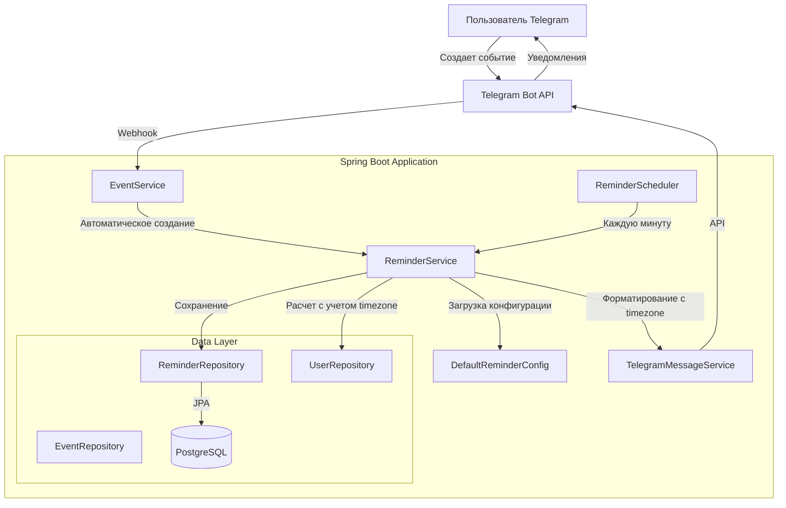
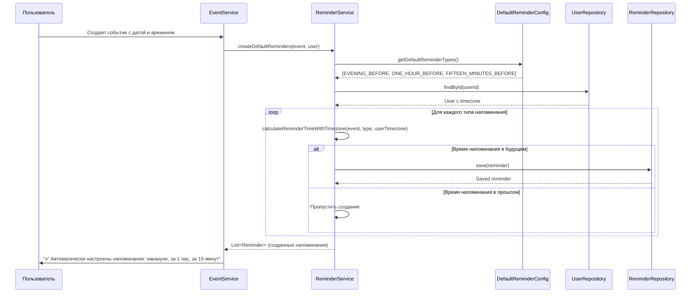

# Документ дизайна: Автоматические напоминания по умолчанию

## Обзор

Система автоматических напоминаний по умолчанию расширяет существующую функциональность напоминаний, добавляя автоматическое создание набора напоминаний при создании события. Это значительно улучшает пользовательский опыт, избавляя пользователей от необходимости вручную настраивать напоминания для каждого события.

Основные возможности:
- **Автоматическое создание напоминаний** при создании события с датой и временем
- **Учет часового пояса пользователя** при расчете времени напоминаний
- **Умная логика** - не создавать напоминания, если событие слишком скоро
- **Новый тип напоминания** FIFTEEN_MINUTES_BEFORE вместо TEN_MINUTES_BEFORE
- **Разные тексты уведомлений** в зависимости от времени отправки
- **Возможность отключить** автоматические напоминания для конкретного события

## Архитектура

### Компонентная диаграмма



### Поток данных: Автоматическое создание напоминаний




## Компоненты и интерфейсы

### 1. DefaultReminderConfig

Новый компонент для хранения конфигурации напоминаний по умолчанию.

**Ответственность:**
- Загрузка конфигурации из application.yml
- Предоставление списка типов напоминаний по умолчанию
- Управление глобальным флагом включения/отключения автоматических напоминаний

**Методы:**
```java
@Configuration
@ConfigurationProperties(prefix = "reminder.defaults")
public class DefaultReminderConfig {
    private boolean enabled = true;
    private List<ReminderType> types = List.of(
        ReminderType.EVENING_BEFORE,
        ReminderType.ONE_HOUR_BEFORE,
        ReminderType.FIFTEEN_MINUTES_BEFORE
    );
    
    public boolean isEnabled();
    public List<ReminderType> getTypes();
}
```

### 2. ReminderService (расширение существующего)

**Новые методы:**
```java
public class ReminderService {
    // Новые методы
    List<Reminder> createDefaultReminders(Event event, User user);
    void disableRemindersForEvent(Long eventId);
    LocalDateTime calculateReminderTimeWithTimezone(Event event, ReminderType type, ZoneId userTimezone);
    String formatReminderMessageByType(Reminder reminder, ZoneId recipientTimezone);
    
    // Модифицированные методы
    void sendReminders(); // Добавлена поддержка timezone при форматировании
}
```

### 3. EventService (модификация существующего)

**Изменения:**
- Добавление вызова `createDefaultReminders()` после создания события
- Добавление кнопки "🔕 Без автоматических напоминаний"
- Обработка отключения автоматических напоминаний

```java
public class EventService {
    // Новые методы
    void handleEventCreated(Event event, User user);
    void addReminderControlButtons(Long eventId, Long chatId, Integer messageId);
}
```

### 4. Reminder.ReminderType (модификация ENUM)

**Изменения:**
- Добавление нового типа `FIFTEEN_MINUTES_BEFORE`
- Сохранение `TEN_MINUTES_BEFORE` для обратной совместимости (deprecated)

```java
public enum ReminderType {
    MORNING_OF_DAY,
    EVENING_BEFORE,
    ONE_HOUR_BEFORE,
    @Deprecated
    TEN_MINUTES_BEFORE,
    FIFTEEN_MINUTES_BEFORE,  // Новый тип
    CUSTOM
}
```

## Модели данных

### Reminder (существующая модель, без изменений)

Модель остается без изменений, так как все необходимые поля уже присутствуют.

### User (существующая модель, без изменений)

Поле `timezone` уже существует и будет использоваться для расчета времени напоминаний.

## Correctness Properties

*A property is a characteristic or behavior that should hold true across all valid executions of a system-essentially, a formal statement about what the system should do. Properties serve as the bridge between human-readable specifications and machine-verifiable correctness guarantees.*


### Property 1: Автоматическое создание напоминаний по умолчанию

*Для любого* события с датой и временем, при создании события система должна автоматически создать набор напоминаний по умолчанию (если автоматические напоминания включены глобально).

**Validates: Requirements 1.1**

### Property 2: Создание всех типов напоминаний по умолчанию

*Для любого* события с датой и временем, созданный набор напоминаний должен включать все типы из конфигурации по умолчанию (EVENING_BEFORE, ONE_HOUR_BEFORE, FIFTEEN_MINUTES_BEFORE), если их время не находится в прошлом.

**Validates: Requirements 1.2, 1.3, 1.4**

### Property 3: Корректный расчет времени относительных напоминаний

*Для любого* события с датой и временем, и для любого относительного типа напоминания (ONE_HOUR_BEFORE, FIFTEEN_MINUTES_BEFORE), рассчитанное reminder_time должно быть ровно на указанное количество времени раньше времени начала события с учетом часового пояса создателя.

**Validates: Requirements 2.2, 2.3, 12.3**

### Property 4: Расчет напоминания "Вечером накануне" с учетом timezone

*Для любого* события с датой и временем, напоминание типа EVENING_BEFORE должно иметь reminder_time = 20:00 предыдущего дня в часовом поясе создателя события.

**Validates: Requirements 1.2, 2.1**

### Property 5: Отключение автоматических напоминаний

*Для любого* события с автоматически созданными напоминаниями, после отключения автоматических напоминаний все напоминания этого события должны быть удалены из базы данных.

**Validates: Requirements 3.2**

### Property 6: Умная логика пропуска напоминаний

*Для любого* события, если время начала события находится менее чем через N времени от текущего момента, то напоминание типа "За N времени" не должно быть создано. Аналогично, если событие на сегодня, напоминание EVENING_BEFORE не должно быть создано.

**Validates: Requirements 6.1, 6.2, 6.3**

### Property 7: Форматирование времени в timezone получателя

*Для любого* уведомления о напоминании, время события в сообщении должно быть отформатировано в часовом поясе получателя уведомления.

**Validates: Requirements 8.1**

### Property 8: Хранение reminder_time в UTC

*Для любого* напоминания в базе данных, поле reminder_time должно быть сохранено в UTC (без информации о часовом поясе).

**Validates: Requirements 8.5**

### Property 9: Уникальный формат сообщений по типам

*Для любого* напоминания, текст уведомления должен содержать уникальный префикс и структуру в зависимости от типа напоминания (🌙 для EVENING_BEFORE, ⏰ для ONE_HOUR_BEFORE, ⚡ для FIFTEEN_MINUTES_BEFORE), а также название события и время.

**Validates: Requirements 14.1, 14.2, 14.3**

### Property 10: Содержание полной информации о событии в уведомлении

*Для любого* уведомления о напоминании, сообщение должно содержать название события, дату, время, и эмодзи типа события (👤 для персональных, 👨‍👩‍👧‍👦 для семейных).

**Validates: Requirements 14.4, 14.5, 14.6, 14.7**

## Обработка ошибок

### 1. Ошибки создания автоматических напоминаний

**Сценарий:** Событие не имеет даты или времени
- **Обработка:** Пропустить создание автоматических напоминаний, показать сообщение "ℹ️ Добавьте время события для автоматических напоминаний"
- **Логирование:** INFO уровень с event_id

**Сценарий:** Все напоминания пропущены из-за времени в прошлом
- **Обработка:** Показать сообщение "ℹ️ Событие слишком скоро, автоматические напоминания не созданы"
- **Логирование:** INFO уровень с event_id

**Сценарий:** Автоматические напоминания отключены глобально
- **Обработка:** Не создавать напоминания, не показывать сообщение
- **Логирование:** DEBUG уровень

### 2. Ошибки расчета времени с timezone

**Сценарий:** Некорректный timezone у пользователя
- **Обработка:** Использовать timezone по умолчанию (Europe/Moscow), логировать предупреждение
- **Логирование:** WARN уровень с user_id и некорректным timezone

**Сценарий:** Ошибка конвертации timezone
- **Обработка:** Использовать UTC, логировать ошибку
- **Логирование:** ERROR уровень с полным stack trace

### 3. Ошибки отправки уведомлений с timezone

**Сценарий:** Ошибка форматирования времени в timezone получателя
- **Обработка:** Использовать UTC для отображения, логировать предупреждение
- **Логирование:** WARN уровень с user_id

## Стратегия тестирования

### Unit тесты

**ReminderService:**
- Создание автоматических напоминаний для события с датой и временем
- Пропуск создания для события без времени
- Пропуск создания напоминаний в прошлом
- Расчет времени напоминаний с различными timezone
- Форматирование сообщений с учетом timezone получателя
- Форматирование уникальных сообщений для каждого типа напоминания
- Отключение автоматических напоминаний для события

**DefaultReminderConfig:**
- Загрузка конфигурации из application.yml
- Использование значений по умолчанию при отсутствии конфигурации
- Проверка флага enabled

**EventService:**
- Вызов createDefaultReminders после создания события
- Добавление кнопки отключения автоматических напоминаний
- Обработка отключения напоминаний

### Property-based тесты

Будут использоваться для проверки correctness properties с использованием библиотеки **jqwik** для Java.

**Конфигурация:** Каждый property-based тест должен выполнять минимум 100 итераций.

**Property 1: Автоматическое создание напоминаний по умолчанию**
- Генератор: случайные события с датой и временем, случайные пользователи с разными timezone
- Проверка: для каждого события создаются напоминания

**Property 2: Создание всех типов напоминаний по умолчанию**
- Генератор: случайные события с датой и временем в будущем
- Проверка: созданы все типы из конфигурации

**Property 3: Корректный расчет времени относительных напоминаний**
- Генератор: случайные события, случайные timezone
- Проверка: reminder_time = event_time - N времени с учетом timezone

**Property 4: Расчет напоминания "Вечером накануне" с учетом timezone**
- Генератор: случайные события, случайные timezone
- Проверка: reminder_time = 20:00 предыдущего дня в timezone создателя

**Property 5: Отключение автоматических напоминаний**
- Генератор: случайные события с напоминаниями
- Проверка: после отключения количество напоминаний = 0

**Property 6: Умная логика пропуска напоминаний**
- Генератор: события с различным временем начала (прошлое, близкое будущее, далекое будущее)
- Проверка: напоминания создаются только когда это имеет смысл

**Property 7: Форматирование времени в timezone получателя**
- Генератор: случайные напоминания, случайные timezone получателей
- Проверка: время в сообщении соответствует timezone получателя

**Property 8: Хранение reminder_time в UTC**
- Генератор: случайные напоминания
- Проверка: все reminder_time в БД не содержат информации о timezone (хранятся как LocalDateTime)

**Property 9: Уникальный формат сообщений по типам**
- Генератор: напоминания всех типов
- Проверка: каждый тип имеет уникальный префикс (🌙, ⏰, ⚡)

**Property 10: Содержание полной информации о событии в уведомлении**
- Генератор: случайные напоминания с различными событиями
- Проверка: сообщение содержит название, дату, время, эмодзи типа

### Integration тесты

**Полный цикл автоматических напоминаний:**
1. Создание события через бота
2. Проверка автоматического создания напоминаний
3. Проверка корректности расчета времени с timezone
4. Имитация наступления времени напоминания
5. Проверка отправки уведомления с правильным форматом
6. Проверка форматирования времени в timezone получателя

**Тестирование с Testcontainers:**
- Использование PostgreSQL контейнера для integration тестов
- Проверка работы с реальной базой данных
- Тестирование с различными timezone


## Работа с часовыми поясами

### Принципы работы с timezone

1. **Хранение в базе данных:** Все временные метки (reminder_time, event_time) хранятся как `LocalDateTime` без информации о часовом поясе. Это упрощает работу с БД и избегает проблем с конвертацией.

2. **Расчет времени напоминаний:** При создании напоминания используется часовой пояс создателя события (`user.timezone`). Время рассчитывается в его timezone, затем сохраняется как LocalDateTime.

3. **Отправка уведомлений:** При отправке уведомления время события форматируется в часовом поясе получателя для корректного отображения.

4. **Планировщик:** Планировщик работает в timezone сервера (UTC или настроенный в системе) и сравнивает reminder_time с текущим временем сервера.

### Примеры работы с timezone

**Пример 1: Создание события**
- Пользователь в Москве (UTC+3) создает событие на 27 января 2026 в 15:00
- Система создает напоминание "За 1 час" с reminder_time = 27 января 2026 14:00 (в его timezone)
- В БД сохраняется LocalDateTime: 2026-01-27 14:00 (без timezone)

**Пример 2: Отправка уведомления**
- Событие создано пользователем в Москве (UTC+3) на 15:00
- Член семьи находится во Владивостоке (UTC+10)
- При отправке уведомления время форматируется как "15:00 по московскому времени" для создателя и "22:00 по владивостокскому времени" для члена семьи

**Пример 3: Напоминание "Вечером накануне"**
- Событие на 27 января 2026 в 15:00, пользователь в Лондоне (UTC+0)
- Напоминание создается на 26 января 2026 в 20:00 по лондонскому времени
- В БД: 2026-01-26 20:00

### Обработка edge cases с timezone

**Переход на летнее/зимнее время:**
- Система использует `ZoneId` из Java Time API, который автоматически учитывает переходы
- При расчете времени напоминания учитываются правила DST для конкретного timezone

**Изменение timezone пользователя:**
- Существующие напоминания не пересчитываются (они уже созданы с учетом старого timezone)
- Новые напоминания создаются с учетом нового timezone
- При отображении времени используется текущий timezone пользователя

## Производительность и масштабирование

### Оптимизация создания напоминаний

**Batch создание:**
- Все напоминания по умолчанию создаются одной транзакцией
- Используется `saveAll()` вместо множественных `save()`

**Кэширование конфигурации:**
- DefaultReminderConfig загружается один раз при старте приложения
- Изменения требуют перезапуска приложения

### Оптимизация отправки уведомлений

**Индексы базы данных:**
- Существующий индекс на `(sent, reminder_time)` используется для быстрого поиска
- Дополнительный индекс на `event_id` для быстрого получения напоминаний события

**Загрузка связанных сущностей:**
- Использование `@EntityGraph` для загрузки event.user.timezone одним запросом
- Избежание N+1 проблемы при форматировании времени

## Безопасность

### Валидация timezone

**Проверка корректности timezone:**
- При создании/обновлении пользователя проверяется, что timezone является валидным IANA timezone
- Используется `ZoneId.of(timezone)` с обработкой исключения

**Защита от некорректных данных:**
- Если timezone пользователя некорректен, используется значение по умолчанию (Europe/Moscow)
- Логируется предупреждение для дальнейшего исправления

### Защита от спама

**Ограничения:**
- Максимум 10 напоминаний на одно событие (существующее ограничение)
- Автоматические напоминания не учитываются в этом лимите отдельно

## Миграция и развертывание

### Изменения в базе данных

**Миграция ENUM ReminderType:**
```sql
-- V20__Add_fifteen_minutes_before_reminder_type.sql
-- Добавление нового значения в ENUM не требуется, так как используется VARCHAR
-- Просто начинаем использовать новое значение 'FIFTEEN_MINUTES_BEFORE'
```

**Миграция существующих напоминаний:**
```sql
-- V21__Migrate_ten_to_fifteen_minutes.sql
-- Опционально: можно мигрировать существующие TEN_MINUTES_BEFORE на FIFTEEN_MINUTES_BEFORE
-- Или оставить как есть для обратной совместимости
UPDATE reminders 
SET reminder_type = 'FIFTEEN_MINUTES_BEFORE', 
    reminder_time = reminder_time - INTERVAL '5 minutes'
WHERE reminder_type = 'TEN_MINUTES_BEFORE' 
  AND sent = false;
```

### Конфигурация

**application.yml:**
```yaml
reminder:
  defaults:
    enabled: true
    types:
      - EVENING_BEFORE
      - ONE_HOUR_BEFORE
      - FIFTEEN_MINUTES_BEFORE
  scheduler:
    enabled: true
    fixed-rate: 60000  # 1 минута
  max-per-event: 10
  max-custom-minutes: 43200  # 30 дней
```

### Развертывание

**Шаги:**
1. Обновление кода приложения
2. Применение миграций базы данных (если есть)
3. Обновление конфигурации application.yml
4. Перезапуск Spring Boot приложения
5. Проверка создания автоматических напоминаний в логах
6. Мониторинг метрик в первые 24 часа

**Rollback план:**
- Откат к предыдущей версии приложения
- Автоматические напоминания перестанут создаваться
- Существующие напоминания продолжат работать
- При повторном развертывании функциональность восстановится

**Обратная совместимость:**
- Существующие напоминания типа TEN_MINUTES_BEFORE продолжат работать
- Ручная настройка напоминаний остается доступной
- Пользователи могут отключить автоматические напоминания

## Мониторинг и метрики

### Ключевые метрики

**Создание автоматических напоминаний:**
- Количество созданных автоматических напоминаний в час
- Процент событий с автоматическими напоминаниями
- Количество отключений автоматических напоминаний

**Отправка уведомлений:**
- Количество отправленных уведомлений по типам (EVENING_BEFORE, ONE_HOUR_BEFORE, FIFTEEN_MINUTES_BEFORE)
- Среднее время форматирования сообщения с timezone
- Количество ошибок конвертации timezone

### Алерты

**Критические:**
- Более 50% ошибок при создании автоматических напоминаний
- Более 50% ошибок конвертации timezone

**Предупреждения:**
- Более 10% событий без автоматических напоминаний (возможно, проблема с конфигурацией)
- Более 5% ошибок конвертации timezone

## Будущие улучшения

### Фаза 2

- Персональные настройки автоматических напоминаний для каждого пользователя
- Возможность выбрать время для "утром" и "вечером" (сейчас фиксированные 9:00 и 20:00)
- Автоматические напоминания для повторяющихся событий
- Умные напоминания на основе местоположения

### Фаза 3

- Машинное обучение для предсказания оптимального времени напоминаний
- Интеграция с внешними календарями (Google Calendar, iCal)
- Групповые настройки автоматических напоминаний для семьи
- A/B тестирование различных наборов напоминаний по умолчанию
