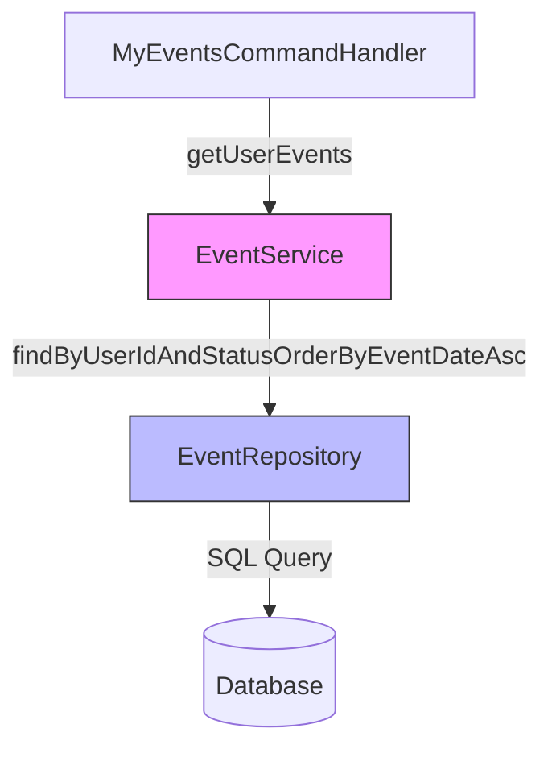

# Проектирование: Фильтрация удаленных событий в списке "Мои события"

## Обзор

Данный документ описывает проектное решение для исправления проблемы отображения удаленных событий в команде `/my_events`. Проблема заключается в том, что метод `getUserEvents()` в `EventService` использует репозиторный метод `findByUserIdOrderByEventDateAsc()`, который не фильтрует события по статусу, возвращая все события пользователя, включая удаленные (`DELETED`), черновики (`DRAFT`) и завершенные (`COMPLETED`).

## Архитектура

Решение затрагивает следующие компоненты:

1. **EventRepository** - добавление нового метода с фильтрацией по статусу
2. **EventService** - обновление метода `getUserEvents()` для использования фильтрации
3. **MyEventsCommandHandler** - без изменений (уже использует `EventService.getUserEvents()`)

### Диаграмма компонентов



## Компоненты и интерфейсы

### EventRepository

Добавляем новый метод для получения событий пользователя с фильтрацией по статусу:

```java
/**
 * Находит все события пользователя с определенным статусом, 
 * отсортированные по дате в порядке возрастания.
 * Использует @EntityGraph для загрузки связанных сущностей User и Family,
 * чтобы избежать N+1 проблемы при доступе к связанным данным.
 * 
 * @param userId идентификатор пользователя
 * @param status статус события (ACTIVE, DELETED, COMPLETED, DRAFT)
 * @return список событий пользователя с указанным статусом, 
 *         отсортированный по дате возрастания
 * @throws org.springframework.dao.DataAccessException если возникла ошибка доступа к БД
 */
@EntityGraph(attributePaths = {"user", "family"})
List<Event> findByUserIdAndStatusOrderByEventDateAsc(Long userId, Event.EventStatus status);
```

### EventService

Обновляем метод `getUserEvents()` для использования фильтрации по статусу `ACTIVE`:

```java
/**
 * Получает активные события пользователя.
 * 
 * <p>Возвращает только события со статусом ACTIVE, исключая:
 * <ul>
 *   <li>Удаленные события (DELETED) - доступны через /trash</li>
 *   <li>Черновики (DRAFT) - незавершенные события</li>
 *   <li>Завершенные события (COMPLETED) - прошедшие события</li>
 * </ul>
 * 
 * <p><b>Требования:</b> 1.1, 1.2, 1.3, 1.4, 3.1, 3.2, 3.3</p>
 * 
 * @param userId идентификатор пользователя
 * @return список активных событий пользователя, отсортированный по дате
 */
@Transactional(readOnly = true)
public List<Event> getUserEvents(Long userId) {
    log.debug("Получение активных событий пользователя ID={}", userId);
    
    List<Event> events = eventRepository.findByUserIdAndStatusOrderByEventDateAsc(
        userId, 
        Event.EventStatus.ACTIVE
    );
    
    log.debug("Найдено {} активных событий для пользователя ID={}", events.size(), userId);
    return events;
}
```

## Модели данных

### Event.EventStatus

Существующий enum со статусами событий:

```java
public enum EventStatus {
    DRAFT,      // Черновик - в процессе создания
    ACTIVE,     // Активное - готово к отображению
    COMPLETED,  // Завершенное - время прошло
    DELETED     // Удаленное - в корзине
}
```

## Свойства корректности

*Свойство - это характеристика или поведение, которое должно выполняться для всех допустимых выполнений системы - по сути, формальное утверждение о том, что система должна делать. Свойства служат мостом между человекочитаемыми спецификациями и машинно-проверяемыми гарантиями корректности.*

### Свойство 1: Фильтрация активных событий

*Для любого* пользователя, когда система получает список его событий через `getUserEvents()`, все возвращенные события должны иметь статус `ACTIVE`.

**Проверяет: Требования 1.1, 3.1, 3.2, 3.3**

### Свойство 2: Исключение удаленных событий

*Для любого* пользователя с удаленными событиями (статус `DELETED`), когда система получает список его событий через `getUserEvents()`, ни одно из возвращенных событий не должно иметь статус `DELETED`.

**Проверяет: Требования 1.2**

### Свойство 3: Исключение черновиков

*Для любого* пользователя с черновиками событий (статус `DRAFT`), когда система получает список его событий через `getUserEvents()`, ни одно из возвращенных событий не должно иметь статус `DRAFT`.

**Проверяет: Требования 1.3**

### Свойство 4: Исключение завершенных событий

*Для любого* пользователя с завершенными событиями (статус `COMPLETED`), когда система получает список его событий через `getUserEvents()`, ни одно из возвращенных событий не должно иметь статус `COMPLETED`.

**Проверяет: Требования 1.4**

### Свойство 5: Корзина содержит только удаленные события

*Для любого* пользователя, когда система получает список событий в корзине через `TrashService`, все возвращенные события должны иметь статус `DELETED`.

**Проверяет: Требования 2.1**

## Обработка ошибок

Изменения не вводят новых сценариев ошибок. Существующая обработка ошибок остается без изменений:

- `UserNotFoundException` - если пользователь не найден
- `DataAccessException` - при ошибках доступа к базе данных

## Стратегия тестирования

### Тесты на основе свойств (Property-Based Tests)

Используем библиотеку **jqwik** для Java (уже используется в проекте).

**Конфигурация:**
- Минимум 100 итераций на тест
- Каждый тест помечается комментарием с номером свойства

**Тесты:**

1. **Свойство 1: Фильтрация активных событий**
   - Генерируем случайного пользователя с событиями разных статусов
   - Вызываем `getUserEvents()`
   - Проверяем, что все возвращенные события имеют статус `ACTIVE`

2. **Свойство 2-4: Исключение событий с другими статусами**
   - Генерируем случайного пользователя с событиями всех статусов
   - Вызываем `getUserEvents()`
   - Проверяем, что ни одно событие не имеет статус `DELETED`, `DRAFT` или `COMPLETED`

3. **Свойство 5: Корзина содержит только удаленные события**
   - Генерируем случайного пользователя с событиями разных статусов
   - Вызываем метод получения корзины
   - Проверяем, что все возвращенные события имеют статус `DELETED`

### Unit-тесты

Дополнительные unit-тесты для конкретных сценариев:

1. **Пустой список событий**
   - Пользователь без событий
   - Ожидаем пустой список

2. **Только активные события**
   - Пользователь только с активными событиями
   - Ожидаем все события в результате

3. **Смешанные статусы**
   - Пользователь с событиями всех статусов
   - Ожидаем только активные события

4. **Сортировка по дате**
   - Проверяем, что события отсортированы по дате возрастания

### Integration-тесты

1. **Команда /my_events**
   - Создаем пользователя с событиями разных статусов
   - Вызываем команду `/my_events`
   - Проверяем, что отображаются только активные события

2. **Команда /trash**
   - Создаем пользователя с удаленными событиями
   - Вызываем команду `/trash`
   - Проверяем, что отображаются только удаленные события
