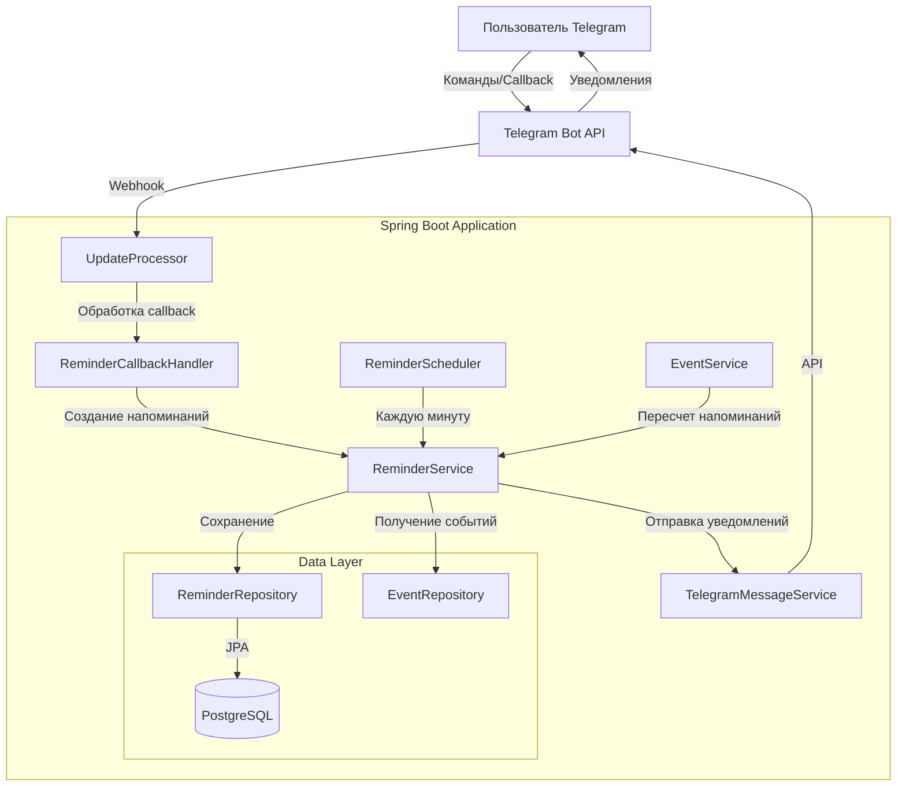
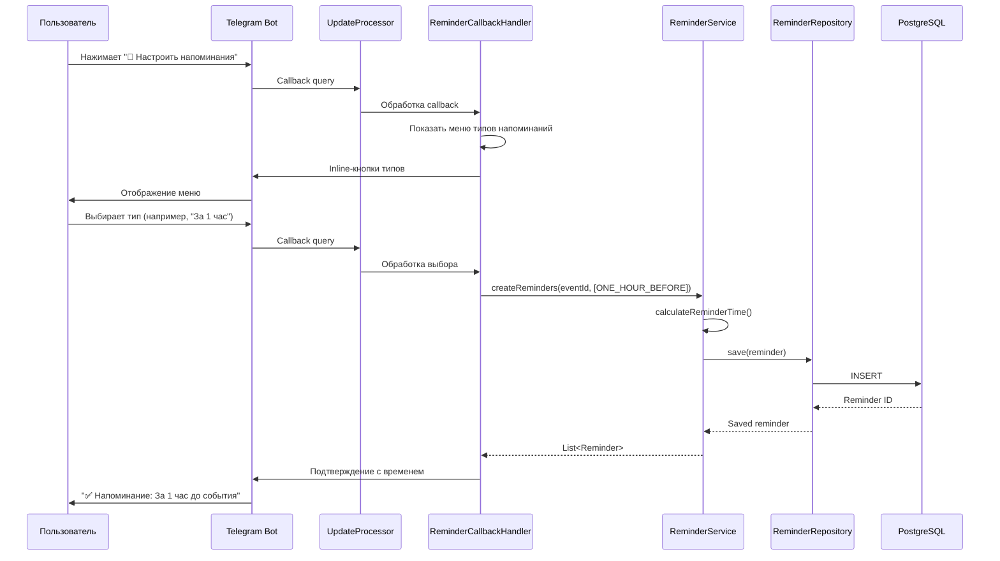
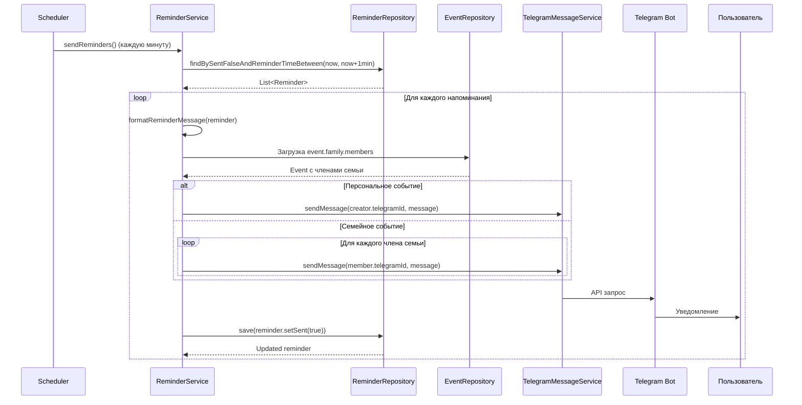

# Документ дизайна системы уведомлений о событиях

## Обзор

Система уведомлений о событиях предоставляет пользователям возможность настраивать гибкие напоминания для событий в семейном календаре и автоматически получать уведомления в заданное время. Система интегрируется с существующей архитектурой Spring Boot приложения и использует уже созданную инфраструктуру (модель Reminder, ReminderRepository, ReminderService).

Основные компоненты системы:
- **Интерфейс настройки напоминаний** - inline-кнопки для выбора типов напоминаний при создании/редактировании событий
- **Планировщик напоминаний** - автоматическая проверка и отправка уведомлений каждую минуту
- **Сервис управления напоминаниями** - создание, обновление, удаление и расчет времени напоминаний
- **Форматирование уведомлений** - создание информативных сообщений с деталями события

## Архитектура

### Компонентная диаграмма



### Поток данных

#### 1. Создание напоминаний



#### 2. Отправка напоминаний



## Компоненты и интерфейсы

### 1. ReminderCallbackHandler

Новый компонент для обработки callback-запросов, связанных с напоминаниями.

**Ответственность:**
- Обработка нажатий на кнопку "🔔 Настроить напоминания"
- Отображение меню выбора типов напоминаний
- Обработка выбора типов напоминаний
- Запрос и валидация пользовательского ввода для custom напоминаний
- Отображение списка настроенных напоминаний
- Обработка редактирования и удаления напоминаний

**Методы:**
```java
public class ReminderCallbackHandler {
    void handleSetupReminders(Long eventId, Long chatId, Integer messageId, String callbackQueryId);
    void handleReminderTypeSelection(Long eventId, ReminderType type, Long chatId, Integer messageId, String callbackQueryId);
    void handleCustomReminderInput(Long eventId, String input, Long chatId);
    void handleViewReminders(Long eventId, Long chatId, Integer messageId);
    void handleDeleteReminder(Long reminderId, Long chatId, Integer messageId, String callbackQueryId);
}
```

### 2. ReminderService (расширение существующего)

**Дополнительные методы:**
```java
public class ReminderService {
    // Существующие методы
    List<Reminder> createReminders(Long eventId, List<ReminderType> reminderTypes);
    Reminder createCustomReminder(Long eventId, int minutesBefore);
    void sendReminders(); // @Scheduled
    
    // Новые методы
    List<Reminder> getEventReminders(Long eventId);
    void deleteReminder(Long reminderId);
    void recalculateReminders(Long eventId);
    void markRemindersAsSent(Long eventId);
    boolean hasActiveReminders(Long eventId);
}
```

### 3. ReminderScheduler

Новый компонент-планировщик для автоматической отправки напоминаний.

**Ответственность:**
- Запуск проверки напоминаний каждую минуту
- Делегирование отправки в ReminderService
- Логирование работы планировщика

**Методы:**
```java
@Component
public class ReminderScheduler {
    @Scheduled(fixedRate = 60000) // Каждую минуту
    void checkAndSendReminders();
}
```

### 4. UpdateProcessor (модификация существующего)

**Изменения:**
- Добавление обработки callback для настройки напоминаний
- Интеграция с ReminderCallbackHandler

```java
// В методе handleCallbackQuery
if (callbackData.startsWith("setup_reminders_")) {
    reminderCallbackHandler.handleSetupReminders(...);
} else if (callbackData.startsWith("reminder_type_")) {
    reminderCallbackHandler.handleReminderTypeSelection(...);
} else if (callbackData.startsWith("view_reminders_")) {
    reminderCallbackHandler.handleViewReminders(...);
} else if (callbackData.startsWith("delete_reminder_")) {
    reminderCallbackHandler.handleDeleteReminder(...);
}
```

### 5. EventService (модификация существующего)

**Изменения:**
- Добавление кнопки "🔔 Настроить напоминания" при создании события
- Пересчет напоминаний при изменении даты/времени события
- Отметка напоминаний как отправленных при завершении события

```java
public class EventService {
    // Новые методы
    void addReminderButtonToEvent(Long eventId, Long chatId, Integer messageId);
    void handleEventDateTimeChange(Long eventId);
    void handleEventCompletion(Long eventId);
}
```

## Модели данных

### Reminder (существующая модель)

```java
@Entity
@Table(name = "reminders")
public class Reminder {
    @Id
    @GeneratedValue(strategy = GenerationType.IDENTITY)
    private Long id;
    
    @ManyToOne(fetch = FetchType.LAZY)
    @JoinColumn(name = "event_id", nullable = false)
    private Event event;
    
    @Enumerated(EnumType.STRING)
    @Column(name = "reminder_type", nullable = false)
    private ReminderType reminderType;
    
    @Column(name = "custom_minutes")
    private Integer customMinutes;
    
    @Column(name = "reminder_time", nullable = false)
    private LocalDateTime reminderTime;
    
    @Column(name = "sent", nullable = false)
    private Boolean sent = false;
    
    @Column(name = "sent_at")
    private LocalDateTime sentAt;
    
    public enum ReminderType {
        MORNING_OF_DAY,      // 9:00 в день события
        EVENING_BEFORE,      // 20:00 накануне
        ONE_HOUR_BEFORE,     // За 1 час
        TEN_MINUTES_BEFORE,  // За 10 минут
        CUSTOM               // Свое время
    }
}
```

### Связь с Event

```java
@Entity
@Table(name = "events")
public class Event {
    // Существующие поля...
    
    @OneToMany(mappedBy = "event", cascade = CascadeType.ALL, orphanRemoval = true)
    private List<Reminder> reminders = new ArrayList<>();
}
```

## Correctness Properties

*A property is a characteristic or behavior that should hold true across all valid executions of a system-essentially, a formal statement about what the system should do. Properties serve as the bridge between human-readable specifications and machine-verifiable correctness guarantees.*

### Property 1: Расчет времени напоминаний

*Для любого* события с датой и временем, и для любого типа напоминания (кроме CUSTOM), рассчитанное время напоминания должно быть раньше времени начала события и соответствовать правилам типа напоминания.

**Validates: Requirements 7.1, 7.2, 7.3, 7.4, 7.5**

### Property 2: Расчет custom напоминаний

*Для любого* события с датой и временем, и для любого положительного количества минут N, рассчитанное время custom напоминания должно быть ровно на N минут раньше времени начала события.

**Validates: Requirements 7.6**

### Property 3: Отправка напоминаний только в будущем

*Для любого* напоминания, если его reminder_time находится в прошлом более чем на 1 час, оно не должно быть отправлено планировщиком.

**Validates: Requirements 11.4**

### Property 4: Персональные события - уведомления только создателю

*Для любого* персонального события (is_personal=true), уведомления о напоминаниях должны отправляться только создателю события, а не всем членам семьи.

**Validates: Requirements 6.2**

### Property 5: Семейные события - уведомления всем членам

*Для любого* семейного события (is_personal=false), уведомления о напоминаниях должны отправляться всем членам семьи.

**Validates: Requirements 6.1**

### Property 6: Идемпотентность отправки

*Для любого* напоминания, после успешной отправки уведомления, повторный запуск планировщика не должен отправлять это напоминание снова (sent=true).

**Validates: Requirements 4.4**

### Property 7: Каскадное удаление напоминаний

*Для любого* события, при удалении события из базы данных, все связанные напоминания должны быть автоматически удалены.

**Validates: Requirements 9.1**

### Property 8: Пересчет при изменении времени события

*Для любого* события с напоминаниями, при изменении даты или времени события, все reminder_time должны быть пересчитаны в соответствии с новым временем события.

**Validates: Requirements 9.5**

### Property 9: Валидация custom_minutes

*Для любого* напоминания типа CUSTOM, поле custom_minutes должно быть NOT NULL и > 0, а для всех остальных типов должно быть NULL.

**Validates: Requirements 1.5**

### Property 10: Формат уведомления содержит обязательные поля

*Для любого* напоминания, отформатированное уведомление должно содержать название события, дату, время и тип напоминания.

**Validates: Requirements 5.1, 5.2, 5.3**

## Обработка ошибок

### 1. Ошибки создания напоминаний

**Сценарий:** Событие не имеет даты или времени
- **Обработка:** Выбросить `IllegalArgumentException` с сообщением "Событие должно иметь дату и время для создания напоминаний"
- **Логирование:** ERROR уровень с event_id

**Сценарий:** Время напоминания в прошлом
- **Обработка:** Пропустить создание напоминания, вернуть пустой список
- **Логирование:** WARN уровень с event_id и типом напоминания

**Сценарий:** Некорректное значение custom_minutes
- **Обработка:** Выбросить `IllegalArgumentException` с сообщением "Количество минут должно быть >= 1"
- **Логирование:** ERROR уровень с event_id и значением

### 2. Ошибки отправки уведомлений

**Сценарий:** Telegram API недоступен
- **Обработка:** Логировать ошибку, не отмечать напоминание как отправленное, повторить при следующем запуске
- **Логирование:** ERROR уровень с reminder_id и stack trace

**Сценарий:** Пользователь заблокировал бота
- **Обработка:** Логировать предупреждение, отметить напоминание как отправленное
- **Логирование:** WARN уровень с user_id

**Сценарий:** Ошибка отправки одному члену семьи
- **Обработка:** Продолжить отправку остальным членам семьи
- **Логирование:** ERROR уровень с user_id

### 3. Ошибки планировщика

**Сценарий:** Исключение при обработке напоминания
- **Обработка:** Логировать ошибку, продолжить обработку следующих напоминаний
- **Логирование:** ERROR уровень с reminder_id и stack trace

**Сценарий:** Событие удалено, но напоминание осталось
- **Обработка:** Пропустить напоминание, логировать предупреждение
- **Логирование:** WARN уровень с reminder_id

## Стратегия тестирования

### Unit тесты

**ReminderService:**
- Создание стандартных напоминаний с различными типами
- Создание custom напоминаний с различными значениями минут
- Расчет времени напоминаний для всех типов
- Форматирование сообщений уведомлений
- Обработка событий без даты/времени
- Обработка напоминаний в прошлом

**ReminderCallbackHandler:**
- Обработка callback для настройки напоминаний
- Обработка выбора типов напоминаний
- Валидация пользовательского ввода для custom напоминаний
- Отображение списка напоминаний
- Удаление напоминаний

**ReminderScheduler:**
- Запуск планировщика по расписанию
- Обработка пустого списка напоминаний
- Обработка ошибок отправки

### Property-based тесты

Будут использоваться для проверки correctness properties с использованием библиотеки **jqwik** для Java.

**Конфигурация:** Каждый property-based тест должен выполнять минимум 100 итераций.

**Property 1: Расчет времени напоминаний**
- Генератор: случайные события с датой и временем, все типы напоминаний (кроме CUSTOM)
- Проверка: reminder_time < event_time и соответствует правилам типа

**Property 2: Расчет custom напоминаний**
- Генератор: случайные события, случайные значения минут (1-10000)
- Проверка: reminder_time = event_time - N минут

**Property 3: Отправка напоминаний только в будущем**
- Генератор: напоминания с различными reminder_time (прошлое, настоящее, будущее)
- Проверка: напоминания с reminder_time < now - 1 час не отправляются

**Property 4: Персональные события - уведомления только создателю**
- Генератор: персональные события с несколькими членами семьи
- Проверка: уведомление отправлено только создателю

**Property 5: Семейные события - уведомления всем членам**
- Генератор: семейные события с различным количеством членов семьи
- Проверка: уведомления отправлены всем членам

**Property 6: Идемпотентность отправки**
- Генератор: случайные напоминания
- Проверка: после отправки sent=true, повторная отправка не происходит

**Property 7: Каскадное удаление напоминаний**
- Генератор: события с различным количеством напоминаний
- Проверка: после удаления события напоминания отсутствуют в БД

**Property 8: Пересчет при изменении времени события**
- Генератор: события с напоминаниями, случайные новые даты/времена
- Проверка: все reminder_time пересчитаны корректно

**Property 9: Валидация custom_minutes**
- Генератор: напоминания всех типов
- Проверка: CUSTOM имеет custom_minutes > 0, остальные NULL

**Property 10: Формат уведомления содержит обязательные поля**
- Генератор: случайные напоминания с различными событиями
- Проверка: сообщение содержит название, дату, время, тип

### Integration тесты

**Полный цикл создания и отправки напоминания:**
1. Создание события через бота
2. Настройка напоминания
3. Имитация наступления времени напоминания
4. Проверка отправки уведомления
5. Проверка обновления статуса напоминания

**Тестирование с Testcontainers:**
- Использование PostgreSQL контейнера для integration тестов
- Проверка работы с реальной базой данных
- Тестирование транзакций и каскадных операций

## Производительность и масштабирование

### Оптимизация запросов

**Индексы базы данных:**
- `idx_reminders_time_sent` - для быстрого поиска неотправленных напоминаний
- `idx_reminders_event_id` - для быстрого получения напоминаний события
- `idx_reminders_event_time` - для сортировки напоминаний по времени

**Загрузка связанных сущностей:**
- Использование `@EntityGraph` для загрузки event.family.members одним запросом
- Избежание N+1 проблемы при отправке уведомлений семейным событиям

### Планировщик

**Интервал проверки:** 1 минута
- Достаточно для своевременной отправки уведомлений
- Не создает избыточной нагрузки на базу данных

**Окно поиска:** [now, now + 1 минута]
- Гарантирует, что напоминания не будут пропущены
- Предотвращает повторную отправку

### Обработка большого количества напоминаний

**Batch обработка:**
- Если количество напоминаний > 100, обрабатывать батчами по 100
- Коммитить транзакцию после каждого батча

**Асинхронная отправка:**
- Рассмотреть использование `@Async` для отправки уведомлений
- Использовать thread pool для параллельной отправки

## Безопасность

### Валидация входных данных

**Custom minutes:**
- Проверка на положительное значение
- Ограничение максимального значения (например, 43200 минут = 30 дней)

**Event ID:**
- Проверка существования события
- Проверка прав доступа пользователя к событию

### Защита от спама

**Rate limiting:**
- Ограничение количества напоминаний на одно событие (например, максимум 10)
- Ограничение частоты создания напоминаний (например, не более 20 в минуту на пользователя)

### Логирование

**Чувствительные данные:**
- Не логировать telegram_id в открытом виде
- Не логировать содержимое сообщений полностью

## Мониторинг и метрики

### Ключевые метрики

**Отправка напоминаний:**
- Количество отправленных напоминаний в минуту
- Количество ошибок отправки
- Среднее время обработки одного напоминания

**Создание напоминаний:**
- Количество созданных напоминаний по типам
- Количество ошибок создания

**Планировщик:**
- Время выполнения каждого запуска
- Количество обработанных напоминаний за запуск

### Алерты

**Критические:**
- Планировщик не запускается более 5 минут
- Более 50% ошибок отправки уведомлений

**Предупреждения:**
- Более 10% ошибок отправки уведомлений
- Время выполнения планировщика > 30 секунд

## Миграция и развертывание

### База данных

Таблица `reminders` и ENUM `reminder_type` уже созданы миграцией V9.

### Конфигурация

**application.yml:**
```yaml
spring:
  task:
    scheduling:
      pool:
        size: 2  # Для планировщиков

reminder:
  scheduler:
    enabled: true
    fixed-rate: 60000  # 1 минута
  max-per-event: 10
  max-custom-minutes: 43200  # 30 дней
```

### Развертывание

**Шаги:**
1. Обновление кода приложения
2. Перезапуск Spring Boot приложения
3. Проверка запуска планировщика в логах
4. Мониторинг метрик в первые 24 часа

**Rollback план:**
- Откат к предыдущей версии приложения
- Напоминания в базе данных останутся, но не будут отправляться
- При повторном развертывании напоминания продолжат работу

## Будущие улучшения

### Фаза 2

- Поддержка часовых поясов пользователей
- Настройка времени для "утром" и "вечером" (сейчас фиксированные 9:00 и 20:00)
- Повторяющиеся напоминания для серий событий
- Отключение напоминаний для конкретного события

### Фаза 3

- Push-уведомления через Telegram
- Интеграция с внешними календарями (Google Calendar, iCal)
- Умные напоминания на основе местоположения
- Групповые настройки напоминаний для семьи
