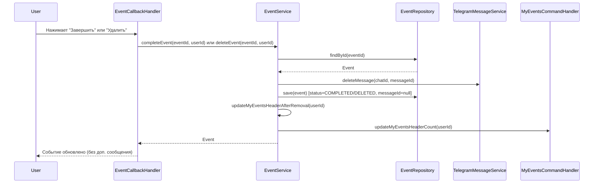

# Документ проектирования: Сообщение о пустом состоянии в /my_events

## Overview

Данный документ описывает проектирование механики отображения базового сообщения "У вас пока нет созданных событий" в команде `/my_events`, когда все активные события заканчиваются (завершаются или удаляются). Основная цель - обеспечить единообразный пользовательский опыт, аналогичный механике команды `/trash`.

Ключевые изменения:
- Удаление сообщений событий при завершении/удалении
- Автоматическое обновление шапки /my_events
- Отображение сообщения о пустом состоянии
- Управление флагом isMyEventsHeader при изменении списка событий

## Architecture

### Компоненты системы

1. **EventCallbackHandler** - обработчик callback-запросов событий
   - Обрабатывает завершение событий
   - Обрабатывает удаление событий
   - Удаляет сообщения событий
   - Обновляет шапку /my_events

2. **EventService** - бизнес-логика работы с событиями
   - Управление флагом `isMyEventsHeader`
   - Обновление счетчика в шапке
   - Отправка сообщения о пустом состоянии

3. **MyEventsCommandHandler** - обработчик команды `/my_events`
   - Уже имеет метод `updateMyEventsHeaderCount`
   - Уже отправляет сообщение о пустом состоянии при вызове команды
   - Требуется интеграция с новой механикой удаления сообщений

4. **TrashService** - сервис работы с корзиной
   - Обновление шапки /my_events при восстановлении событий
   - Уже имеет интеграцию с MyEventsCommandHandler

5. **TelegramMessageService** - сервис работы с Telegram API
   - Удаление сообщений
   - Редактирование сообщений
   - Отправка сообщений

### Диаграмма взаимодействия



## Components and Interfaces

### 1. EventService Updates

```java
@Service
@RequiredArgsConstructor
@Slf4j
public class EventService {
    
    private final EventRepository eventRepository;
    private final TelegramMessageService messageService;
    private final MyEventsCommandHandler myEventsCommandHandler;
    private final BotMessageBuilder botMessageBuilder;
    private final KeyboardService keyboardService;
    
    /**
     * Завершает событие и обновляет UI.
     * 
     * <p>Метод выполняет следующие действия:</p>
     * <ol>
     *   <li>Проверяет права доступа пользователя</li>
     *   <li>Удаляет сообщение события из чата</li>
     *   <li>Изменяет статус события на COMPLETED</li>
     *   <li>Сбрасывает messageId и флаги</li>
     *   <li>Обновляет шапку /my_events</li>
     * </ol>
     */
    @Transactional
    public Event completeEvent(Long eventId, Long userId) {
        Event event = eventRepository.findById(eventId)
            .orElseThrow(() -> new EventNotFoundException("Событие не найдено"));
        
        // Проверка прав доступа
        if (!event.belongsToUser(userId)) {
            throw new UnauthorizedAccessException("Нет прав на завершение");
        }
        
        // Удаляем сообщение события
        if (event.getMessageId() != null) {
            Long chatId = event.getUser().getTelegramId();
            messageService.deleteMessage(chatId, event.getMessageId().intValue());
        }
        
        // Завершаем событие
        event.setStatus(Event.EventStatus.COMPLETED);
        event.setMessageId(null);
        event.setIsMyEventsHeader(false);
        
        Event completedEvent = eventRepository.save(event);
        
        // Обновляем шапку /my_events
        updateMyEventsHeaderAfterRemoval(userId);
        
        return completedEvent;
    }
    
    /**
     * Удаляет событие (перемещает в корзину) и обновляет UI.
     * 
     * <p>Метод выполняет следующие действия:</p>
     * <ol>
     *   <li>Проверяет права доступа пользователя</li>
     *   <li>Удаляет сообщение события из чата</li>
     *   <li>Изменяет статус события на DELETED</li>
     *   <li>Сбрасывает messageId и флаги</li>
     *   <li>Обновляет шапку /my_events</li>
     * </ol>
     */
    @Transactional
    public Event deleteEvent(Long eventId, Long userId) {
        Event event = eventRepository.findById(eventId)
            .orElseThrow(() -> new EventNotFoundException("Событие не найдено"));
        
        // Проверка прав доступа
        if (!event.belongsToUser(userId)) {
            throw new UnauthorizedAccessException("Нет прав на удаление");
        }
        
        // Удаляем сообщение события
        if (event.getMessageId() != null) {
            Long chatId = event.getUser().getTelegramId();
            messageService.deleteMessage(chatId, event.getMessageId().intValue());
        }
        
        // Удаляем событие (перемещаем в корзину)
        event.setStatus(Event.EventStatus.DELETED);
        event.setDeletedAt(LocalDateTime.now());
        event.setMessageId(null);
        event.setIsMyEventsHeader(false);
        
        Event deletedEvent = eventRepository.save(event);
        
        // Обновляем шапку /my_events
        updateMyEventsHeaderAfterRemoval(userId);
        
        return deletedEvent;
    }
    
    /**
     * Обновляет шапку /my_events после удаления или завершения события.
     * 
     * <p>Метод выполняет следующие действия:</p>
     * <ol>
     *   <li>Получает актуальный список активных событий</li>
     *   <li>Если список пуст - отправляет сообщение о пустом состоянии</li>
     *   <li>Если есть события - обновляет флаг isMyEventsHeader и счетчик</li>
     * </ol>
     */
    @Transactional
    public void updateMyEventsHeaderAfterRemoval(Long userId) {
        List<Event> activeEvents = getUserEvents(userId);
        
        User user = userRepository.findById(userId)
            .orElseThrow(() -> new UserNotFoundException("Пользователь не найден"));
        
        Long chatId = user.getTelegramId();
        
        if (chatId == null) {
            log.warn("Не удалось получить chatId для пользователя ID={}", userId);
            return;
        }
        
        if (activeEvents.isEmpty()) {
            // Отправляем сообщение о пустом состоянии
            String emptyMessage = buildEmptyStateMessage();
            try {
                messageService.sendMessage(chatId, emptyMessage);
            } catch (Exception e) {
                log.error("Ошибка при отправке сообщения о пустом состоянии", e);
            }
            return;
        }
        
        // Находим новое первое событие
        Event newFirstEvent = activeEvents.get(0);
        
        // Устанавливаем флаг isMyEventsHeader
        if (!Boolean.TRUE.equals(newFirstEvent.getIsMyEventsHeader())) {
            newFirstEvent.setIsMyEventsHeader(true);
            eventRepository.save(newFirstEvent);
        }
        
        // Обновляем счетчик в шапке
        myEventsCommandHandler.updateMyEventsHeaderCount(userId);
    }
    
    /**
     * Формирует сообщение о пустом состоянии /my_events.
     */
    private String buildEmptyStateMessage() {
        StringBuilder message = new StringBuilder();
        message.append("📋 ").append(bold("Мои события")).append("\n\n");
        message.append(escape("У вас пока нет созданных событий.\n\n"));
        message.append(escape("Используйте ")).append(escape("/add_event")).append(escape(" для добавления нового события."));
        return message.toString();
    }
}
```

### 2. EventCallbackHandler Updates

```java
@Component
@RequiredArgsConstructor
@Slf4j
public class EventCallbackHandler implements CallbackHandler {
    
    private final EventService eventService;
    private final TelegramMessageService messageService;
    
    private void handleComplete(Long chatId, User user, Long eventId) {
        try {
            // Завершаем событие (внутри удаляется сообщение)
            Event completedEvent = eventService.completeEvent(eventId, user.getId());
            
            // НЕ отправляем дополнительное сообщение о завершении
            
        } catch (EventNotFoundException e) {
            // Обработка ошибок без отправки сообщений
            log.error("Событие не найдено: eventId={}", eventId, e);
        }
    }
    
    private void handleDelete(Long chatId, User user, Long eventId) {
        try {
            // Удаляем событие (внутри удаляется сообщение)
            Event deletedEvent = eventService.deleteEvent(eventId, user.getId());
            
            // НЕ отправляем дополнительное сообщение об удалении
            
        } catch (EventNotFoundException e) {
            // Обработка ошибок без отправки сообщений
            log.error("Событие не найдено: eventId={}", eventId, e);
        }
    }
}
```

### 3. TrashService Updates

```java
@Service
@RequiredArgsConstructor
@Slf4j
public class TrashService {
    
    private final EventRepository eventRepository;
    private final TelegramMessageService messageService;
    private final MyEventsCommandHandler myEventsCommandHandler;
    
    @Transactional
    public Event restoreEvent(Long eventId, Long userId) {
        Event event = eventRepository.findById(eventId)
            .orElseThrow(() -> new EventNotFoundException("Событие не найдено"));
        
        // ... существующая логика удаления сообщения и восстановления ...
        
        // Обновляем шапку /my_events
        myEventsCommandHandler.updateMyEventsHeaderCount(userId);
        
        // Обновляем шапку корзины
        updateTrashHeaderAfterRemoval(userId);
        
        return restoredEvent;
    }
}
```

## Data Models

Изменения в модели Event не требуются, так как поле `isMyEventsHeader` уже существует (добавлено в спецификации my-events-header-preservation).

## Correctness Properties


*A property is a characteristic or behavior that should hold true across all valid executions of a system-essentially, a formal statement about what the system should do. Properties serve as the bridge between human-readable specifications and machine-verifiable correctness guarantees.*

### Property 1: Удаление сообщения при изменении статуса события
*For any* событие с сохраненным messageId, при завершении или удалении события система должна вызвать deleteMessage с chatId пользователя и messageId события
**Validates: Requirements 1.1, 1.2, 1.3**

### Property 2: Отсутствие дополнительных уведомлений
*For any* событие, после завершения или удаления система не должна отправлять сообщения с текстом уведомления о завершении или удалении
**Validates: Requirements 1.4**

### Property 3: Перенос флага isMyEventsHeader
*For any* список активных событий с двумя или более событиями, где первое событие имеет isMyEventsHeader=true, после завершения или удаления первого события второе событие должно получить isMyEventsHeader=true
**Validates: Requirements 2.1**

### Property 4: Уникальность флага isMyEventsHeader
*For any* пользователь и любой момент времени, в списке активных событий этого пользователя должно быть не более одного события с isMyEventsHeader=true
**Validates: Requirements 2.2**

### Property 5: Обновление сообщения при установке флага
*For any* событие с messageId, при установке isMyEventsHeader=true система должна вызвать tryEditMessageText для обновления сообщения с добавлением шапки
**Validates: Requirements 2.3**

### Property 6: MarkdownV2 форматирование пустого состояния
*For any* сообщение о пустом состоянии, оно должно содержать корректное MarkdownV2 форматирование с экранированными специальными символами
**Validates: Requirements 3.2**

### Property 7: Консистентность сообщения о пустом состоянии
*For any* пользователь, сообщение о пустом состоянии должно быть идентичным независимо от того, вызвана ли команда /my_events для пустого списка или список стал пустым после удаления последнего события
**Validates: Requirements 3.1, 3.3**

### Property 8: Обновление счетчика при изменении списка
*For any* событие, после завершения или удаления система должна вызвать updateMyEventsHeaderCount для обновления счетчика в шапке
**Validates: Requirements 4.1, 4.2**

### Property 9: Использование editMessageText для обновления счетчика
*For any* обновление счетчика в шапке /my_events, система должна использовать метод tryEditMessageText Telegram API
**Validates: Requirements 4.3**

### Property 10: Обработка ошибок обновления счетчика
*For any* ошибка при обновлении счетчика в шапке, система должна логировать ошибку и продолжить работу без выброса исключения
**Validates: Requirements 4.4**

### Property 11: Обновление счетчика при восстановлении
*For any* событие, после восстановления из корзины система должна вызвать updateMyEventsHeaderCount для обновления счетчика в шапке
**Validates: Requirements 5.1**

### Property 12: Сохранение флагов при восстановлении
*For any* событие, восстанавливаемое из корзины, когда уже есть другие активные события, флаги isMyEventsHeader существующих событий не должны изменяться
**Validates: Requirements 5.3**

## Error Handling

### 1. Ошибки Telegram API

**Сценарий:** Не удается удалить сообщение (сообщение уже удалено пользователем)
- **Обработка:** Логировать предупреждение, продолжить выполнение операции
- **Код:** `log.warn("Не удалось удалить сообщение messageId={}: {}", messageId, e.getMessage())`

**Сценарий:** Не удается обновить сообщение с шапкой
- **Обработка:** Логировать ошибку, продолжить без выброса исключения
- **Код:** `messageService.tryEditMessageText()` возвращает boolean

### 2. Ошибки доступа

**Сценарий:** Пользователь пытается завершить/удалить чужое событие
- **Обработка:** Выбросить `UnauthorizedAccessException`
- **Сообщение:** "У вас нет доступа к этому событию"

### 3. Ошибки состояния

**Сценарий:** Попытка завершить уже завершенное событие
- **Обработка:** Выбросить `IllegalStateException`
- **Сообщение:** "Событие уже завершено"

### 4. Ошибки данных

**Сценарий:** Событие не найдено
- **Обработка:** Выбросить `EventNotFoundException`
- **Сообщение:** "Событие не найдено"

## Testing Strategy

### Unit Tests

1. **EventServiceTest**
   - Тест завершения события с удалением сообщения
   - Тест удаления события с удалением сообщения
   - Тест updateMyEventsHeaderAfterRemoval с пустым списком
   - Тест updateMyEventsHeaderAfterRemoval с одним событием
   - Тест updateMyEventsHeaderAfterRemoval с несколькими событиями
   - Тест обработки ошибок Telegram API

2. **EventCallbackHandlerTest**
   - Тест обработки завершения события
   - Тест обработки удаления события
   - Тест обработки ошибок доступа
   - Тест обработки ошибок состояния

3. **MyEventsCommandHandlerTest**
   - Тест отображения пустого состояния
   - Тест консистентности сообщения о пустом состоянии

### Property-Based Tests

Будут использоваться для проверки correctness properties, описанных выше. Используется библиотека jqwik для Java.

Каждое свойство будет протестировано с минимум 100 итерациями случайных данных.

### Integration Tests

1. **MyEventsEmptyStateIntegrationTest**
   - Полный цикл: создание события → завершение → проверка пустого состояния
   - Полный цикл: создание события → удаление → проверка пустого состояния
   - Проверка обновления шапки при изменении количества событий
   - Проверка восстановления события из корзины

## Implementation Notes

### 1. Порядок операций при завершении события

1. Удалить сообщение события из чата
2. Изменить статус события на COMPLETED
3. Сбросить messageId и isMyEventsHeader
4. Сохранить событие
5. Обновить шапку /my_events

### 2. Порядок операций при удалении события

1. Удалить сообщение события из чата
2. Изменить статус события на DELETED
3. Установить deletedAt
4. Сбросить messageId и isMyEventsHeader
5. Сохранить событие
6. Обновить шапку /my_events

### 3. Обновление шапки /my_events

1. Получить актуальный список активных событий
2. Если список пуст - отправить сообщение о пустом состоянии
3. Если есть события:
   - Найти новое первое событие
   - Установить isMyEventsHeader=true
   - Обновить сообщение с новым счетчиком

### 4. Fallback механизм

При ошибках форматирования MarkdownV2 использовать тот же fallback механизм, что уже реализован в MyEventsCommandHandler:
- Отправка без форматирования
- Сохранение inline-кнопок

## Dependencies

- Spring Boot 3.x
- Telegram Bots API
- JPA/Hibernate
- PostgreSQL
- jqwik (для property-based testing)
- Mockito (для unit testing)

## Migration Strategy

1. Обновить EventService для удаления сообщений при завершении/удалении
2. Добавить метод updateMyEventsHeaderAfterRemoval в EventService
3. Обновить EventCallbackHandler для использования новой логики
4. Обновить TrashService для интеграции с /my_events при восстановлении
5. Написать тесты
6. Провести интеграционное тестирование

## Performance Considerations

1. **Индексы базы данных**
   - Использовать существующий индекс на `(user_id, status)` для получения списка активных событий
   - Использовать существующий индекс на `(user_id, is_my_events_header)` для быстрого поиска события с шапкой

2. **Кэширование**
   - Не требуется, так как операции выполняются нечасто

3. **Batch операции**
   - При обновлении флагов isMyEventsHeader использовать batch update для нескольких событий

## Security Considerations

1. **Проверка прав доступа**
   - Всегда проверять, что пользователь является создателем события
   - Использовать метод `event.belongsToUser(userId)`

2. **Валидация входных данных**
   - Проверять, что eventId и userId не null
   - Проверять, что событие находится в активном состоянии перед завершением

3. **Защита от race conditions**
   - Использовать транзакции для атомарности операций
   - Использовать `@Transactional` аннотацию
