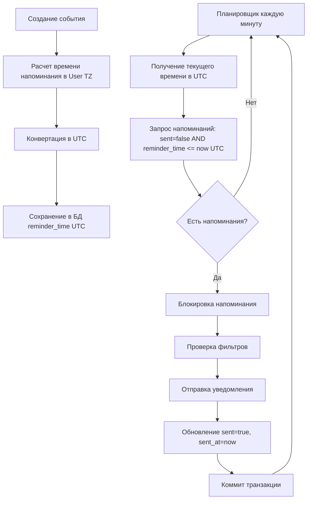

# Design Document: Исправление учета таймзоны при отправке напоминаний

## Overview

Этот документ описывает дизайн исправления критических проблем с учетом часовых поясов в системе отправки напоминаний.


Текущая система имеет три основные проблемы:

1. **Неправильное время отправки**: Напоминания отправляются со смещением относительно ожидаемого времени из-за несоответствия таймзон при сравнении времени.

2. **Дублирование напоминаний**: Некоторые напоминания отправляются несколько раз из-за того, что окно проверки (`now` до `now + 1 минута`) может захватывать одно и то же напоминание в нескольких итерациях планировщика.

3. **Пропуск напоминаний**: Некоторые напоминания не отправляются, если их время попадает между проверками планировщика.

Решение включает:
- Хранение всех времен напоминаний в UTC
- Использование UTC для сравнения времени при отправке
- Изменение логики окна проверки для предотвращения дублирования и пропусков
- Добавление пессимистических блокировок для предотвращения race conditions
- Миграция существующих данных

## Architecture

Архитектура решения основана на следующих принципах:

1. **Единая таймзона для хранения**: Все времена напоминаний хранятся в UTC в БД
2. **Конвертация на границах**: Конвертация между UTC и таймзоной пользователя происходит только при:
   - Расчете времени напоминания (User TZ → UTC)
   - Отображении времени пользователю (UTC → User TZ)
3. **Атомарность операций**: Отправка напоминания и обновление флага `sent` происходят в одной транзакции
4. **Идемпотентность**: Повторная обработка напоминания не приводит к повторной отправке

### Диаграмма потока данных



## Components and Interfaces

### 1. ReminderService

Основной сервис для работы с напоминаниями. Требует изменений в следующих методах:

#### calculateReminderTimeWithTimezone()

**Текущая реализация**: Возвращает `LocalDateTime` без явной таймзоны.

**Новая реализация**: 
- Рассчитывает время в таймзоне пользователя
- Конвертирует результат в UTC
- Возвращает `LocalDateTime` в UTC
- Добавляет подробное логирование

```java
/**
 * Рассчитывает время отправки напоминания в UTC.
 * 
 * @param event событие
 * @param type тип напоминания
 * @param userTimezone часовой пояс пользователя
 * @param customMinutes количество минут для CUSTOM типа
 * @return время напоминания в UTC
 */
public LocalDateTime calculateReminderTimeInUTC(
    Event event, 
    Reminder.ReminderType type,
    ZoneId userTimezone, 
    Integer customMinutes
) {
    // 1. Создать ZonedDateTime для времени события в user timezone
    ZonedDateTime eventZonedDateTime = ZonedDateTime.of(
        event.getEventDate(), 
        event.getEventTime(), 
        userTimezone
    );
    
    // 2. Рассчитать время напоминания в user timezone
    ZonedDateTime reminderZonedDateTime = calculateReminderZonedDateTime(
        eventZonedDateTime, type, customMinutes
    );
    
    // 3. Конвертировать в UTC
    ZonedDateTime reminderUTC = reminderZonedDateTime.withZoneSameInstant(ZoneId.of("UTC"));
    
    // 4. Логирование
    log.debug("Расчет времени напоминания: eventId={}, type={}, " +
             "userTZ={}, eventTime={}, reminderUserTZ={}, reminderUTC={}", 
             event.getId(), type, userTimezone,
             eventZonedDateTime.toLocalDateTime(),
             reminderZonedDateTime.toLocalDateTime(),
             reminderUTC.toLocalDateTime());
    
    // 5. Вернуть LocalDateTime в UTC
    return reminderUTC.toLocalDateTime();
}
```

#### sendReminders()

**Текущая реализация**: 
- Использует `LocalDateTime.now()` без таймзоны
- Окно проверки: `BETWEEN now AND now+1min`
- Может захватывать одно напоминание несколько раз

**Новая реализация**:
- Использует `LocalDateTime.now(ZoneId.of("UTC"))` для получения текущего времени в UTC
- Окно проверки: `reminder_time <= now AND sent = false`
- Использует пессимистическую блокировку `PESSIMISTIC_WRITE`
- Атомарное обновление `sent` флага

```java
@Scheduled(fixedRate = 60000)
@Transactional
public void sendReminders() {
    // 1. Получить текущее время в UTC
    LocalDateTime nowUTC = LocalDateTime.now(ZoneId.of("UTC"));
    LocalDateTime oneHourAgo = nowUTC.minusHours(1);
    
    log.debug("Проверка напоминаний: nowUTC={}, oneHourAgo={}", nowUTC, oneHourAgo);
    
    // 2. Найти напоминания для отправки
    // reminder_time <= nowUTC AND sent = false AND reminder_time >= oneHourAgo
    List<Reminder> reminders = reminderRepository
        .findBySentFalseAndReminderTimeLessThanEqualAndReminderTimeGreaterThanEqual(
            nowUTC, oneHourAgo
        );
    
    // 3. Обработать каждое напоминание
    for (Reminder reminder : reminders) {
        try {
            // 3.1. Получить блокировку на напоминание
            Reminder lockedReminder = reminderRepository
                .findByIdWithLock(reminder.getId());
            
            // 3.2. Проверить, что напоминание еще не отправлено
            if (lockedReminder.isSent()) {
                log.debug("Напоминание ID {} уже отправлено, пропуск", reminder.getId());
                continue;
            }
            
            // 3.3. Применить фильтры
            if (!shouldSendReminder(lockedReminder, nowUTC)) {
                continue;
            }
            
            // 3.4. Отправить напоминание
            sendReminderNotification(lockedReminder);
            
            // 3.5. Атомарно обновить флаг sent
            lockedReminder.setSent(true);
            lockedReminder.setSentAt(nowUTC);
            reminderRepository.save(lockedReminder);
            
            log.info("Напоминание отправлено: id={}, eventId={}, reminderTimeUTC={}, sentAtUTC={}",
                    lockedReminder.getId(), 
                    lockedReminder.getEvent().getId(),
                    lockedReminder.getReminderTime(),
                    nowUTC);
            
        } catch (Exception e) {
            log.error("Ошибка при отправке напоминания ID {}: {}", 
                     reminder.getId(), e.getMessage(), e);
        }
    }
}

private boolean shouldSendReminder(Reminder reminder, LocalDateTime nowUTC) {
    Event event = reminder.getEvent();
    
    // Фильтр 1: Событие не удалено
    if (event.getStatus() == Event.EventStatus.DELETED) {
        log.debug("Пропуск напоминания ID {}: событие удалено", reminder.getId());
        return false;
    }
    
    // Фильтр 2: Событие не в прошлом (с учетом UTC)
    LocalDateTime eventDateTimeUTC = ZonedDateTime.of(
        event.getEventDate(), 
        event.getEventTime(),
        getUserTimezone(event.getUser())
    ).withZoneSameInstant(ZoneId.of("UTC")).toLocalDateTime();
    
    if (eventDateTimeUTC.isBefore(nowUTC)) {
        log.debug("Пропуск напоминания ID {}: событие в прошлом", reminder.getId());
        return false;
    }
    
    return true;
}
```

### 2. ReminderRepository

Требуется добавить новые методы для поддержки новой логики:

```java
/**
 * Находит неотправленные напоминания, время которых наступило.
 * Использует <= вместо BETWEEN для предотвращения пропусков.
 * 
 * @param nowUTC текущее время в UTC
 * @param oneHourAgo время час назад в UTC (для фильтрации старых напоминаний)
 * @return список напоминаний для отправки
 */
List<Reminder> findBySentFalseAndReminderTimeLessThanEqualAndReminderTimeGreaterThanEqual(
    LocalDateTime nowUTC, 
    LocalDateTime oneHourAgo
);

/**
 * Находит напоминание по ID с пессимистической блокировкой.
 * Предотвращает одновременную обработку одного напоминания.
 * 
 * @param id идентификатор напоминания
 * @return напоминание с блокировкой
 */
@Lock(LockModeType.PESSIMISTIC_WRITE)
@Query("SELECT r FROM Reminder r WHERE r.id = :id")
Optional<Reminder> findByIdWithLock(@Param("id") Long id);
```

### 3. Миграция данных

Требуется создать скрипт миграции для конвертации существующих напоминаний:

```sql
-- V23__Convert_reminder_times_to_utc.sql

-- Добавляем временную колонку для хранения оригинального времени
ALTER TABLE reminders ADD COLUMN reminder_time_original TIMESTAMP;

-- Копируем текущие значения
UPDATE reminders SET reminder_time_original = reminder_time;

-- Конвертируем времена напоминаний в UTC
-- Предполагаем, что текущие времена в Europe/Moscow (UTC+3)
-- Для production нужно использовать timezone из users.timezone

UPDATE reminders r
SET reminder_time = r.reminder_time - INTERVAL '3 hours'
WHERE r.sent = false;

-- Логируем количество обновленных записей
-- (в реальной миграции используем DO блок для логирования)

-- Комментарий для отката:
-- UPDATE reminders SET reminder_time = reminder_time_original WHERE reminder_time_original IS NOT NULL;
```

## Data Models

### Reminder

Модель не требует изменений в структуре, но требует изменений в семантике:

**Текущая семантика**:
- `reminder_time`: LocalDateTime в неопределенной таймзоне (предположительно в таймзоне пользователя)

**Новая семантика**:
- `reminder_time`: LocalDateTime в UTC
- При сохранении: конвертируется из User TZ в UTC
- При чтении: интерпретируется как UTC
- При отображении: конвертируется из UTC в User TZ

```java
@Entity
@Table(name = "reminders")
public class Reminder {
    // ... существующие поля ...
    
    /**
     * Время отправки напоминания в UTC.
     * 
     * ВАЖНО: Это поле хранит время в UTC, независимо от таймзоны пользователя.
     * При расчете времени напоминания оно конвертируется из таймзоны пользователя в UTC.
     * При отображении пользователю оно конвертируется из UTC в таймзону пользователя.
     */
    @Column(name = "reminder_time", nullable = false)
    private LocalDateTime reminderTime; // В UTC!
    
    // ... остальные поля ...
}
```

## Correctness Properties

*Свойство (property) - это характеристика или поведение, которое должно выполняться для всех допустимых выполнений системы. Свойства служат мостом между человекочитаемыми спецификациями и машинно-проверяемыми гарантиями корректности.*


### Property 1: UTC Consistency для расчета и сравнения времени

*Для любого* напоминания, время которого рассчитано в таймзоне пользователя и сконвертировано в UTC, при сравнении с текущим временем в UTC должно использоваться одинаковое представление времени (UTC).

**Validates: Requirements 1.1, 1.2, 1.4**

### Property 2: Корректная конвертация времени между таймзонами

*Для любого* события с временем в таймзоне пользователя, расчет времени напоминания должен корректно конвертироваться в UTC, и обратная конвертация должна давать исходное время в таймзоне пользователя.

**Validates: Requirements 1.3, 4.2, 4.4**

### Property 3: Round-trip конвертация времени напоминания

*Для любого* времени напоминания, сохраненного в UTC, чтение из БД и интерпретация как UTC должны давать то же самое время.

**Validates: Requirements 4.1, 4.3**

### Property 4: Идемпотентность отправки напоминаний

*Для любого* напоминания, повторная проверка планировщиком после отправки не должна приводить к повторной отправке (sent=true исключает напоминание из выборки).

**Validates: Requirements 1.5, 2.1, 2.2, 2.4**

### Property 5: Отсутствие пропуска напоминаний

*Для любого* напоминания с reminder_time <= now AND sent=false, оно должно быть захвачено окном проверки и отправлено.

**Validates: Requirements 3.1, 3.2**

### Property 6: Восстановление после сбоя

*Для любого* неотправленного напоминания с reminder_time в диапазоне [now - 1 hour, now], оно должно быть отправлено при следующей проверке планировщика.

**Validates: Requirements 3.4**

### Property 7: Корректная обработка разных таймзон

*Для любых* двух пользователей в разных таймзонах с событиями в одно и то же абсолютное время (UTC), их напоминания должны быть отправлены в одно и то же абсолютное время (UTC).

**Validates: Requirements 1.3**

## Error Handling

### 1. Ошибки конвертации таймзоны

**Сценарий**: Некорректная таймзона пользователя или ошибка при конвертации.

**Обработка**:
- Логирование ошибки с полными деталями
- Fallback на UTC
- Продолжение работы с UTC
- Уведомление в логах о необходимости исправить таймзону пользователя

```java
private ZoneId getUserTimezoneWithFallback(User user) {
    try {
        if (user.getTimezone() == null || user.getTimezone().isBlank()) {
            log.warn("Пользователь ID {} не имеет установленного timezone, используется UTC", 
                    user.getId());
            return ZoneId.of("UTC");
        }
        return ZoneId.of(user.getTimezone());
    } catch (Exception e) {
        log.error("Некорректный timezone '{}' у пользователя ID {}, используется UTC: {}", 
                user.getTimezone(), user.getId(), e.getMessage(), e);
        return ZoneId.of("UTC");
    }
}
```

### 2. Race Conditions при отправке

**Сценарий**: Два экземпляра планировщика пытаются отправить одно напоминание одновременно.

**Обработка**:
- Использование пессимистической блокировки `PESSIMISTIC_WRITE`
- Проверка флага `sent` после получения блокировки
- Пропуск уже отправленных напоминаний

```java
try {
    Reminder lockedReminder = reminderRepository.findByIdWithLock(reminder.getId());
    
    if (lockedReminder.isSent()) {
        log.debug("Напоминание ID {} уже отправлено другим процессом, пропуск", 
                 reminder.getId());
        continue;
    }
    
    // Отправка и обновление флага
    
} catch (PessimisticLockingFailureException e) {
    log.warn("Не удалось получить блокировку на напоминание ID {}, пропуск: {}", 
            reminder.getId(), e.getMessage());
}
```

### 3. Ошибки отправки уведомлений

**Сценарий**: Telegram API недоступен или возвращает ошибку.

**Обработка**:
- Логирование ошибки
- НЕ обновлять флаг `sent` при ошибке
- Напоминание будет повторно обработано при следующей проверке
- Если напоминание старше 1 часа, отметить как sent для предотвращения бесконечных попыток

```java
try {
    sendReminderNotification(reminder);
    
    reminder.setSent(true);
    reminder.setSentAt(nowUTC);
    reminderRepository.save(reminder);
    
} catch (TelegramApiException e) {
    log.error("Ошибка отправки напоминания ID {}: {}", 
             reminder.getId(), e.getMessage(), e);
    
    // Если напоминание старше 1 часа, отметить как sent
    if (reminder.getReminderTime().isBefore(nowUTC.minusHours(1))) {
        log.warn("Напоминание ID {} старше 1 часа, отмечаем как sent для предотвращения повторов", 
                reminder.getId());
        reminder.setSent(true);
        reminder.setSentAt(nowUTC);
        reminderRepository.save(reminder);
    }
}
```

### 4. Миграция существующих данных

**Сценарий**: Существующие напоминания имеют время в неопределенной таймзоне.

**Обработка**:
- Создание миграционного скрипта для конвертации
- Предположение: существующие времена в Europe/Moscow (UTC+3)
- Сохранение оригинальных значений во временной колонке
- Возможность отката миграции
- Подробное логирование процесса миграции

## Testing Strategy

### Unit Tests

Unit-тесты будут проверять:

1. **Расчет времени напоминаний**:
   - Корректная конвертация из User TZ в UTC
   - Обработка разных типов напоминаний (MORNING_OF_DAY, ONE_HOUR_BEFORE, и т.д.)
   - Edge cases: переход через полночь, летнее/зимнее время

2. **Фильтрация напоминаний**:
   - Исключение напоминаний с sent=true
   - Исключение удаленных событий
   - Исключение событий в прошлом

3. **Конвертация времени**:
   - Round-trip конвертация User TZ → UTC → User TZ
   - Обработка некорректных таймзон (fallback на UTC)

4. **Логирование**:
   - Проверка наличия нужной информации в логах
   - Проверка логирования ошибок

### Property-Based Tests

Property-тесты будут проверять:

1. **Property 1: UTC Consistency**
   - Генерация случайных событий в разных таймзонах
   - Расчет времени напоминания
   - Проверка, что сравнение использует UTC

2. **Property 2: Корректная конвертация**
   - Генерация случайных событий и таймзон
   - Расчет времени напоминания в UTC
   - Обратная конвертация в User TZ
   - Проверка, что результат совпадает с исходным временем

3. **Property 3: Round-trip**
   - Генерация случайных времен напоминаний
   - Сохранение в UTC
   - Чтение из БД
   - Проверка, что время не изменилось

4. **Property 4: Идемпотентность**
   - Генерация случайных напоминаний
   - Отправка напоминания
   - Повторная проверка планировщиком
   - Проверка, что напоминание не отправлено повторно

5. **Property 5: Отсутствие пропуска**
   - Генерация случайных напоминаний с reminder_time <= now
   - Проверка, что все они захвачены окном проверки

6. **Property 6: Восстановление после сбоя**
   - Генерация напоминаний в прошлом (но не старше часа)
   - Проверка, что они отправляются при следующей проверке

7. **Property 7: Разные таймзоны**
   - Генерация событий для пользователей в разных таймзонах
   - Проверка, что напоминания отправляются в правильное абсолютное время

### Integration Tests

Integration-тесты будут проверять:

1. **Параллельная обработка**:
   - Запуск нескольких экземпляров планировщика
   - Проверка, что напоминание отправлено только один раз
   - Проверка работы пессимистических блокировок

2. **Полный цикл**:
   - Создание события
   - Создание напоминаний
   - Ожидание времени отправки
   - Проверка отправки уведомлений
   - Проверка обновления флага sent

3. **Миграция данных**:
   - Создание тестовых данных в старом формате
   - Выполнение миграции
   - Проверка корректности конвертации

### Test Configuration

- **Минимум 100 итераций** для каждого property-теста
- **Тег для каждого теста**: `Feature: reminder-timezone-fix, Property N: [property_text]`
- **Использование библиотеки**: jqwik для property-based testing в Java
- **Моки**: Минимальное использование моков, предпочтение реальным объектам
- **Testcontainers**: Использование для integration-тестов с реальной БД

## Implementation Notes

### 1. Порядок внедрения

1. **Фаза 1**: Обновление ReminderService
   - Изменение `calculateReminderTimeWithTimezone()` для возврата UTC
   - Обновление `sendReminders()` для использования UTC
   - Добавление подробного логирования

2. **Фаза 2**: Обновление ReminderRepository
   - Добавление новых методов запросов
   - Добавление метода с блокировкой

3. **Фаза 3**: Миграция данных
   - Создание миграционного скрипта
   - Тестирование на копии production данных
   - Выполнение миграции

4. **Фаза 4**: Тестирование
   - Написание unit-тестов
   - Написание property-тестов
   - Написание integration-тестов

5. **Фаза 5**: Мониторинг
   - Развертывание в production
   - Мониторинг логов
   - Проверка корректности отправки напоминаний

### 2. Обратная совместимость

- Миграционный скрипт сохраняет оригинальные значения во временной колонке
- Возможность отката миграции
- Fallback на UTC при ошибках конвертации
- Подробное логирование для отладки

### 3. Производительность

- Использование индексов на `reminder_time` и `sent`
- Пессимистические блокировки только на время обработки одного напоминания
- Batch обработка напоминаний
- Ограничение окна проверки (не старше 1 часа)

### 4. Мониторинг

Ключевые метрики для мониторинга:

- Количество отправленных напоминаний в час
- Количество пропущенных напоминаний (старше 1 часа)
- Количество ошибок конвертации таймзоны
- Количество ошибок отправки уведомлений
- Среднее время обработки одного напоминания
- Количество race conditions (попытки получить уже заблокированное напоминание)

Логи для мониторинга:

- `log.info("Напоминание отправлено: ...")` - успешная отправка
- `log.warn("Пропуск старого напоминания: ...")` - пропуск старых напоминаний
- `log.error("Ошибка отправки напоминания: ...")` - ошибки отправки
- `log.error("Некорректный timezone: ...")` - проблемы с таймзонами
