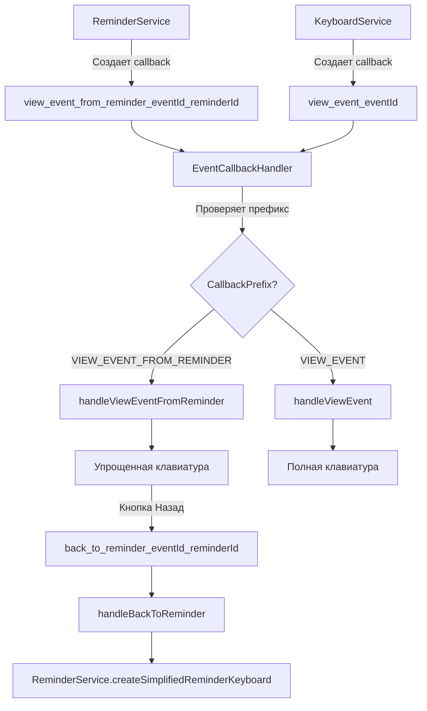

# Design Document: Исправление контекста просмотра деталей события из напоминания

## Overview

Данный дизайн описывает исправление логики определения контекста просмотра деталей события. Текущая реализация использует проверку наличия активных напоминаний (`hasActiveReminders()`) для определения, откуда был вызван просмотр. Это приводит к неправильному поведению: если у события есть активные напоминания, то при просмотре из любого места (например, из списка "Мои события") пользователь видит упрощенную клавиатуру только с кнопкой "Назад к напоминанию" вместо полной клавиатуры с действиями.

Правильное решение - передавать информацию о контексте в callback data. При создании кнопки "Посмотреть детали" в уведомлении о напоминании будет использоваться специальный формат callback data, который включает как eventId, так и reminderId. При обработке callback система будет определять контекст по формату callback data, а не по состоянию события.

### Ключевые изменения

1. **Добавление нового префикса callback**: `VIEW_EVENT_FROM_REMINDER` для отличия просмотра из напоминания от обычного просмотра
2. **Обновление ReminderService**: использование нового формата callback data `view_event_from_reminder_{eventId}_{reminderId}`
3. **Обновление EventCallbackHandler**: добавление метода `handleViewEventFromReminder()` для обработки нового формата
4. **Удаление неправильной логики**: удаление метода `hasActiveReminders()` и связанной логики определения контекста
5. **Обратная совместимость**: старые callback `view_event_{eventId}` продолжат работать, показывая полную клавиатуру

## Architecture

### Текущая архитектура (проблемная)

```
Уведомление о напоминании
    ↓
Кнопка "Посмотреть детали" (callback: view_event_{eventId})
    ↓
EventCallbackHandler.handleViewEvent()
    ↓
Проверка hasActiveReminders(event) ← ПРОБЛЕМА: проверяет состояние события
    ↓
Если true → Упрощенная клавиатура (неправильно для просмотра из списка)
Если false → Полная клавиатура
```

**Проблема**: Метод `hasActiveReminders()` проверяет состояние события, а не источник вызова. Если у события есть активные напоминания, то при просмотре из любого места (список событий, поиск) пользователь видит упрощенную клавиатуру.

### Новая архитектура (правильная)

```
Уведомление о напоминании
    ↓
Кнопка "Посмотреть детали" (callback: view_event_from_reminder_{eventId}_{reminderId})
    ↓
EventCallbackHandler.handle()
    ↓
Проверка CallbackPrefix.VIEW_EVENT_FROM_REMINDER.matches()
    ↓
Если true → handleViewEventFromReminder() → Упрощенная клавиатура
Если false → handleViewEvent() → Полная клавиатура

Список событий / Поиск
    ↓
Кнопка "Посмотреть детали" (callback: view_event_{eventId})
    ↓
EventCallbackHandler.handle()
    ↓
Проверка CallbackPrefix.VIEW_EVENT.matches()
    ↓
handleViewEvent() → Полная клавиатура
```

**Решение**: Контекст определяется по формату callback data, а не по состоянию события. Каждый источник использует свой формат callback.

### Диаграмма компонентов




## Components and Interfaces

### 1. CallbackPrefix (Enum)

**Файл**: `src/main/java/ru/golubyatnikov/family/calendar/bot/model/CallbackPrefix.java`

**Изменения**: Добавление нового префикса для callback из напоминаний

```java
public enum CallbackPrefix {
    // ... существующие префиксы ...
    
    /** Просмотр деталей события (формат: view_event_{eventId}) */
    VIEW_EVENT("view_event_"),
    
    /** Просмотр деталей события из напоминания (формат: view_event_from_reminder_{eventId}_{reminderId}) */
    VIEW_EVENT_FROM_REMINDER("view_event_from_reminder_"),
    
    /** Возврат к минималистичному виду напоминания (формат: back_to_reminder_{eventId}_{reminderId}) */
    BACK_TO_REMINDER("back_to_reminder_"),
    
    // ... остальные префиксы ...
}
```

**Методы**:
- `matches(String callbackData)` - проверяет соответствие callback data префиксу
- `extractPayload(String callbackData)` - извлекает payload (часть после префикса)
- `withPayload(String payload)` - создает callback data с payload

**Примеры использования**:
```java
// Создание callback data
String callback = CallbackPrefix.VIEW_EVENT_FROM_REMINDER.withPayload("123_456");
// Результат: "view_event_from_reminder_123_456"

// Проверка соответствия
boolean matches = CallbackPrefix.VIEW_EVENT_FROM_REMINDER.matches("view_event_from_reminder_123_456");
// Результат: true

// Извлечение payload
String payload = CallbackPrefix.VIEW_EVENT_FROM_REMINDER.extractPayload("view_event_from_reminder_123_456");
// Результат: "123_456"
```

### 2. ReminderService

**Файл**: `src/main/java/ru/golubyatnikov/family/calendar/bot/service/ReminderService.java`

**Изменения**: Обновление метода создания упрощенной клавиатуры для использования нового формата callback

**Текущая реализация**:
```java
public InlineKeyboardMarkup createSimplifiedReminderKeyboard(Event event) {
    var viewButton = InlineKeyboardButton.builder()
        .text("📋 Посмотреть детали")
        .callbackData("view_event_" + event.getId())  // ← Старый формат
        .build();
    
    rows.add(List.of(viewButton));
    keyboard.setKeyboard(rows);
    return keyboard;
}
```

**Новая реализация**:
```java
public InlineKeyboardMarkup createSimplifiedReminderKeyboard(Event event, Long reminderId) {
    var viewButton = InlineKeyboardButton.builder()
        .text("📋 Посмотреть детали")
        .callbackData(CallbackPrefix.VIEW_EVENT_FROM_REMINDER.withPayload(
            event.getId() + "_" + reminderId))  // ← Новый формат
        .build();
    
    rows.add(List.of(viewButton));
    keyboard.setKeyboard(rows);
    return keyboard;
}
```

**Сигнатура метода**:
- **Было**: `createSimplifiedReminderKeyboard(Event event)`
- **Стало**: `createSimplifiedReminderKeyboard(Event event, Long reminderId)`

**Места вызова**:
1. `createReminderKeyboard(Event event, Long userId)` - при создании клавиатуры для уведомления
2. `sendReminderNotification(Reminder reminder)` - при отправке уведомления о напоминании

**Обновление вызовов**:
```java
// В методе sendReminderNotification
private void sendReminderNotification(Reminder reminder) {
    Event event = reminder.getEvent();
    Long reminderId = reminder.getId();
    
    // ... форматирование сообщения ...
    
    InlineKeyboardMarkup keyboard = createSimplifiedReminderKeyboard(event, reminderId);
    
    // ... отправка сообщения ...
}
```

### 3. EventCallbackHandler

**Файл**: `src/main/java/ru/golubyatnikov/family/calendar/bot/handler/callback/EventCallbackHandler.java`

**Изменения**: 
1. Добавление нового метода `handleViewEventFromReminder()`
2. Обновление метода `canHandle()` для поддержки нового префикса
3. Обновление метода `handle()` для маршрутизации нового callback
4. Удаление метода `hasActiveReminders()`
5. Обновление метода `handleViewEvent()` для использования только стандартного контекста

#### 3.1. Обновление canHandle()

```java
@Override
public boolean canHandle(String callbackData) {
    if (callbackData == null) {
        return false;
    }
    
    return CallbackPrefix.VIEW_EVENT.matches(callbackData) ||
           CallbackPrefix.VIEW_EVENT_FROM_REMINDER.matches(callbackData) ||  // ← Новый префикс
           CallbackPrefix.EDIT_EVENT.matches(callbackData) ||
           CallbackPrefix.DELETE_EVENT.matches(callbackData) ||
           CallbackPrefix.EDIT_FIELD.matches(callbackData) ||
           CallbackPrefix.COMPLETE_EVENT.matches(callbackData) ||
           CallbackPrefix.EDIT_CANCEL.matches(callbackData) ||
           CallbackPrefix.ADD_COMPLETION_NOTE.matches(callbackData) ||
           CallbackPrefix.SKIP_COMPLETION_NOTE.matches(callbackData) ||
           CallbackPrefix.BACK_TO_REMINDER.matches(callbackData);
}
```

#### 3.2. Обновление handle()

```java
@Override
@HandleCallbackErrors
public void handle(CallbackQuery callbackQuery, User user) throws Exception {
    String callbackData = callbackQuery.getData();
    Long chatId = callbackQuery.getMessage().getChatId();
    Integer messageId = callbackQuery.getMessage().getMessageId();
    String callbackQueryId = callbackQuery.getId();
    
    log.debug("Обработка callback для события: data='{}', userId={}", 
            callbackData, user.getId());
    
    if (CallbackPrefix.VIEW_EVENT_FROM_REMINDER.matches(callbackData)) {
        // ← Новая обработка
        handleViewEventFromReminder(callbackData, user.getId(), chatId, messageId, callbackQueryId);
    } else if (CallbackPrefix.VIEW_EVENT.matches(callbackData)) {
        handleViewEvent(callbackData, user.getId(), chatId, messageId, callbackQueryId);
    } else if (CallbackPrefix.EDIT_EVENT.matches(callbackData)) {
        handleEditEvent(callbackData, user, chatId, messageId, callbackQueryId);
    }
    // ... остальные обработчики ...
}
```

#### 3.3. Новый метод handleViewEventFromReminder()

```java
/**
 * Обрабатывает просмотр деталей события из уведомления о напоминании.
 * 
 * <p>Метод обновляет текущее сообщение с полной информацией о событии
 * и упрощенной клавиатурой с одной кнопкой "Назад к напоминанию".</p>
 * 
 * <p><b>Требования:</b> 1.1, 2.1, 2.3, 3.1, 3.2, 7.1, 7.2, 7.4, 10.1, 10.2</p>
 * 
 * @param callbackData данные callback (формат: view_event_from_reminder_{eventId}_{reminderId})
 * @param userId идентификатор пользователя
 * @param chatId идентификатор чата
 * @param messageId идентификатор сообщения для обновления
 * @param callbackQueryId идентификатор callback query
 */
private void handleViewEventFromReminder(String callbackData, Long userId, Long chatId, 
                                        Integer messageId, String callbackQueryId) {
    log.debug("Просмотр деталей события из напоминания: callbackData='{}', userId={}, messageId={}", 
             callbackData, userId, messageId);
    
    try {
        // Извлекаем payload из callback data
        String payload = CallbackPrefix.VIEW_EVENT_FROM_REMINDER.extractPayload(callbackData);
        
        // Разделяем payload на eventId и reminderId
        String[] parts = payload.split("_", 2);
        
        // Валидация формата
        if (parts.length != 2) {
            log.error("Некорректный формат callback data для view_event_from_reminder: " +
                     "ожидается 2 части, получено {}. CallbackData='{}', userId={}", 
                     parts.length, callbackData, userId);
            
            messageService.answerCallbackQuery(callbackQueryId, CallbackMessages.INVALID_REQUEST);
            return;
        }
        
        Long eventId;
        Long reminderId;
        
        // Парсинг eventId и reminderId с обработкой NumberFormatException
        try {
            eventId = Long.parseLong(parts[0]);
            reminderId = Long.parseLong(parts[1]);
            
            log.debug("Успешно извлечены данные: eventId={}, reminderId={}, userId={}", 
                     eventId, reminderId, userId);
        } catch (NumberFormatException e) {
            log.error("Некорректный eventId или reminderId в callback data: " +
                     "eventId='{}', reminderId='{}', callbackData='{}', userId={}, error={}", 
                     parts[0], parts[1], callbackData, userId, e.getMessage());
            
            messageService.answerCallbackQuery(callbackQueryId, CallbackMessages.INVALID_REQUEST);
            return;
        }
        
        // Получаем событие
        Event event = eventService.getEventById(eventId);
        
        log.debug("Событие загружено: eventId={}, userId={}", eventId, userId);
        log.debug("Определен контекст: Reminder_Context, eventId={}, reminderId={}, userId={}", 
                 eventId, reminderId, userId);
        
        // Формируем текст сообщения с полной информацией о событии
        String eventMessage = botMessageBuilder.buildEventMessage(event);
        
        // Создаем упрощенную клавиатуру с кнопкой "Назад к напоминанию"
        InlineKeyboardMarkup keyboard = createDetailsKeyboard(eventId, reminderId);
        
        log.debug("Создана упрощенная клавиатура для напоминания: eventId={}, reminderId={}, userId={}", 
                 eventId, reminderId, userId);
        
        // Обновляем сообщение
        messageService.editMessageText(chatId, messageId, eventMessage, keyboard);
        
        log.info("Детали события отображены из напоминания: eventId={}, reminderId={}, " +
                "messageId={}, userId={}", eventId, reminderId, messageId, userId);
        
        // Отвечаем на callback query
        messageService.answerCallbackQuery(callbackQueryId, CallbackMessages.EMPTY);
        
    } catch (EventNotFoundException e) {
        log.warn("Событие не найдено при просмотре деталей из напоминания: userId={}", userId, e);
        messageService.answerCallbackQuery(callbackQueryId, 
            CallbackMessageFormatter.notFound("Событие"));
            
    } catch (TelegramApiException e) {
        log.warn("Ошибка Telegram API при просмотре деталей из напоминания: " +
                "messageId={}, userId={}, error={}", messageId, userId, e.getMessage());
        messageService.answerCallbackQuery(callbackQueryId, CallbackMessages.ERROR);
        
    } catch (Exception e) {
        log.error("Неожиданная ошибка при просмотре деталей из напоминания: " +
                 "userId={}, error={}", userId, e.getMessage(), e);
        messageService.answerCallbackQuery(callbackQueryId, CallbackMessages.ERROR);
    }
}
```

#### 3.4. Обновление handleViewEvent()

**Удаляем логику проверки hasActiveReminders**:

```java
private void handleViewEvent(String callbackData, Long userId, Long chatId, 
                             Integer messageId, String callbackQueryId) {
    Long eventId = extractEventId(callbackData, CallbackPrefix.VIEW_EVENT);
    
    log.debug("Просмотр деталей события: eventId={}, userId={}, messageId={}", 
             eventId, userId, messageId);
    
    try {
        // Получаем событие
        Event event = eventService.getEventById(eventId);
        
        log.debug("Событие загружено: eventId={}, userId={}", eventId, userId);
        log.debug("Определен контекст: Standard_Context, eventId={}, userId={}", 
                 eventId, userId);
        
        // Формируем текст сообщения с полной информацией о событии
        String eventMessage = botMessageBuilder.buildEventMessage(event);
        
        // Используем стандартную клавиатуру с действиями
        InlineKeyboardMarkup keyboard = keyboardService.createEventActionsKeyboard(event, userId);
        
        log.debug("Используется стандартная клавиатура с действиями: eventId={}, userId={}", 
                 eventId, userId);
        
        // Обновляем сообщение
        messageService.editMessageText(chatId, messageId, eventMessage, keyboard);
        
        log.info("Детали события отображены: eventId={}, messageId={}, userId={}", 
                eventId, messageId, userId);
        
        // Отвечаем на callback query
        messageService.answerCallbackQuery(callbackQueryId, CallbackMessages.EMPTY);
        
    } catch (EventNotFoundException e) {
        log.warn("Событие не найдено при просмотре деталей: eventId={}, userId={}", 
                eventId, userId, e);
        messageService.answerCallbackQuery(callbackQueryId, 
            CallbackMessageFormatter.notFound("Событие"));
            
    } catch (TelegramApiException e) {
        log.warn("Ошибка Telegram API при просмотре деталей события: " +
                "eventId={}, messageId={}, userId={}, error={}", 
                eventId, messageId, userId, e.getMessage());
        messageService.answerCallbackQuery(callbackQueryId, CallbackMessages.ERROR);
        
    } catch (Exception e) {
        log.error("Неожиданная ошибка при просмотре деталей события: " +
                 "eventId={}, userId={}, error={}", eventId, userId, e.getMessage(), e);
        messageService.answerCallbackQuery(callbackQueryId, CallbackMessages.ERROR);
    }
}
```

#### 3.5. Удаление метода hasActiveReminders()

**Удаляем метод** (больше не используется):
```java
// УДАЛИТЬ
private boolean hasActiveReminders(Event event) {
    return event.getReminders() != null && 
           !event.getReminders().isEmpty() &&
           event.getReminders().stream()
               .anyMatch(reminder -> reminder.getSent() != null && !reminder.getSent());
}
```

**Сохраняем метод** `getFirstActiveReminderId()` (используется в других местах):
```java
// СОХРАНИТЬ - используется для обратной совместимости
private Long getFirstActiveReminderId(Event event) {
    if (event.getReminders() == null || event.getReminders().isEmpty()) {
        return null;
    }
    
    return event.getReminders().stream()
        .filter(reminder -> reminder.getSent() != null && !reminder.getSent())
        .findFirst()
        .map(Reminder::getId)
        .orElse(null);
}
```


## Data Models

### Callback Data Formats

#### 1. Просмотр события из напоминания

**Формат**: `view_event_from_reminder_{eventId}_{reminderId}`

**Примеры**:
- `view_event_from_reminder_123_456` - просмотр события 123 из напоминания 456
- `view_event_from_reminder_789_101` - просмотр события 789 из напоминания 101

**Структура payload**:
```
{eventId}_{reminderId}
```

**Парсинг**:
```java
String payload = CallbackPrefix.VIEW_EVENT_FROM_REMINDER.extractPayload(callbackData);
String[] parts = payload.split("_", 2);
Long eventId = Long.parseLong(parts[0]);
Long reminderId = Long.parseLong(parts[1]);
```

#### 2. Просмотр события (стандартный контекст)

**Формат**: `view_event_{eventId}`

**Примеры**:
- `view_event_123` - просмотр события 123
- `view_event_789` - просмотр события 789

**Структура payload**:
```
{eventId}
```

**Парсинг**:
```java
String payload = CallbackPrefix.VIEW_EVENT.extractPayload(callbackData);
Long eventId = Long.parseLong(payload);
```

#### 3. Возврат к напоминанию

**Формат**: `back_to_reminder_{eventId}_{reminderId}`

**Примеры**:
- `back_to_reminder_123_456` - возврат к напоминанию 456 для события 123
- `back_to_reminder_789_101` - возврат к напоминанию 101 для события 789

**Структура payload**:
```
{eventId}_{reminderId}
```

**Парсинг**:
```java
String payload = CallbackPrefix.BACK_TO_REMINDER.extractPayload(callbackData);
String[] parts = payload.split("_", 2);
Long eventId = Long.parseLong(parts[0]);
Long reminderId = Long.parseLong(parts[1]);
```

### Context Types

#### Reminder_Context

**Описание**: Контекст просмотра события из уведомления о напоминании

**Определение**: Callback data соответствует префиксу `VIEW_EVENT_FROM_REMINDER`

**Клавиатура**: Упрощенная клавиатура с одной кнопкой "◀️ Назад к напоминанию"

**Пример**:
```
┌─────────────────────────────────┐
│ 📅 Событие: Встреча с клиентом  │
│ 🕐 Время: 15:00                 │
│ 📝 Описание: ...                │
├─────────────────────────────────┤
│ [◀️ Назад к напоминанию]        │
└─────────────────────────────────┘
```

#### Standard_Context

**Описание**: Контекст просмотра события из других частей приложения (список событий, поиск и т.д.)

**Определение**: Callback data соответствует префиксу `VIEW_EVENT`

**Клавиатура**: Полная клавиатура с действиями (редактирование, удаление, завершение, вложения, напоминания)

**Пример**:
```
┌─────────────────────────────────┐
│ 📅 Событие: Встреча с клиентом  │
│ 🕐 Время: 15:00                 │
│ 📝 Описание: ...                │
├─────────────────────────────────┤
│ [✏️ Редактировать] [🗑️ Удалить] │
│ [✅ Завершить]                   │
│ [📎 Вложения] [🔔 Напоминания]  │
└─────────────────────────────────┘
```

### Keyboard Structures

#### Упрощенная клавиатура (Reminder_Context)

```java
InlineKeyboardMarkup {
    keyboard: [
        [
            InlineKeyboardButton {
                text: "◀️ Назад к напоминанию",
                callbackData: "back_to_reminder_{eventId}_{reminderId}"
            }
        ]
    ]
}
```

**Характеристики**:
- 1 ряд
- 1 кнопка
- Только навигация назад к напоминанию
- Нет кнопок действий (редактирование, удаление, завершение)

#### Полная клавиатура (Standard_Context)

```java
InlineKeyboardMarkup {
    keyboard: [
        [
            InlineKeyboardButton {
                text: "✏️ Редактировать",
                callbackData: "edit_event_{eventId}"
            },
            InlineKeyboardButton {
                text: "🗑️ Удалить",
                callbackData: "delete_event_{eventId}"
            }
        ],
        [
            InlineKeyboardButton {
                text: "✅ Завершить",
                callbackData: "complete_event_{eventId}"
            }
        ],
        [
            InlineKeyboardButton {
                text: "📎 Вложения",
                callbackData: "attach_file_view_{eventId}"
            },
            InlineKeyboardButton {
                text: "🔔 Напоминания",
                callbackData: "view_reminders_{eventId}"
            }
        ]
    ]
}
```

**Характеристики**:
- 3 ряда
- 5 кнопок (для активного события)
- Полный набор действий
- Кнопки "Вложения" и "Напоминания" показываются условно


## Correctness Properties

*Свойство (property) - это характеристика или поведение, которое должно выполняться для всех допустимых входных данных системы. Свойства служат мостом между человекочитаемыми спецификациями и машинно-проверяемыми гарантиями корректности.*

### Property 1: Callback data для напоминаний содержит eventId и reminderId

*Для любого* события и напоминания, когда создается упрощенная клавиатура напоминания, callback data кнопки "Посмотреть детали" должен иметь формат `view_event_from_reminder_{eventId}_{reminderId}` и содержать оба идентификатора.

**Validates: Requirements 1.1, 1.3, 5.1, 5.2**

### Property 2: Callback data для стандартного контекста содержит только eventId

*Для любого* события, когда создается клавиатура в стандартном контексте, callback data кнопки "Посмотреть детали" должен иметь формат `view_event_{eventId}` и не содержать reminderId.

**Validates: Requirements 1.2, 1.4**

### Property 3: CallbackPrefix round-trip для VIEW_EVENT_FROM_REMINDER

*Для любых* eventId и reminderId, создание callback data через `withPayload()` и последующее извлечение через `extractPayload()` должно вернуть исходные значения.

**Validates: Requirements 6.2, 6.3, 6.4**

### Property 4: Упрощенная клавиатура содержит только кнопку "Назад"

*Для любого* события и напоминания, когда определен контекст Reminder_Context, созданная клавиатура должна содержать ровно одну кнопку "◀️ Назад к напоминанию" с callback data формата `back_to_reminder_{eventId}_{reminderId}` и не содержать кнопок действий (редактирование, удаление, завершение, вложения, напоминания).

**Validates: Requirements 2.3, 3.1, 3.2, 3.3, 3.4**

### Property 5: Полная клавиатура для активных событий содержит кнопки действий

*Для любого* активного события, когда определен контекст Standard_Context, созданная клавиатура должна содержать кнопки "✏️ Редактировать", "🗑️ Удалить" и "✅ Завершить".

**Validates: Requirements 2.4, 4.2**

### Property 6: Кнопка "Вложения" отображается условно

*Для любого* события в стандартном контексте, кнопка "📎 Вложения" должна присутствовать в клавиатуре тогда и только тогда, когда у события есть вложения или пользователь является владельцем события.

**Validates: Requirements 4.3**

### Property 7: Кнопка "Напоминания" отображается для владельца

*Для любого* события в стандартном контексте, кнопка "🔔 Напоминания" должна присутствовать в клавиатуре тогда и только тогда, когда пользователь является владельцем события.

**Validates: Requirements 4.4**

### Property 8: Полная клавиатура для завершенных событий не содержит кнопок редактирования и завершения

*Для любого* завершенного события в стандартном контексте, созданная клавиатура не должна содержать кнопки "✏️ Редактировать" и "✅ Завершить".

**Validates: Requirements 4.5**

### Property 9: Парсинг payload корректно извлекает eventId и reminderId

*Для любого* корректного payload формата "{eventId}_{reminderId}", парсинг должен корректно извлечь оба идентификатора как Long значения.

**Validates: Requirements 7.4**

### Property 10: Некорректный формат callback data обрабатывается gracefully

*Для любого* callback data с некорректным форматом (неправильное количество частей, некорректные числа), система должна обработать ошибку без исключений и использовать Standard_Context по умолчанию или отправить сообщение об ошибке.

**Validates: Requirements 2.5, 7.5**

### Example Tests

Следующие требования лучше проверять через example-based тесты, так как они проверяют конкретные сценарии или интеграцию компонентов:

#### Example 1: Маршрутизация callback VIEW_EVENT_FROM_REMINDER

Проверить, что callback data `view_event_from_reminder_123_456` правильно маршрутизируется к обработчику `handleViewEventFromReminder()` и определяется как Reminder_Context.

**Validates: Requirements 2.1, 7.2, 9.2**

#### Example 2: Маршрутизация callback VIEW_EVENT

Проверить, что callback data `view_event_123` правильно маршрутизируется к обработчику `handleViewEvent()` и определяется как Standard_Context.

**Validates: Requirements 2.2, 7.3, 9.1**

#### Example 3: Наличие префикса VIEW_EVENT_FROM_REMINDER

Проверить, что enum CallbackPrefix содержит константу VIEW_EVENT_FROM_REMINDER со значением "view_event_from_reminder_".

**Validates: Requirements 6.1**

#### Example 4: Уведомление о напоминании содержит клавиатуру с новым форматом

Проверить, что при отправке уведомления о напоминании клавиатура содержит кнопку с callback data формата `view_event_from_reminder_{eventId}_{reminderId}`.

**Validates: Requirements 5.4**

#### Example 5: Обратная совместимость с callback back_to_reminder

Проверить, что callback data `back_to_reminder_123_456` корректно обрабатывается и возвращает пользователя к минималистичному виду напоминания.

**Validates: Requirements 9.3**

#### Example 6: Обратная совместимость со старыми уведомлениями

Проверить, что старые уведомления с callback data `view_event_123` показывают полную клавиатуру (Standard_Context).

**Validates: Requirements 9.4**

#### Example 7: Сохранение метода getFirstActiveReminderId

Проверить, что метод `getFirstActiveReminderId()` существует в EventCallbackHandler и корректно работает.

**Validates: Requirements 8.3**


## Error Handling

### 1. Некорректный формат callback data

**Сценарий**: Callback data не соответствует ожидаемому формату (например, неправильное количество частей после split)

**Обработка**:
```java
String[] parts = payload.split("_", 2);

if (parts.length != 2) {
    log.error("Некорректный формат callback data: ожидается 2 части, получено {}. " +
             "CallbackData='{}', userId={}", parts.length, callbackData, userId);
    
    messageService.answerCallbackQuery(callbackQueryId, CallbackMessages.INVALID_REQUEST);
    return;
}
```

**Результат**: Отправляется callback query answer с сообщением об ошибке, обработка прерывается

### 2. Некорректные идентификаторы (NumberFormatException)

**Сценарий**: eventId или reminderId не могут быть распарсены как Long

**Обработка**:
```java
try {
    eventId = Long.parseLong(parts[0]);
    reminderId = Long.parseLong(parts[1]);
} catch (NumberFormatException e) {
    log.error("Некорректный eventId или reminderId в callback data: " +
             "eventId='{}', reminderId='{}', callbackData='{}', userId={}, error={}", 
             parts[0], parts[1], callbackData, userId, e.getMessage());
    
    messageService.answerCallbackQuery(callbackQueryId, CallbackMessages.INVALID_REQUEST);
    return;
}
```

**Результат**: Отправляется callback query answer с сообщением об ошибке, обработка прерывается

### 3. Событие не найдено (EventNotFoundException)

**Сценарий**: Событие с указанным eventId не существует в базе данных

**Обработка**:
```java
catch (EventNotFoundException e) {
    log.warn("Событие не найдено при просмотре деталей из напоминания: userId={}", userId, e);
    
    messageService.answerCallbackQuery(callbackQueryId, 
        CallbackMessageFormatter.notFound("Событие"));
}
```

**Результат**: Отправляется callback query answer с сообщением "Событие не найдено"

### 4. Напоминание не найдено (ReminderNotFoundException)

**Сценарий**: Напоминание с указанным reminderId не существует в базе данных (при возврате к напоминанию)

**Обработка**:
```java
catch (ReminderNotFoundException e) {
    log.warn("Напоминание не найдено при возврате к напоминанию: userId={}", userId, e);
    
    messageService.answerCallbackQuery(callbackQueryId, 
        CallbackMessageFormatter.notFound("Напоминание"));
}
```

**Результат**: Отправляется callback query answer с сообщением "Напоминание не найдено"

### 5. Ошибка Telegram API (TelegramApiException)

**Сценарий**: Ошибка при обновлении сообщения или отправке callback query answer

**Обработка**:
```java
catch (TelegramApiException e) {
    log.warn("Ошибка Telegram API при просмотре деталей из напоминания: " +
            "messageId={}, userId={}, error={}", messageId, userId, e.getMessage());
    
    messageService.answerCallbackQuery(callbackQueryId, CallbackMessages.ERROR);
}
```

**Результат**: Отправляется callback query answer с общим сообщением об ошибке

### 6. Неожиданная ошибка (Exception)

**Сценарий**: Любая другая неожиданная ошибка

**Обработка**:
```java
catch (Exception e) {
    log.error("Неожиданная ошибка при просмотре деталей из напоминания: " +
             "userId={}, error={}", userId, e.getMessage(), e);
    
    messageService.answerCallbackQuery(callbackQueryId, CallbackMessages.ERROR);
}
```

**Результат**: Отправляется callback query answer с общим сообщением об ошибке, полный stack trace логируется

### Обработка ошибок через аннотацию @HandleCallbackErrors

Все методы обработки callback в EventCallbackHandler защищены аннотацией `@HandleCallbackErrors`, которая обеспечивает:
- Автоматическую обработку всех необработанных исключений
- Логирование ошибок
- Отправку пользователю понятных сообщений об ошибках
- Предотвращение падения приложения

## Testing Strategy

### Dual Testing Approach

Для обеспечения комплексного покрытия используется двойной подход к тестированию:

1. **Unit Tests**: Проверяют конкретные примеры, граничные случаи и обработку ошибок
2. **Property-Based Tests**: Проверяют универсальные свойства на множестве сгенерированных входных данных

Оба типа тестов дополняют друг друга и необходимы для полного покрытия.

### Property-Based Testing Configuration

**Библиотека**: jqwik (Java property-based testing library)

**Конфигурация**:
- Минимум 100 итераций на каждый property test
- Каждый property test должен ссылаться на свойство из дизайн документа
- Формат тега: `@Tag("Feature: reminder-view-details-context-fix, Property {number}: {property_text}")`

**Пример**:
```java
@Property
@Tag("Feature: reminder-view-details-context-fix, Property 1: Callback data для напоминаний содержит eventId и reminderId")
void callbackDataForRemindersContainsEventIdAndReminderId(
    @ForAll @LongRange(min = 1, max = 999999) Long eventId,
    @ForAll @LongRange(min = 1, max = 999999) Long reminderId) {
    
    // Создаем событие и напоминание
    Event event = createTestEvent(eventId);
    
    // Создаем упрощенную клавиатуру
    InlineKeyboardMarkup keyboard = reminderService.createSimplifiedReminderKeyboard(event, reminderId);
    
    // Извлекаем callback data из кнопки
    String callbackData = keyboard.getKeyboard().get(0).get(0).getCallbackData();
    
    // Проверяем формат
    assertThat(callbackData).matches("view_event_from_reminder_\\d+_\\d+");
    
    // Проверяем содержимое
    String payload = CallbackPrefix.VIEW_EVENT_FROM_REMINDER.extractPayload(callbackData);
    String[] parts = payload.split("_", 2);
    
    assertThat(Long.parseLong(parts[0])).isEqualTo(eventId);
    assertThat(Long.parseLong(parts[1])).isEqualTo(reminderId);
}
```

### Unit Testing Balance

Unit тесты фокусируются на:
- **Конкретных примерах**: Демонстрация правильного поведения на типичных входных данных
- **Граничных случаях**: Пустые значения, null, максимальные/минимальные значения
- **Обработке ошибок**: Некорректные форматы, отсутствующие данные, исключения
- **Интеграционных точках**: Взаимодействие между компонентами

Property тесты фокусируются на:
- **Универсальных свойствах**: Правила, которые должны выполняться для всех входных данных
- **Комплексном покрытии**: Автоматическая генерация множества тестовых случаев
- **Инвариантах**: Свойства, которые не должны нарушаться при любых входных данных

### Test Organization

#### 1. CallbackPrefixPropertyTest

**Файл**: `src/test/java/ru/golubyatnikov/family/calendar/bot/model/CallbackPrefixPropertyTest.java`

**Property Tests**:
- Property 3: CallbackPrefix round-trip для VIEW_EVENT_FROM_REMINDER

**Unit Tests**:
- Example 3: Наличие префикса VIEW_EVENT_FROM_REMINDER

#### 2. ReminderServicePropertyTest

**Файл**: `src/test/java/ru/golubyatnikov/family/calendar/bot/service/ReminderServicePropertyTest.java`

**Property Tests**:
- Property 1: Callback data для напоминаний содержит eventId и reminderId

**Unit Tests**:
- Example 4: Уведомление о напоминании содержит клавиатуру с новым форматом

#### 3. EventCallbackHandlerPropertyTest

**Файл**: `src/test/java/ru/golubyatnikov/family/calendar/bot/handler/callback/EventCallbackHandlerPropertyTest.java`

**Property Tests**:
- Property 9: Парсинг payload корректно извлекает eventId и reminderId
- Property 10: Некорректный формат callback data обрабатывается gracefully

**Unit Tests**:
- Example 1: Маршрутизация callback VIEW_EVENT_FROM_REMINDER
- Example 2: Маршрутизация callback VIEW_EVENT
- Example 5: Обратная совместимость с callback back_to_reminder
- Example 6: Обратная совместимость со старыми уведомлениями
- Example 7: Сохранение метода getFirstActiveReminderId

#### 4. KeyboardServicePropertyTest

**Файл**: `src/test/java/ru/golubyatnikov/family/calendar/bot/service/KeyboardServicePropertyTest.java`

**Property Tests**:
- Property 2: Callback data для стандартного контекста содержит только eventId
- Property 4: Упрощенная клавиатура содержит только кнопку "Назад"
- Property 5: Полная клавиатура для активных событий содержит кнопки действий
- Property 6: Кнопка "Вложения" отображается условно
- Property 7: Кнопка "Напоминания" отображается для владельца
- Property 8: Полная клавиатура для завершенных событий не содержит кнопок редактирования и завершения

### Test Data Generators

Для property-based тестов необходимо создать генераторы тестовых данных:

```java
@Provide
Arbitrary<Event> events() {
    return Combinators.combine(
        Arbitraries.longs().between(1, 999999),
        Arbitraries.strings().alpha().ofMinLength(1).ofMaxLength(100),
        Arbitraries.of(EventStatus.ACTIVE, EventStatus.COMPLETED)
    ).as((id, title, status) -> {
        Event event = new Event();
        event.setId(id);
        event.setTitle(title);
        event.setStatus(status);
        // ... остальные поля ...
        return event;
    });
}

@Provide
Arbitrary<Long> eventIds() {
    return Arbitraries.longs().between(1, 999999);
}

@Provide
Arbitrary<Long> reminderIds() {
    return Arbitraries.longs().between(1, 999999);
}

@Provide
Arbitrary<String> invalidCallbackData() {
    return Arbitraries.of(
        "view_event_from_reminder_",
        "view_event_from_reminder_123",
        "view_event_from_reminder_abc_def",
        "view_event_from_reminder_123_",
        "view_event_from_reminder__456"
    );
}
```

### Integration Testing

Интеграционные тесты проверяют взаимодействие между компонентами:

1. **ReminderService → EventCallbackHandler**: Проверка, что callback data, созданный ReminderService, корректно обрабатывается EventCallbackHandler
2. **EventCallbackHandler → KeyboardService**: Проверка, что правильная клавиатура создается в зависимости от контекста
3. **End-to-End**: Полный цикл от отправки уведомления до возврата к напоминанию

### Regression Testing

После внедрения изменений необходимо убедиться, что:
1. Все существующие тесты продолжают проходить
2. Старые callback data продолжают работать (обратная совместимость)
3. Функциональность возврата к напоминанию не нарушена
4. Полная клавиатура корректно отображается в стандартном контексте

