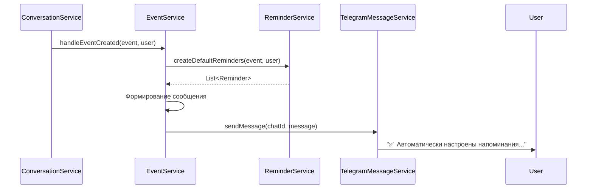
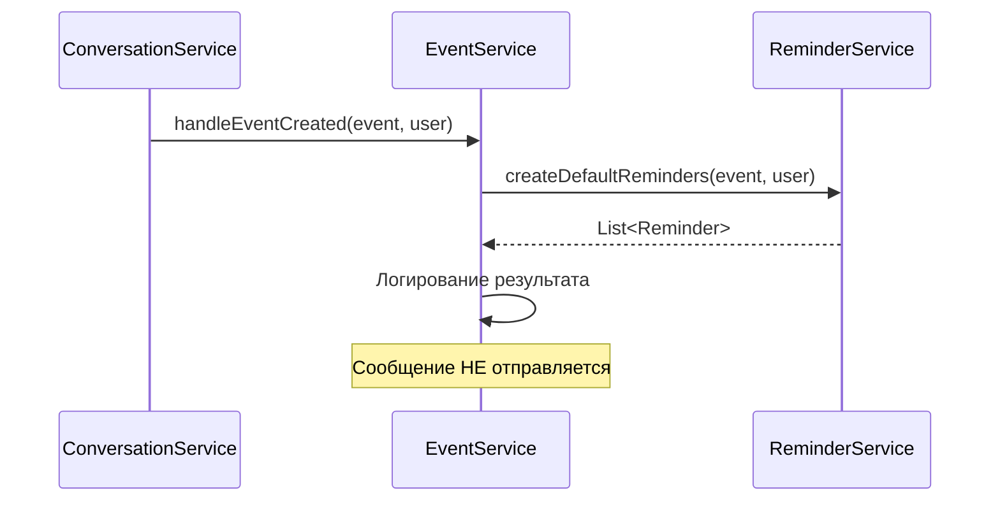

# Документ дизайна: Удаление сообщения о настройке автоматических напоминаний

## Обзор

Данное изменение упрощает пользовательский опыт, удаляя избыточное уведомление о создании автоматических напоминаний. Автоматические напоминания продолжат создаваться в фоновом режиме, но пользователь не будет получать дополнительное сообщение об этом.

Основные изменения:
- **Удаление отправки сообщений** из метода `handleEventCreated` в `EventService`
- **Сохранение логирования** для мониторинга и отладки
- **Сохранение функциональности** создания автоматических напоминаний

## Архитектура

### Текущая реализация



### Новая реализация



## Компоненты и интерфейсы

### EventService (модификация существующего)

**Текущая реализация метода `handleEventCreated`:**
```java
public void handleEventCreated(Event event, User user) {
    log.debug("Обработка создания события ID={} пользователем ID={}", event.getId(), user.getId());
    
    // Создаем автоматические напоминания
    List<Reminder> createdReminders = reminderService.createDefaultReminders(event, user);
    
    Long chatId = user.getTelegramId();
    if (chatId == null) {
        log.warn("Не удалось получить chatId для пользователя ID={}", user.getId());
        return;
    }
    
    // Формируем сообщение в зависимости от результата
    String message;
    
    if (event.getEventTime() == null) {
        message = "ℹ️ Добавьте время события для автоматических напоминаний";
        log.debug("Событие ID={} без времени, напоминания не созданы", event.getId());
    } else if (createdReminders.isEmpty()) {
        message = "ℹ️ Событие слишком скоро, автоматические напоминания не созданы";
        log.debug("Все напоминания пропущены для события ID={} (событие слишком скоро)", event.getId());
    } else {
        message = "✅ Автоматически настроены напоминания: накануне, за 1 час, за 15 минут";
        log.info("Автоматически созданы {} напоминаний для события ID={}", 
                createdReminders.size(), event.getId());
    }
    
    // Отправляем сообщение пользователю
    try {
        telegramMessageService.sendMessage(chatId, message);
        log.debug("Сообщение о напоминаниях отправлено пользователю ID={}", user.getId());
    } catch (Exception e) {
        log.error("Ошибка при отправке сообщения о напоминаниях пользователю ID={}: {}", 
                 user.getId(), e.getMessage(), e);
    }
}
```

**Новая реализация метода `handleEventCreated`:**
```java
public void handleEventCreated(Event event, User user) {
    log.debug("Обработка создания события ID={} пользователем ID={}", event.getId(), user.getId());
    
    // Создаем автоматические напоминания
    List<Reminder> createdReminders = reminderService.createDefaultReminders(event, user);
    
    // Логируем результат создания напоминаний
    if (event.getEventTime() == null) {
        log.debug("Событие ID={} без времени, напоминания не созданы", event.getId());
    } else if (createdReminders.isEmpty()) {
        log.debug("Все напоминания пропущены для события ID={} (событие слишком скоро)", event.getId());
    } else {
        log.info("Автоматически созданы {} напоминаний для события ID={}", 
                createdReminders.size(), event.getId());
    }
}
```

## Модели данных

Изменения в моделях данных не требуются.

## Correctness Properties

*A property is a characteristic or behavior that should hold true across all valid executions of a system-essentially, a formal statement about what the system should do. Properties serve as the bridge between human-readable specifications and machine-verifiable correctness guarantees.*

### Property 1: Отсутствие отправки сообщений

*Для любого* события и пользователя, при вызове метода `handleEventCreated`, система не должна вызывать метод `telegramMessageService.sendMessage()`.

**Validates: Requirements 1.1, 1.2, 1.3, 1.5**

### Property 2: Сохранение создания напоминаний

*Для любого* события с датой и временем, при вызове метода `handleEventCreated`, система должна создавать автоматические напоминания через вызов `reminderService.createDefaultReminders()`.

**Validates: Requirements 1.4**

### Property 3: Сохранение логирования

*Для любого* события, при вызове метода `handleEventCreated`, система должна логировать результат создания напоминаний (INFO для успешного создания, DEBUG для пропуска).

**Validates: Requirements 2.1, 2.2, 2.4**

## Обработка ошибок

### Удаление обработки ошибок отправки сообщений

**Текущая обработка:**
- Try-catch блок вокруг `telegramMessageService.sendMessage()`
- Логирование ошибок отправки с уровнем ERROR

**Новая обработка:**
- Try-catch блок удаляется, так как отправка сообщений больше не выполняется
- Обработка ошибок создания напоминаний остается в `ReminderService`

## Стратегия тестирования

### Unit тесты

**EventService:**
- Тест, что `handleEventCreated` НЕ вызывает `telegramMessageService.sendMessage()`
- Тест, что `handleEventCreated` вызывает `reminderService.createDefaultReminders()`
- Тест логирования для события с временем и созданными напоминаниями
- Тест логирования для события без времени
- Тест логирования для события с пропущенными напоминаниями

### Property-based тесты

Будут использоваться для проверки correctness properties с использованием библиотеки **jqwik** для Java.

**Конфигурация:** Каждый property-based тест должен выполнять минимум 100 итераций.

**Property 1: Отсутствие отправки сообщений**
- Генератор: случайные события и пользователи
- Проверка: `telegramMessageService.sendMessage()` не вызывается

**Property 2: Сохранение создания напоминаний**
- Генератор: случайные события с датой и временем
- Проверка: `reminderService.createDefaultReminders()` вызывается

**Property 3: Сохранение логирования**
- Генератор: случайные события
- Проверка: логи содержат информацию о создании напоминаний

### Integration тесты

**Полный цикл создания события:**
1. Создание события через бота
2. Проверка автоматического создания напоминаний
3. Проверка отсутствия дополнительных сообщений в чате
4. Проверка наличия логов о создании напоминаний

## Обратная совместимость

Данное изменение полностью обратно совместимо:
- Автоматические напоминания продолжают создаваться
- Логирование сохраняется
- Удаляется только отправка сообщения пользователю
- Никакие API или интерфейсы не изменяются

## Влияние на пользователей

**Положительное:**
- Меньше шума в чате
- Более чистый пользовательский интерфейс
- Пользователь все равно получит напоминания в нужное время

**Отрицательное:**
- Пользователь не получает явного подтверждения о создании напоминаний
- Решение: пользователь может проверить напоминания в деталях события

## Альтернативные решения

### Альтернатива 1: Сделать сообщение опциональным через конфигурацию

**Плюсы:**
- Гибкость для разных пользователей
- Возможность включить обратно при необходимости

**Минусы:**
- Дополнительная сложность
- Необходимость управления конфигурацией

**Решение:** Не выбрано, так как требование явно указывает на полное удаление сообщения

### Альтернатива 2: Заменить на более короткое сообщение

**Плюсы:**
- Пользователь получает подтверждение
- Меньше текста в чате

**Минусы:**
- Все равно создает шум
- Не решает основную проблему

**Решение:** Не выбрано, так как требование указывает на полное удаление

## Миграция и развертывание

### Изменения в коде

**Файлы для изменения:**
- `src/main/java/ru/golubyatnikov/family/calendar/bot/service/EventService.java`

**Изменения:**
- Удаление логики формирования сообщения
- Удаление вызова `telegramMessageService.sendMessage()`
- Удаление try-catch блока для отправки сообщений
- Сохранение логирования

### Развертывание

**Шаги:**
1. Обновление кода `EventService`
2. Запуск unit тестов
3. Запуск integration тестов
4. Развертывание в production
5. Мониторинг логов для проверки создания напоминаний

**Rollback план:**
- Откат к предыдущей версии кода
- Сообщения снова начнут отправляться
- Никаких изменений в базе данных не требуется

## Мониторинг

### Ключевые метрики

**После развертывания:**
- Количество созданных автоматических напоминаний (должно остаться прежним)
- Количество отправленных сообщений (должно уменьшиться)
- Количество ошибок создания напоминаний (должно остаться прежним)

### Проверка успешности

**Критерии успеха:**
- Автоматические напоминания продолжают создаваться
- Логи содержат информацию о создании напоминаний
- Пользователи не получают дополнительные сообщения после создания события
- Никаких новых ошибок в логах
