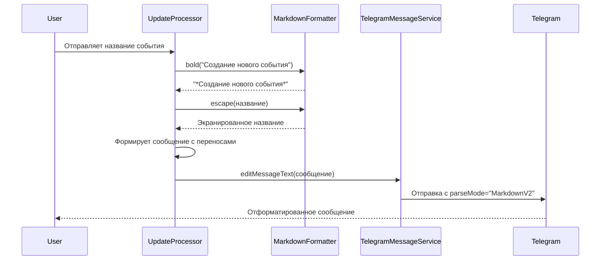

# Документ дизайна: Исправление markdown-форматирования в сообщениях Telegram бота

## Обзор

Данный документ описывает дизайн решения для исправления проблемы с отображением markdown-форматирования в сообщениях Telegram бота при создании событий. Проблема заключается в том, что текст отображается без форматирования и переносов строк, что ухудшает читаемость.

**Текущее поведение:**
```
📅 *Создание нового события*✅ Название: ЧубакаТеперь отправьте описание события или нажмите кнопку 'Пропустить':
```

**Ожидаемое поведение:**
```
📅 Создание нового события

✅ Название: Чубака

Теперь отправьте описание события или нажмите кнопку 'Пропустить':
```

### Причина проблемы

Анализ кода показал, что проблема возникает в методе `UpdateProcessor.processTextMessage()` при формировании сообщения после ввода названия события. Используется метод `formatMessage()`, который:

1. **Экранирует весь текст целиком**, включая символы форматирования (звездочки для жирного текста)
2. **Не добавляет переносы строк** между секциями сообщения
3. **Экранирует звездочки** в `*Создание нового события*`, превращая их в `\*Создание нового события\*`, что отображается как обычный текст

### Решение

Необходимо использовать метод `MarkdownFormatter.bold()` для форматирования заголовка и добавить явные переносы строк между секциями сообщения.

## Архитектура

Решение затрагивает следующие компоненты:

1. **UpdateProcessor** - основной компонент, где формируются сообщения при создании события
2. **MarkdownFormatter** - утилитный класс для форматирования текста (уже существует и работает корректно)
3. **TelegramMessageService** - сервис отправки сообщений (уже настроен на MarkdownV2)

### Диаграмма взаимодействия



## Компоненты и интерфейсы

### UpdateProcessor

**Текущая реализация (проблемная):**

```java
String response = formatMessage(
    "📅 *Создание нового события*\n\n" +
    "✅ Название: %s\n\n" +
    "Теперь отправьте описание события или нажмите кнопку 'Пропустить':",
    text
);
```

**Проблемы:**
- `formatMessage()` экранирует ВСЕ специальные символы, включая звездочки для жирного текста
- Результат: `\*Создание нового события\*` вместо жирного текста

**Новая реализация:**

```java
String response = bold("📅 Создание нового события") + "\n\n" +
    "✅ Название: " + escape(text) + "\n\n" +
    "Теперь отправьте описание события или нажмите кнопку 'Пропустить':";
```

**Преимущества:**
- `bold()` правильно форматирует заголовок: `*📅 Создание нового события*`
- `escape()` экранирует только пользовательский ввод (название события)
- Явные переносы строк `\n\n` между секциями
- Статический текст не экранируется (не содержит специальных символов)

### MarkdownFormatter

Утилитный класс уже реализован и работает корректно. Используемые методы:

**bold(String text)**
- Форматирует текст жирным шрифтом
- Автоматически экранирует специальные символы внутри текста
- Возвращает: `*текст*`

**escape(String text)**
- Экранирует специальные символы MarkdownV2
- Не экранирует эмодзи
- Используется для пользовательского ввода

**formatMessage(String template, Object... args)**
- Форматирует сообщение с параметрами
- Экранирует ВСЕ специальные символы в результате
- **НЕ подходит** для текста с форматированием

### TelegramMessageService

Сервис уже настроен корректно:
- Использует `parseMode="MarkdownV2"` для всех сообщений
- Имеет fallback механизм при ошибках парсинга
- Не требует изменений

## Модели данных

Изменения в моделях данных не требуются. Все необходимые данные уже хранятся в черновике события через `ConversationService`.

## Correctness Properties

*Свойство корректности (correctness property) - это характеристика или поведение, которое должно выполняться для всех допустимых выполнений системы. По сути, это формальное утверждение о том, что система должна делать. Свойства служат мостом между человекочитаемыми спецификациями и машинно-проверяемыми гарантиями корректности.*

### Prework анализ критериев приемки


### Property Reflection (Устранение избыточности)

После анализа всех критериев приемки выявлены следующие избыточности:

1. **Свойства 2.1, 2.2, 2.3** - все проверяют двойные переносы строк. Объединяются в одно свойство о структуре сообщения.
2. **Свойства 1.2 и 3.3** - оба проверяют, что эмодзи не экранируются. Объединяются в одно свойство.
3. **Свойства 5.1-5.4** - все проверяют одинаковый паттерн (✅ + текст). Объединяются в одно свойство.
4. **Свойства 1.3 и 3.1** - оба проверяют экранирование. Объединяются в одно общее свойство.

### Свойства корректности

**Property 1: Форматирование заголовка жирным шрифтом**

*For any* заголовок сообщения, при форматировании методом `bold()` результат должен содержать заголовок, обернутый в символы `*` (звездочки), что обеспечивает жирное отображение в MarkdownV2

**Validates: Requirements 1.1**

---

**Property 2: Экранирование специальных символов**

*For any* текст, содержащий специальные символы MarkdownV2 (_ * [ ] ( ) ~ \` > # + - = | { } . !), при экранировании методом `escape()` или `formatMessage()` каждый специальный символ должен быть предварен обратным слешем (\)

**Validates: Requirements 1.3, 3.1, 3.2**

---

**Property 3: Сохранение эмодзи без экранирования**

*For any* текст, содержащий эмодзи, при экранировании методом `escape()`, `bold()` или `formatMessage()` эмодзи должны остаться без изменений (без обратных слешей)

**Validates: Requirements 1.2, 3.3**

---

**Property 4: Структура многострочного сообщения**

*For any* сообщение, содержащее несколько секций (заголовок, элементы информации, инструкции), между секциями должны быть двойные переносы строк (\n\n), обеспечивающие визуальное разделение

**Validates: Requirements 2.1, 2.2, 2.3**

---

**Property 5: Формат отображения элементов информации**

*For any* элемент информации о событии (название, описание, дата, время), при отображении перед ним должен быть эмодзи галочки (✅), пробел, название поля с двоеточием, пробел и значение

**Validates: Requirements 5.1, 5.2, 5.3, 5.4**

---

**Property 6: Разделение элементов информации**

*For any* список элементов информации о событии, каждый элемент должен быть на отдельной строке с одинарным переносом (\n) между элементами

**Validates: Requirements 5.5**

---

## Обработка ошибок

### Fallback механизм при ошибках парсинга

`TelegramMessageService` уже реализует fallback механизм:

1. **Первая попытка**: отправка с `parseMode="MarkdownV2"`
2. **При ошибке 400 (Bad Request)**: автоматическое переключение на plain text (без parseMode)
3. **Логирование**: запись метрики `markdown_parse_error_fallback` и warning лога

Этот механизм уже работает корректно и не требует изменений.

### Обработка некорректного пользовательского ввода

Все пользовательские данные (название, описание события) должны экранироваться через `MarkdownFormatter.escape()` перед отправкой. Это предотвращает ошибки парсинга, если пользователь вводит специальные символы.

## Стратегия тестирования

### Unit тесты

**Тесты для UpdateProcessor:**

1. **testEventTitleMessageFormatting** - проверка корректного форматирования сообщения после ввода названия:
   - Заголовок должен быть жирным
   - Должны быть двойные переносы строк между секциями
   - Название события должно быть экранировано
   - Эмодзи должны отображаться корректно

2. **testEventTitleMessageWithSpecialCharacters** - проверка обработки специальных символов в названии:
   - Специальные символы должны быть экранированы
   - Форматирование должно сохраниться

3. **testEventTitleMessageWithEmoji** - проверка обработки эмодзи в названии:
   - Эмодзи не должны экранироваться
   - Форматирование должно сохраниться

**Тесты для MarkdownFormatter (уже существуют):**

Класс `MarkdownFormatter` уже имеет обширное покрытие тестами:
- `MarkdownFormatterTest` - базовые тесты экранирования
- `MarkdownFormatterExclamationTest` - тесты восклицательного знака
- `MarkdownFormatterEventFormattingTest` - тесты форматирования событий
- `MarkdownFormatterHourSelectionTest` - тесты с ведущими нулями
- `MarkdownFormatterDoubleEscapingTest` - тесты двойного экранирования

Эти тесты покрывают все основные сценарии и не требуют изменений.

### Property-based тесты

**Property Test 1: Форматирование заголовка**

*For any* строка заголовка, результат `bold(заголовок)` должен начинаться с `*` и заканчиваться `*`

**Feature: telegram-markdown-formatting-fix, Property 1: Форматирование заголовка жирным шрифтом**

```java
@Property
void boldFormattingWrapsTextInAsterisks(@ForAll String header) {
    String result = MarkdownFormatter.bold(header);
    
    if (!header.isEmpty()) {
        assertThat(result).startsWith("*");
        assertThat(result).endsWith("*");
    }
}
```

---

**Property Test 2: Экранирование специальных символов**

*For any* текст, содержащий специальные символы, результат `escape()` должен содержать `\` перед каждым специальным символом

**Feature: telegram-markdown-formatting-fix, Property 2: Экранирование специальных символов**

```java
@Property
void escapeAddsBackslashBeforeSpecialChars(@ForAll String text) {
    String result = MarkdownFormatter.escape(text);
    
    char[] specialChars = {'_', '*', '[', ']', '(', ')', '~', '`', 
                          '>', '#', '+', '-', '=', '|', '{', '}', '.', '!'};
    
    for (char special : specialChars) {
        if (text.contains(String.valueOf(special))) {
            assertThat(result).contains("\\" + special);
        }
    }
}
```

---

**Property Test 3: Сохранение эмодзи**

*For any* текст с эмодзи, результат `escape()` должен содержать эмодзи без обратных слешей перед ними

**Feature: telegram-markdown-formatting-fix, Property 3: Сохранение эмодзи без экранирования**

```java
@Property
void escapeDoesNotEscapeEmojis(@ForAll("textWithEmojis") String text) {
    String result = MarkdownFormatter.escape(text);
    
    // Эмодзи должны остаться без изменений
    String[] emojis = {"📅", "✅", "📝", "🕐", "❌"};
    for (String emoji : emojis) {
        if (text.contains(emoji)) {
            assertThat(result).contains(emoji);
            assertThat(result).doesNotContain("\\" + emoji);
        }
    }
}

@Provide
Arbitrary<String> textWithEmojis() {
    return Arbitraries.strings()
        .withCharRange('a', 'z')
        .ofMinLength(1)
        .ofMaxLength(50)
        .map(s -> s + "📅✅📝");
}
```

---

**Property Test 4: Структура сообщения**

*For any* сообщение с несколькими секциями, между секциями должны быть `\n\n`

**Feature: telegram-markdown-formatting-fix, Property 4: Структура многострочного сообщения**

```java
@Property
void messageHasDoubleNewlinesBetweenSections(@ForAll String title) {
    Assume.that(!title.isBlank());
    
    String message = MarkdownFormatter.bold("📅 Создание нового события") + "\n\n" +
        "✅ Название: " + MarkdownFormatter.escape(title) + "\n\n" +
        "Теперь отправьте описание события или нажмите кнопку 'Пропустить':";
    
    // Проверяем наличие двойных переносов
    assertThat(message).contains("\n\n");
    
    // Проверяем, что между заголовком и названием есть \n\n
    String[] parts = message.split("\n\n");
    assertThat(parts).hasSizeGreaterThanOrEqualTo(3);
}
```

---

### Integration тесты

**Тест отправки сообщения с форматированием:**

Проверка полного цикла: формирование сообщения → отправка → проверка корректности parseMode

```java
@Test
void shouldSendFormattedMessageWithMarkdownV2() throws TelegramApiException {
    // Given
    String title = "Тестовое событие!";
    String expectedMessage = "*📅 Создание нового события*\n\n" +
        "✅ Название: Тестовое событие\\!\n\n" +
        "Теперь отправьте описание события или нажмите кнопку 'Пропустить':";
    
    // When
    messageService.editMessageText(chatId, messageId, expectedMessage, keyboard);
    
    // Then
    ArgumentCaptor<EditMessageText> captor = ArgumentCaptor.forClass(EditMessageText.class);
    verify(telegramClient).execute(captor.capture());
    
    EditMessageText sentMessage = captor.getValue();
    assertThat(sentMessage.getParseMode()).isEqualTo("MarkdownV2");
    assertThat(sentMessage.getText()).isEqualTo(expectedMessage);
}
```

### Конфигурация property-based тестов

- **Минимум 100 итераций** на каждый property тест
- Использование библиотеки **jqwik** для Java
- Генерация случайных строк с различными символами
- Генерация строк с эмодзи
- Генерация строк со специальными символами MarkdownV2

## Детали реализации

### Места изменений в UpdateProcessor

**Метод: processTextMessage()**

**Секция: WAITING_FOR_TITLE**

Текущий код (строки 322-326):
```java
String response = formatMessage(
    "📅 *Создание нового события*\n\n" +
    "✅ Название: %s\n\n" +
    "Теперь отправьте описание события или нажмите кнопку 'Пропустить':",
    text
);
```

Новый код:
```java
String response = bold("📅 Создание нового события") + "\n\n" +
    "✅ Название: " + escape(text) + "\n\n" +
    "Теперь отправьте описание события или нажмите кнопку 'Пропустить':";
```

**Аналогичные изменения в fallback блоках** (строки 340-344 и 355-359)

### Импорты

Необходимо убедиться, что в UpdateProcessor импортированы статические методы:

```java
import static ru.golubyatnikov.family.calendar.bot.util.MarkdownFormatter.bold;
import static ru.golubyatnikov.family.calendar.bot.util.MarkdownFormatter.escape;
```

### Другие места с аналогичными проблемами

Необходимо проверить и исправить аналогичные паттерны во всех местах, где формируются сообщения о создании события:

1. **Сообщение после ввода описания**
2. **Сообщение после выбора даты**
3. **Сообщение после выбора времени**
4. **Финальное сообщение о создании события**

Во всех этих местах должен использоваться паттерн:
```java
bold("Заголовок") + "\n\n" + "Контент с " + escape(userInput)
```

Вместо:
```java
formatMessage("*Заголовок*\n\nКонтент с %s", userInput)
```

## Риски и ограничения

### Риски

1. **Регрессия в других местах**: Изменение паттерна форматирования может потребовать изменений в других частях кода
2. **Несовместимость с существующими сообщениями**: Старые сообщения могут отображаться некорректно

### Ограничения

1. **Telegram API**: Ограничения на длину сообщения (4096 символов)
2. **MarkdownV2**: Требует корректного экранирования всех специальных символов
3. **Эмодзи**: Некоторые эмодзи могут отображаться по-разному на разных платформах

### Митигация рисков

1. **Тщательное тестирование**: Unit, property-based и integration тесты
2. **Постепенное внедрение**: Сначала исправить одно место, затем распространить на остальные
3. **Мониторинг метрик**: Отслеживание метрики `markdown_parse_error_fallback`
