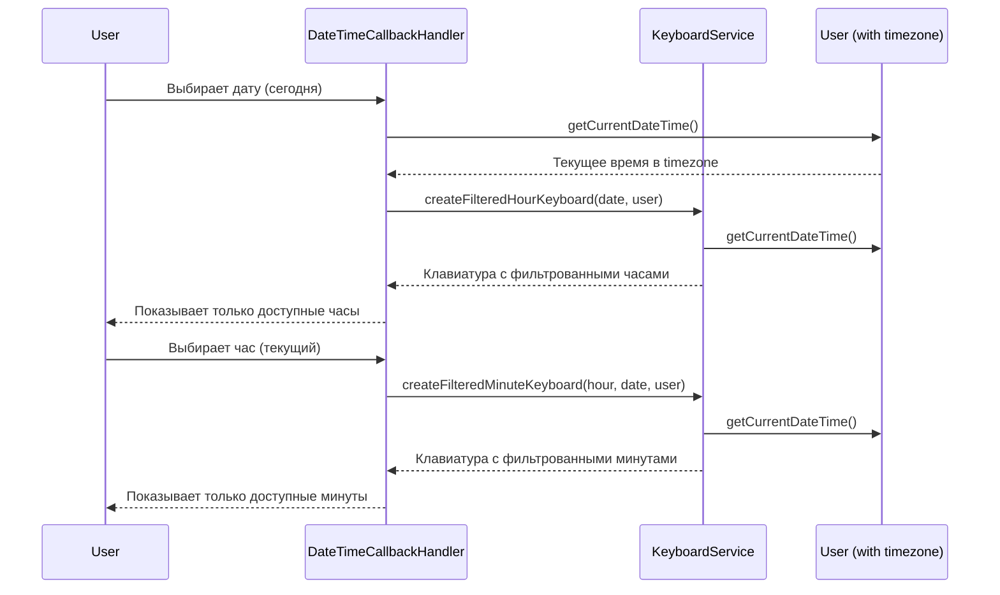

# Документ дизайна: Фильтрация прошедшего времени при выборе

## Обзор

Данная функция реализует проактивную фильтрацию прошедшего времени при выборе даты и времени для событий в Telegram-боте семейного календаря. Вместо того, чтобы позволять пользователям выбирать прошедшее время и затем показывать ошибку, система будет отображать только доступные для выбора часы и минуты, аналогично тому, как работает календарь с датами.

Основная цель - улучшить пользовательский опыт, предотвращая выбор невалидного времени на этапе отображения интерфейса, а не на этапе валидации после выбора.

## Архитектура

Функция будет реализована путем модификации существующих компонентов системы:

1. **KeyboardService** - добавление новых методов для создания фильтрованных клавиатур выбора времени
2. **DateTimeCallbackHandler** - обновление логики обработки выбора даты для передачи контекста
3. **BotMessageBuilder** - добавление новых сообщений для граничных случаев
4. **Удаление устаревшей валидации** - удаление post-selection валидации времени

### Диаграмма потока данных



## Компоненты и интерфейсы

### 1. KeyboardService

Добавляются новые методы для создания фильтрованных клавиатур:

```java
/**
 * Создает inline-клавиатуру для выбора часа с фильтрацией прошедших часов.
 * 
 * @param selectedDate выбранная дата события
 * @param user пользователь (для определения timezone)
 * @return настроенная InlineKeyboardMarkup с кнопками доступных часов
 */
public InlineKeyboardMarkup createFilteredHourSelectionKeyboard(LocalDate selectedDate, User user)

/**
 * Создает inline-клавиатуру для выбора минут с фильтрацией прошедших минут.
 * 
 * @param selectedHour выбранный час
 * @param selectedDate выбранная дата события
 * @param user пользователь (для определения timezone)
 * @return настроенная InlineKeyboardMarkup с кнопками доступных минут
 */
public InlineKeyboardMarkup createFilteredMinuteSelectionKeyboard(int selectedHour, LocalDate selectedDate, User user)

/**
 * Определяет доступные часы для выбора на основе текущего времени пользователя.
 * 
 * @param selectedDate выбранная дата
 * @param user пользователь
 * @return список доступных часов (0-23)
 */
private List<Integer> getAvailableHours(LocalDate selectedDate, User user)

/**
 * Определяет доступные минутные интервалы для выбора.
 * 
 * @param selectedHour выбранный час
 * @param selectedDate выбранная дата
 * @param user пользователь
 * @return список доступных минут (0, 15, 30, 45)
 */
private List<Integer> getAvailableMinutes(int selectedHour, LocalDate selectedDate, User user)
```


### 2. DateTimeCallbackHandler

Обновляется метод `handleDateSelection` для передачи пользователя в KeyboardService:

```java
private void handleDateSelection(String callbackData, Long userId, Long chatId, 
                                 Integer messageId, String callbackQueryId) {
    // ... существующий код ...
    
    // Получаем пользователя для timezone
    User user = userService.findById(userId)
            .orElseThrow(() -> new UserNotFoundException("Пользователь не найден: " + userId));
    
    // Показываем фильтрованный выбор часа
    InlineKeyboardMarkup keyboard = keyboardService.createFilteredHourSelectionKeyboard(date, user);
    
    // Проверяем, есть ли доступные часы
    if (keyboard.getKeyboard().size() <= 2) { // только заголовок и кнопка отмены
        String message = messageBuilder.buildTooLateForTodayMessage();
        messageService.editMessageText(chatId, messageId, message, null);
        return;
    }
    
    // ... остальной код ...
}
```

Обновляется метод `handleHourSelection` для передачи контекста:

```java
private void handleHourSelection(String callbackData, Long userId, Long chatId, 
                                 Integer messageId, String callbackQueryId) {
    // ... существующий код ...
    
    // Получаем пользователя и дату события
    User user = userService.findById(userId)
            .orElseThrow(() -> new UserNotFoundException("Пользователь не найден: " + userId));
    
    LocalDate eventDate;
    if (conversationStateService.isEditingEvent(userId)) {
        ConversationStateService.EditingContext context = conversationStateService.getEditingContext(userId);
        Event event = eventService.getEventById(context.getEventId());
        eventDate = event.getEventDate();
    } else {
        Event draft = conversationService.getActiveDraft(userId);
        eventDate = draft.getEventDate();
    }
    
    // Показываем фильтрованный выбор минут
    InlineKeyboardMarkup keyboard = keyboardService.createFilteredMinuteSelectionKeyboard(hour, eventDate, user);
    
    // Проверяем, есть ли доступные минуты
    if (keyboard.getKeyboard().size() <= 2) { // только заголовок и кнопки навигации
        String message = messageBuilder.buildSelectNextHourMessage(hour);
        messageService.editMessageText(chatId, messageId, message, 
                keyboardService.createFilteredHourSelectionKeyboard(eventDate, user));
        return;
    }
    
    // ... остальной код ...
}
```

Обновляется метод `handleTimeBack` для пересчета доступных часов:

```java
private void handleTimeBack(Long userId, Long chatId, Integer messageId, String callbackQueryId) {
    // Получаем пользователя и дату события
    User user = userService.findById(userId)
            .orElseThrow(() -> new UserNotFoundException("Пользователь не найден: " + userId));
    
    LocalDate eventDate;
    if (conversationStateService.isEditingEvent(userId)) {
        ConversationStateService.EditingContext context = conversationStateService.getEditingContext(userId);
        Event event = eventService.getEventById(context.getEventId());
        eventDate = event.getEventDate();
    } else {
        Event draft = conversationService.getActiveDraft(userId);
        eventDate = draft.getEventDate();
    }
    
    // Пересчитываем доступные часы на основе текущего времени
    InlineKeyboardMarkup keyboard = keyboardService.createFilteredHourSelectionKeyboard(eventDate, user);
    String message = messageBuilder.buildSelectHourMessage();
    
    // ... остальной код ...
}
```

### 3. BotMessageBuilder

Добавляются новые методы для сообщений:

```java
/**
 * Создает сообщение о том, что слишком поздно создавать события на сегодня.
 * 
 * @return текст сообщения
 */
public String buildTooLateForTodayMessage()

/**
 * Создает сообщение с предложением выбрать следующий час.
 * 
 * @param currentHour текущий час
 * @return текст сообщения
 */
public String buildSelectNextHourMessage(int currentHour)
```

### 4. Удаление устаревшей валидации

Из метода `handleTimeSelection` в `DateTimeCallbackHandler` удаляется блок валидации прошедшего времени:

```java
// УДАЛИТЬ ЭТО:
// НОВАЯ ВАЛИДАЦИЯ: Проверяем, что время не в прошлом для сегодняшнего дня
LocalDate today = user.getCurrentDate();
if (eventDate.equals(today)) {
    LocalTime currentTime = user.getCurrentDateTime().toLocalTime();
    if (time.isBefore(currentTime)) {
        String errorMessage = messageBuilder.buildPastTimeErrorMessage(time, currentTime);
        // ... показ ошибки ...
        return;
    }
}
```

Также удаляется метод `buildPastTimeErrorMessage` из `BotMessageBuilder`, так как он больше не нужен.

## Модели данных

Используются существующие модели данных без изменений:

- **User** - содержит timezone для определения текущего времени пользователя
- **Event** - содержит eventDate и eventTime
- **ConversationState** - содержит информацию о редактировании события

## Correctness Properties

*Свойство (property) - это характеристика или поведение, которое должно выполняться для всех валидных выполнений системы. Свойства служат мостом между человекочитаемыми спецификациями и машинно-проверяемыми гарантиями корректности.*

### Property 1: Фильтрация прошедших часов для сегодняшнего дня

*Для любого* пользователя и текущего времени, когда пользователь выбирает сегодняшнюю дату, все отображаемые часы должны быть >= текущему часу в timezone пользователя

**Validates: Requirements 1.1, 3.1**

### Property 2: Все часы доступны для будущих дат

*Для любого* пользователя и любой будущей даты (не сегодня), система должна отображать все 24 часа как доступные для выбора

**Validates: Requirements 1.4**

### Property 3: Фильтрация прошедших минут для текущего часа

*Для любого* пользователя и текущего времени, когда пользователь выбирает текущий час сегодняшнего дня, все отображаемые минутные интервалы должны быть >= текущей минуте в timezone пользователя

**Validates: Requirements 2.1, 3.2**

### Property 4: Округление минут до интервалов

*Для любого* текущего времени с минутами между интервалами (например, 17 минут), система должна отображать только те интервалы (0, 15, 30, 45), которые строго больше текущей минуты

**Validates: Requirements 2.2**

### Property 5: Все минуты доступны для будущих часов

*Для любого* пользователя, когда выбран будущий час (не текущий) или будущая дата, система должна отображать все 4 минутных интервала (00, 15, 30, 45)

**Validates: Requirements 2.4**

### Property 6: Использование timezone пользователя

*Для любых* двух пользователей с разными timezone, выбирающих "сегодня" в одно и то же абсолютное время, доступные часы и минуты должны различаться в соответствии с их локальным временем

**Validates: Requirements 1.5, 2.5**

### Property 7: Фильтрация при редактировании событий

*Для любого* существующего события, при редактировании его времени должны применяться те же правила фильтрации, что и при создании нового события

**Validates: Requirements 4.3**

### Property 8: Пересчет при возврате назад

*Для любого* пользователя, при возврате от выбора минут к выбору часов, система должна пересчитать доступные часы на основе текущего времени пользователя (которое могло измениться)

**Validates: Requirements 4.4**

## Обработка ошибок

### Граничные случаи

1. **Слишком поздно для создания событий на сегодня (23:46+)**
   - Когда: текущее время >= 23:46 и пользователь выбирает сегодня
   - Действие: показать сообщение "Слишком поздно создавать события на сегодня. Выберите завтрашний день."
   - Не показывать клавиатуру выбора часов

2. **Все минуты прошли для текущего часа (XX:46+)**
   - Когда: текущие минуты >= 46 и пользователь выбирает текущий час
   - Действие: показать сообщение "Все минуты для часа {hour} уже прошли. Выберите следующий час."
   - Вернуть пользователя к выбору часа с обновленным списком

3. **Текущий час на границе**
   - Когда: текущий час доступен, но минуты близки к концу часа
   - Действие: показать текущий час в списке, но при выборе отфильтровать минуты

### Обработка исключений

- **UserNotFoundException**: если пользователь не найден при получении timezone
- **EventNotFoundException**: если событие не найдено при редактировании
- **IllegalArgumentException**: если переданы невалидные параметры (час вне диапазона 0-23)

## Стратегия тестирования

### Dual Testing Approach

Для обеспечения корректности реализации будут использоваться два взаимодополняющих подхода:

1. **Unit тесты** - для проверки конкретных примеров, граничных случаев и обработки ошибок
2. **Property-based тесты** - для проверки универсальных свойств на большом количестве сгенерированных входных данных

### Property-Based Testing

Для property-based тестирования будет использоваться библиотека **jqwik** (уже используется в проекте).

Каждый property-based тест должен:
- Выполняться минимум 100 итераций
- Быть помечен комментарием с ссылкой на свойство из дизайна
- Формат тега: `// Feature: time-selection-past-filtering, Property {number}: {property_text}`

Пример:

```java
@Property
@Label("Feature: time-selection-past-filtering, Property 1: Фильтрация прошедших часов для сегодняшнего дня")
void filteredHoursForTodayAreAllInFuture(
    @ForAll @IntRange(min = 0, max = 23) int currentHour,
    @ForAll @IntRange(min = 0, max = 59) int currentMinute,
    @ForAll("timezones") String timezone
) {
    // Arrange
    User user = createUserWithTimezone(timezone);
    LocalDateTime currentTime = LocalDateTime.of(2026, 1, 27, currentHour, currentMinute);
    // Mock current time
    
    LocalDate today = currentTime.toLocalDate();
    
    // Act
    List<Integer> availableHours = keyboardService.getAvailableHours(today, user);
    
    // Assert
    assertThat(availableHours).allMatch(hour -> hour >= currentHour);
}
```

### Unit Testing

Unit тесты должны покрывать:

1. **Конкретные примеры**:
   - Выбор времени в 10:00 для сегодняшнего дня в 09:00
   - Выбор времени в 14:30 для завтрашнего дня
   - Выбор времени при редактировании существующего события

2. **Граничные случаи**:
   - Время 23:46 - последний возможный момент для создания события на сегодня
   - Время XX:46 - последний возможный момент для выбора минут в текущем часе
   - Время 00:00 - начало дня
   - Время 23:59 - конец дня

3. **Обработка ошибок**:
   - Пользователь не найден
   - Событие не найдено при редактировании
   - Невалидные параметры (час < 0 или > 23)

4. **Интеграционные точки**:
   - Взаимодействие DateTimeCallbackHandler с KeyboardService
   - Взаимодействие с ConversationStateService при редактировании
   - Взаимодействие с UserService для получения timezone

### Генераторы для Property-Based Testing

```java
@Provide
Arbitrary<String> timezones() {
    return Arbitraries.of(
        "Europe/Moscow",
        "America/New_York",
        "Asia/Tokyo",
        "Australia/Sydney",
        "UTC"
    );
}

@Provide
Arbitrary<LocalDate> futureDates() {
    LocalDate today = LocalDate.now();
    return Dates.dates()
        .atTheEarliest(today.plusDays(1))
        .atTheLatest(today.plusYears(1));
}
```

### Конфигурация тестов

Все property-based тесты должны быть настроены на минимум 100 итераций:

```java
@Property(tries = 100)
```

### Баланс между Unit и Property тестами

- **Property тесты** фокусируются на проверке универсальных правил для широкого диапазона входных данных
- **Unit тесты** фокусируются на конкретных сценариях, граничных случаях и интеграционных точках
- Вместе они обеспечивают комплексное покрытие: property тесты находят неожиданные баги, unit тесты проверяют известные критические сценарии
