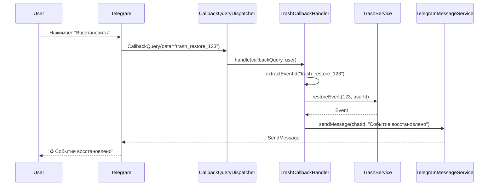
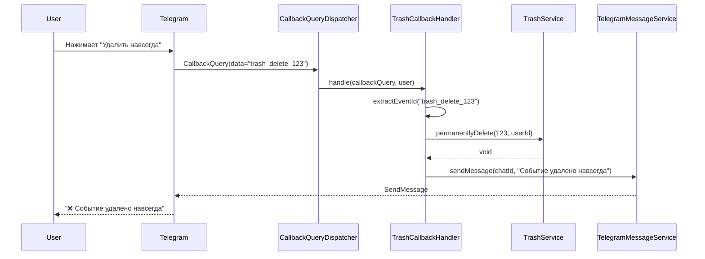
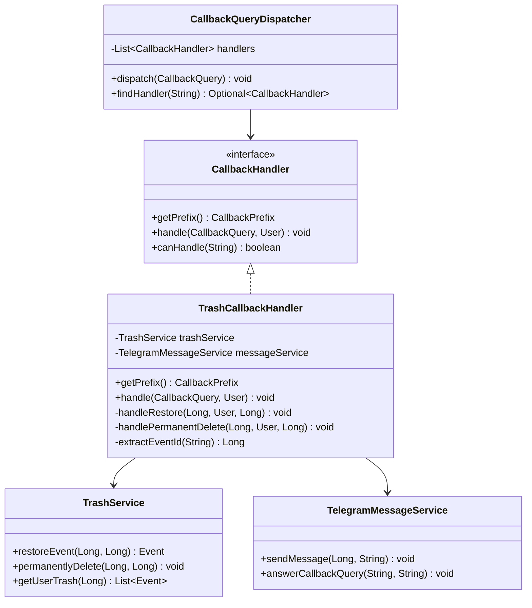

# Документ проектирования: Исправление обработки callback-запросов корзины

## Обзор

Данный документ описывает проектирование решения для исправления обработки callback-запросов от inline-кнопок корзины. Проблема заключается в том, что `TrashCommandHandler` создаёт кнопки "Восстановить" и "Удалить навсегда", но отсутствует обработчик callback-запросов, который бы маршрутизировался через `CallbackQueryDispatcher`.

Решение включает создание нового компонента `TrashCallbackHandler`, который будет реализовывать интерфейс `CallbackHandler` и обрабатывать callback-запросы с префиксом `trash_`.

## Архитектура

### Текущая архитектура

```
User → Telegram → TelegramWebhookController → UpdateProcessor
                                                    ↓
                                            CallbackQueryDispatcher
                                                    ↓
                                            [CallbackHandler implementations]
                                                    ↓
                                            TelegramMessageService → User
```

### Проблема

1. `TrashCommandHandler` реализует `CommandHandler`, а не `CallbackHandler`
2. `TrashCommandHandler` содержит метод `handleTrashCallback()`, но он никогда не вызывается
3. `CallbackQueryDispatcher` не знает о существовании обработчика для `trash_` префикса
4. При нажатии на кнопки корзины пользователь получает "Неизвестная команда"

### Решение

Создать новый компонент `TrashCallbackHandler`, который:
- Реализует интерфейс `CallbackHandler`
- Регистрируется в Spring контексте как `@Component`
- Автоматически обнаруживается `CallbackQueryDispatcher` через DI
- Обрабатывает callback-запросы с префиксом `trash_`

## Компоненты и интерфейсы

### TrashCallbackHandler

**Назначение:** Обработка callback-запросов от inline-кнопок корзины

**Зависимости:**
- `TrashService` - для выполнения операций восстановления и удаления
- `TelegramMessageService` - для отправки сообщений пользователю

**Методы:**

```java
@Component
@RequiredArgsConstructor
@Slf4j
public class TrashCallbackHandler implements CallbackHandler {
    
    private final TrashService trashService;
    private final TelegramMessageService messageService;
    
    @Override
    public CallbackPrefix getPrefix() {
        return CallbackPrefix.TRASH;
    }
    
    @Override
    @HandleCallbackErrors
    public void handle(CallbackQuery callbackQuery, User user) throws Exception {
        // Основная логика обработки
    }
    
    private void handleRestore(Long chatId, User user, Long eventId) {
        // Восстановление события
    }
    
    private void handlePermanentDelete(Long chatId, User user, Long eventId) {
        // Окончательное удаление события
    }
    
    private Long extractEventId(String callbackData) {
        // Извлечение ID события из callback data
    }
}
```

### Изменения в TrashCommandHandler

**Удалить:**
- Метод `handleTrashCallback(CallbackQuery, User)`
- Метод `handleRestore(Long, User, Long)`
- Метод `handlePermanentDelete(Long, User, Long)`

**Сохранить:**
- Метод `handle(Message, User)` - отображение списка удалённых событий
- Метод `createEventActionsKeyboard(Long)` - создание inline-кнопок
- Метод `formatEvent(Event, int)` - форматирование события

## Модели данных

### Callback Data Format

**Восстановление события:**
```
trash_restore_{eventId}
```
Пример: `trash_restore_123`

**Окончательное удаление:**
```
trash_delete_{eventId}
```
Пример: `trash_delete_123`

### Структура обработки

```
CallbackData: "trash_restore_123"
    ↓
CallbackPrefix.TRASH.matches() → true
    ↓
TrashCallbackHandler.handle()
    ↓
extractEventId() → 123
    ↓
handleRestore(chatId, user, 123)
    ↓
TrashService.restoreEvent(123, userId)
    ↓
TelegramMessageService.sendMessage()
```

## Свойства корректности

*Свойство - это характеристика или поведение, которое должно выполняться во всех допустимых выполнениях системы - по сути, формальное утверждение о том, что система должна делать. Свойства служат мостом между человекочитаемыми спецификациями и машинно-проверяемыми гарантиями корректности.*


### Property 1: Восстановление события из корзины

*For any* удалённое событие в корзине, когда пользователь нажимает кнопку "Восстановить", событие должно быть восстановлено и пользователь должен получить подтверждающее сообщение.

**Validates: Requirements 1.1**

### Property 2: Окончательное удаление события

*For any* удалённое событие в корзине, когда пользователь нажимает кнопку "Удалить навсегда", событие должно быть окончательно удалено из системы и пользователь должен получить подтверждающее сообщение.

**Validates: Requirements 1.2**

### Property 3: Обработка ошибок при невалидных данных

*For any* невалидный callback data (например, несуществующий eventId), система должна отправить пользователю сообщение об ошибке вместо падения.

**Validates: Requirements 1.3**

### Property 4: Маршрутизация callback-запросов

*For any* callback data с префиксом "trash_", CallbackQueryDispatcher должен найти и вернуть TrashCallbackHandler.

**Validates: Requirements 1.4, 2.3**

### Property 5: Формат callback data для кнопок корзины

*For any* событие в корзине, TrashCommandHandler должен создавать кнопки с callback data в формате "trash_restore_{eventId}" и "trash_delete_{eventId}".

**Validates: Requirements 3.4**

## Обработка ошибок

### Типы ошибок

1. **EventNotFoundException** - событие не найдено
   - Возникает при попытке восстановить/удалить несуществующее событие
   - Обработка: отправка сообщения "❌ Событие не найдено"

2. **UnauthorizedAccessException** - попытка доступа к чужому событию
   - Возникает при попытке восстановить/удалить событие другого пользователя
   - Обработка: отправка сообщения "❌ У вас нет доступа к этому событию"

3. **NumberFormatException** - некорректный формат eventId
   - Возникает при парсинге eventId из callback data
   - Обработка: отправка сообщения "❌ Ошибка обработки запроса"

4. **TelegramApiException** - ошибка Telegram API
   - Возникает при отправке сообщений
   - Обработка: логирование ошибки, повторная попытка или уведомление пользователя

### Стратегия обработки

```java
@HandleCallbackErrors
public void handle(CallbackQuery callbackQuery, User user) throws Exception {
    try {
        // Основная логика
    } catch (EventNotFoundException e) {
        messageService.sendMessage(chatId, "❌ Событие не найдено");
    } catch (UnauthorizedAccessException e) {
        messageService.sendMessage(chatId, "❌ У вас нет доступа к этому событию");
    } catch (NumberFormatException e) {
        log.error("Ошибка парсинга eventId: {}", callbackData, e);
        messageService.sendMessage(chatId, "❌ Ошибка обработки запроса");
    }
}
```

Аннотация `@HandleCallbackErrors` обеспечивает централизованную обработку ошибок через AOP аспект `CallbackErrorHandlingAspect`.

## Стратегия тестирования

### Dual Testing Approach

Для обеспечения корректности используется комбинация unit-тестов и property-based тестов:

**Unit-тесты:**
- Проверка конкретных примеров восстановления и удаления
- Проверка обработки ошибок с конкретными исключениями
- Проверка интеграции с TrashService и TelegramMessageService
- Проверка формата callback data

**Property-based тесты:**
- Проверка универсальных свойств для всех событий
- Проверка корректности маршрутизации для всех callback с префиксом "trash_"
- Проверка обработки ошибок для всех типов невалидных данных
- Минимум 100 итераций на каждый property-тест

### Property-Based Testing Configuration

**Библиотека:** jqwik (уже используется в проекте)

**Конфигурация тестов:**
```java
@Property(tries = 100)
@Label("Feature: trash-callback-handler-fix, Property 1: Восстановление события из корзины")
void restoreEventProperty(@ForAll Event deletedEvent) {
    // Тест свойства
}
```

**Генераторы данных:**
- Генератор случайных удалённых событий
- Генератор случайных пользователей
- Генератор валидных и невалидных callback data

### Тестовое покрытие

**Обязательные тесты:**
1. Unit-тест: восстановление события
2. Unit-тест: окончательное удаление события
3. Unit-тест: обработка EventNotFoundException
4. Unit-тест: обработка UnauthorizedAccessException
5. Unit-тест: обработка NumberFormatException
6. Unit-тест: проверка использования TrashService
7. Unit-тест: проверка CallbackPrefix.TRASH
8. Property-тест: восстановление для всех событий
9. Property-тест: удаление для всех событий
10. Property-тест: обработка ошибок для всех невалидных данных
11. Property-тест: маршрутизация для всех callback с префиксом "trash_"
12. Property-тест: формат callback data для всех событий

## Диаграммы

### Sequence Diagram: Восстановление события



### Sequence Diagram: Окончательное удаление



### Class Diagram



## Примечания по реализации

### Извлечение eventId

```java
private Long extractEventId(String callbackData) {
    // Определяем префикс
    String prefix;
    if (callbackData.startsWith("trash_restore_")) {
        prefix = "trash_restore_";
    } else if (callbackData.startsWith("trash_delete_")) {
        prefix = "trash_delete_";
    } else {
        throw new IllegalArgumentException("Unknown callback data format: " + callbackData);
    }
    
    // Извлекаем eventId
    String eventIdStr = callbackData.substring(prefix.length());
    return Long.parseLong(eventIdStr);
}
```

### Логирование

Все операции должны логироваться:
- DEBUG: начало обработки callback
- INFO: успешное выполнение операции
- ERROR: ошибки с полным stack trace

```java
log.debug("Обработка callback корзины: data='{}', userId={}", callbackData, user.getId());
log.info("Событие ID={} восстановлено пользователем ID={}", eventId, user.getId());
log.error("Ошибка при восстановлении события ID={}: {}", eventId, e.getMessage(), e);
```

### Форматирование сообщений

Использовать `MarkdownFormatter` для экранирования специальных символов:

```java
String message = MarkdownFormatter.escape("♻️ ") + 
                MarkdownFormatter.bold("Событие восстановлено") + 
                MarkdownFormatter.escape("\n\n") +
                MarkdownFormatter.bold(event.getTitle());
```
