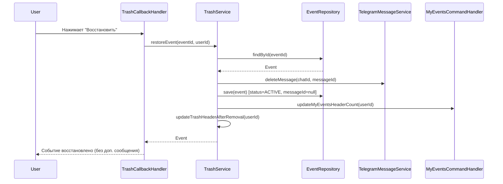

# Документ проектирования: Управление сообщениями в корзине

## Overview

Данный документ описывает проектирование механики управления сообщениями в корзине `/trash`, аналогичной механике команды `/my_events`. Основная цель - обеспечить единообразный пользовательский опыт при работе с событиями в корзине и активными событиями.

Ключевые изменения:
- Добавление поля `isTrashHeader` в модель Event
- Сохранение `messageId` для событий в корзине
- Удаление сообщений при восстановлении/удалении событий
- Автоматическое обновление шапки корзины
- Отображение сообщения о пустой корзине

## Architecture

### Компоненты системы

1. **TrashCommandHandler** - обработчик команды `/trash`
   - Отображает события из корзины
   - Отправляет первое событие с шапкой в одном сообщении
   - Сохраняет messageId для каждого события

2. **TrashCallbackHandler** - обработчик callback-запросов корзины
   - Обрабатывает восстановление событий
   - Обрабатывает окончательное удаление событий
   - Удаляет сообщения событий
   - Обновляет шапку корзины

3. **TrashService** - бизнес-логика работы с корзиной
   - Управление флагом `isTrashHeader`
   - Обновление счетчика в шапке
   - Отправка сообщения о пустой корзине

4. **Event (модель)** - расширение модели события
   - Добавление поля `isTrashHeader`
   - Миграция базы данных

5. **TelegramMessageService** - сервис работы с Telegram API
   - Удаление сообщений
   - Редактирование сообщений
   - Отправка сообщений

### Диаграмма взаимодействия



## Components and Interfaces

### 1. Event Model Extension

```java
@Entity
@Table(name = "events")
public class Event {
    // ... существующие поля ...
    
    /**
     * Флаг, указывающий, что сообщение этого события содержит шапку корзины.
     * 
     * <p>Используется для корректного обновления первого события в корзине,
     * чтобы при редактировании сохранялась шапка с заголовком "🗑️ Корзина" и 
     * информацией о количестве событий в корзине.</p>
     * 
     * <p>Значение true устанавливается для первого события в корзине
     * при отображении списка через команду /trash. При удалении или восстановлении
     * первого события флаг автоматически передается следующему событию.</p>
     * 
     * <p>По умолчанию false - событие не является первым в корзине и не должно
     * содержать шапку при обновлении.</p>
     */
    @Column(name = "is_trash_header")
    @Builder.Default
    private Boolean isTrashHeader = false;
}
```

### 2. TrashCommandHandler Updates

```java
@Component
@RequiredArgsConstructor
@Slf4j
public class TrashCommandHandler implements CommandHandler {
    
    private final TrashService trashService;
    private final TelegramMessageService messageService;
    private final KeyboardService keyboardService;
    private final BotMessageBuilder botMessageBuilder;
    
    @Override
    public String handle(Message message, User user) {
        Long chatId = message.getChatId();
        List<Event> trashedEvents = trashService.getUserTrash(user.getId());
        
        if (trashedEvents.isEmpty()) {
            return buildEmptyTrashMessage();
        }
        
        // Управление флагами isTrashHeader
        Event firstEvent = trashedEvents.get(0);
        if (!Boolean.TRUE.equals(firstEvent.getIsTrashHeader())) {
            firstEvent.setIsTrashHeader(true);
            trashService.saveEvent(firstEvent);
        }
        
        // Сбрасываем флаг для остальных событий
        for (int i = 1; i < trashedEvents.size(); i++) {
            Event event = trashedEvents.get(i);
            if (Boolean.TRUE.equals(event.getIsTrashHeader())) {
                event.setIsTrashHeader(false);
                trashService.saveEvent(event);
            }
        }
        
        // Формируем шапку
        String header = botMessageBuilder.buildTrashHeader(trashedEvents.size());
        
        // Отправляем первое событие с шапкой
        String firstEventText = botMessageBuilder.buildEventMessage(firstEvent);
        String combinedMessage = header + "\n" + firstEventText;
        InlineKeyboardMarkup keyboard = keyboardService.createTrashActionsKeyboard(firstEvent.getId());
        
        Message sentMessage = messageService.sendMessageAndGet(chatId, combinedMessage, keyboard);
        firstEvent.setMessageId((long) sentMessage.getMessageId());
        trashService.saveEvent(firstEvent);
        
        // Отправляем остальные события
        for (int i = 1; i < trashedEvents.size(); i++) {
            Event event = trashedEvents.get(i);
            String eventText = botMessageBuilder.buildEventMessage(event);
            InlineKeyboardMarkup eventKeyboard = keyboardService.createTrashActionsKeyboard(event.getId());
            
            Message eventMessage = messageService.sendMessageAndGet(chatId, eventText, eventKeyboard);
            event.setMessageId((long) eventMessage.getMessageId());
            trashService.saveEvent(event);
        }
        
        return null;
    }
    
    private String buildEmptyTrashMessage() {
        StringBuilder message = new StringBuilder();
        message.append("🗑️ ").append(bold("Корзина")).append("\n\n");
        message.append(escape("Корзина пуста.\n\n"));
        message.append(italic("Удаленные события хранятся здесь 30 дней, после чего автоматически удаляются навсегда."));
        return message.toString();
    }
}
```

### 3. TrashCallbackHandler Updates

```java
@Component
@RequiredArgsConstructor
@Slf4j
public class TrashCallbackHandler implements CallbackHandler {
    
    private final TrashService trashService;
    private final TelegramMessageService messageService;
    
    private void handleRestore(Long chatId, User user, Long eventId) {
        try {
            // Восстанавливаем событие (внутри удаляется сообщение)
            Event restoredEvent = trashService.restoreEvent(eventId, user.getId());
            
            // НЕ отправляем дополнительное сообщение о восстановлении
            
        } catch (EventNotFoundException e) {
            // Обработка ошибок без отправки сообщений
            log.error("Событие не найдено: eventId={}", eventId, e);
        }
    }
    
    private void handlePermanentDelete(Long chatId, User user, Long eventId) {
        try {
            // Удаляем событие навсегда (внутри удаляется сообщение)
            trashService.permanentlyDelete(eventId, user.getId());
            
            // НЕ отправляем дополнительное сообщение об удалении
            
        } catch (EventNotFoundException e) {
            // Обработка ошибок без отправки сообщений
            log.error("Событие не найдено: eventId={}", eventId, e);
        }
    }
}
```

### 4. TrashService Updates

```java
@Service
@RequiredArgsConstructor
@Slf4j
public class TrashService {
    
    private final EventRepository eventRepository;
    private final TelegramMessageService messageService;
    private final MyEventsCommandHandler myEventsCommandHandler;
    private final BotMessageBuilder botMessageBuilder;
    private final KeyboardService keyboardService;
    
    @Transactional
    public Event restoreEvent(Long eventId, Long userId) {
        Event event = eventRepository.findById(eventId)
            .orElseThrow(() -> new EventNotFoundException("Событие не найдено"));
        
        // Проверка прав доступа
        if (!event.belongsToUser(userId)) {
            throw new UnauthorizedAccessException("Нет прав на восстановление");
        }
        
        // Удаляем сообщение события
        if (event.getMessageId() != null) {
            Long chatId = event.getUser().getTelegramId();
            messageService.deleteMessage(chatId, event.getMessageId().intValue());
        }
        
        // Восстанавливаем событие
        event.setStatus(Event.EventStatus.ACTIVE);
        event.setDeletedAt(null);
        event.setMessageId(null);
        event.setIsMyEventsHeader(false);
        event.setIsTrashHeader(false);
        
        Event restoredEvent = eventRepository.save(event);
        
        // Обновляем шапку /my_events
        myEventsCommandHandler.updateMyEventsHeaderCount(userId);
        
        // Обновляем шапку корзины
        updateTrashHeaderAfterRemoval(userId);
        
        return restoredEvent;
    }
    
    @Transactional
    public void permanentlyDelete(Long eventId, Long userId) {
        Event event = eventRepository.findById(eventId)
            .orElseThrow(() -> new EventNotFoundException("Событие не найдено"));
        
        // Проверка прав доступа
        if (!event.belongsToUser(userId)) {
            throw new UnauthorizedAccessException("Нет прав на удаление");
        }
        
        // Удаляем сообщение события
        if (event.getMessageId() != null) {
            Long chatId = event.getUser().getTelegramId();
            messageService.deleteMessage(chatId, event.getMessageId().intValue());
        }
        
        // Удаляем событие из БД
        eventRepository.delete(event);
        
        // Обновляем шапку корзины
        updateTrashHeaderAfterRemoval(userId);
    }
    
    /**
     * Обновляет шапку корзины после удаления или восстановления события.
     * 
     * <p>Метод выполняет следующие действия:</p>
     * <ol>
     *   <li>Получает актуальный список событий в корзине</li>
     *   <li>Если корзина пуста - отправляет сообщение о пустой корзине</li>
     *   <li>Если есть события - обновляет флаг isTrashHeader и счетчик</li>
     * </ol>
     */
    @Transactional
    public void updateTrashHeaderAfterRemoval(Long userId) {
        List<Event> trashedEvents = getUserTrash(userId);
        Long chatId = eventRepository.findById(userId)
            .map(u -> u.getTelegramId())
            .orElse(null);
        
        if (chatId == null) {
            log.warn("Не удалось получить chatId для пользователя ID={}", userId);
            return;
        }
        
        if (trashedEvents.isEmpty()) {
            // Отправляем сообщение о пустой корзине
            String emptyMessage = buildEmptyTrashMessage();
            try {
                messageService.sendMessage(chatId, emptyMessage);
            } catch (Exception e) {
                log.error("Ошибка при отправке сообщения о пустой корзине", e);
            }
            return;
        }
        
        // Находим новое первое событие
        Event newFirstEvent = trashedEvents.get(0);
        
        // Устанавливаем флаг isTrashHeader
        if (!Boolean.TRUE.equals(newFirstEvent.getIsTrashHeader())) {
            newFirstEvent.setIsTrashHeader(true);
            eventRepository.save(newFirstEvent);
        }
        
        // Обновляем счетчик в шапке
        updateTrashHeaderCount(userId);
    }
    
    /**
     * Обновляет счетчик событий в шапке корзины.
     */
    public void updateTrashHeaderCount(Long userId) {
        List<Event> trashedEvents = getUserTrash(userId);
        
        if (trashedEvents.isEmpty()) {
            return;
        }
        
        // Находим событие с шапкой
        Event headerEvent = trashedEvents.stream()
            .filter(e -> Boolean.TRUE.equals(e.getIsTrashHeader()))
            .findFirst()
            .orElse(null);
        
        if (headerEvent == null || headerEvent.getMessageId() == null) {
            return;
        }
        
        // Формируем новую шапку
        String header = botMessageBuilder.buildTrashHeader(trashedEvents.size());
        String eventText = botMessageBuilder.buildEventMessage(headerEvent);
        String combinedMessage = header + "\n" + eventText;
        
        // Получаем клавиатуру
        InlineKeyboardMarkup keyboard = keyboardService.createTrashActionsKeyboard(headerEvent.getId());
        
        // Обновляем сообщение
        Long chatId = headerEvent.getUser().getTelegramId();
        messageService.tryEditMessageText(
            chatId,
            headerEvent.getMessageId().intValue(),
            combinedMessage,
            keyboard
        );
    }
    
    private String buildEmptyTrashMessage() {
        StringBuilder message = new StringBuilder();
        message.append("🗑️ ").append(bold("Корзина")).append("\n\n");
        message.append(escape("Корзина пуста.\n\n"));
        message.append(italic("Удаленные события хранятся здесь 30 дней, после чего автоматически удаляются навсегда."));
        return message.toString();
    }
}
```

### 5. BotMessageBuilder Updates

```java
@Component
public class BotMessageBuilder {
    
    /**
     * Формирует шапку для корзины с количеством событий.
     */
    public String buildTrashHeader(int eventCount) {
        StringBuilder header = new StringBuilder();
        header.append("🗑️ ").append(bold("Корзина")).append("\n\n");
        header.append(italic("Удаленные события хранятся 30 дней")).append("\n\n");
        header.append(escape("Всего событий: ")).append(bold(String.valueOf(eventCount)));
        return header.toString();
    }
}
```

## Data Models

### Database Migration

```sql
-- V15__Add_is_trash_header_to_events.sql

ALTER TABLE events 
ADD COLUMN is_trash_header BOOLEAN DEFAULT FALSE;

COMMENT ON COLUMN events.is_trash_header IS 
'Флаг, указывающий, что сообщение этого события содержит шапку корзины';

-- Создаем индекс для быстрого поиска события с шапкой корзины
CREATE INDEX idx_events_trash_header 
ON events(user_id, is_trash_header) 
WHERE status = 'DELETED' AND is_trash_header = TRUE;
```

## Correctness Properties


*A property is a characteristic or behavior that should hold true across all valid executions of a system-essentially, a formal statement about what the system should do. Properties serve as the bridge between human-readable specifications and machine-verifiable correctness guarantees.*

### Property 1: Удаление сообщения при восстановлении события
*For any* событие в корзине с сохраненным messageId, при восстановлении события система должна вызвать deleteMessage с chatId пользователя и messageId события
**Validates: Requirements 1.1, 1.3**

### Property 2: Удаление сообщения при окончательном удалении
*For any* событие в корзине с сохраненным messageId, при окончательном удалении события система должна вызвать deleteMessage с chatId пользователя и messageId события
**Validates: Requirements 1.2, 1.3**

### Property 3: Отсутствие дополнительных уведомлений
*For any* событие в корзине, после восстановления или окончательного удаления система не должна отправлять сообщения с текстом "♻️ Событие восстановлено" или "❌ Событие удалено навсегда"
**Validates: Requirements 1.4**

### Property 4: Перенос флага isTrashHeader
*For any* корзина с двумя или более событиями, где первое событие имеет isTrashHeader=true, после удаления или восстановления первого события второе событие должно получить isTrashHeader=true
**Validates: Requirements 2.1**

### Property 5: Уникальность флага isTrashHeader
*For any* пользователь и любой момент времени, в корзине этого пользователя должно быть не более одного события с isTrashHeader=true
**Validates: Requirements 2.2**

### Property 6: Обновление сообщения при установке флага
*For any* событие в корзине, при установке isTrashHeader=true система должна вызвать tryEditMessageText для обновления сообщения с добавлением шапки
**Validates: Requirements 2.3**

### Property 7: Консистентность сообщения о пустой корзине
*For any* пользователь, сообщение о пустой корзине должно быть идентичным независимо от того, вызвана ли команда /trash для пустой корзины или корзина стала пустой после удаления последнего события
**Validates: Requirements 3.1, 3.3**

### Property 8: MarkdownV2 форматирование пустой корзины
*For any* сообщение о пустой корзине, оно должно содержать корректное MarkdownV2 форматирование с экранированными специальными символами
**Validates: Requirements 3.2**

### Property 9: Объединенное сообщение для первого события
*For any* непустая корзина, первое отправленное сообщение должно содержать как шапку корзины, так и данные первого события
**Validates: Requirements 4.1**

### Property 10: Сохранение messageId для всех событий
*For any* событие в корзине, после отправки сообщения о нем система должна сохранить messageId в поле messageId события
**Validates: Requirements 4.2, 4.4**

### Property 11: Установка флага для первого события
*For any* непустая корзина, после отправки сообщений первое событие должно иметь isTrashHeader=true
**Validates: Requirements 4.3**

### Property 12: Round-trip персистентности isTrashHeader
*For any* событие с установленным isTrashHeader=true, после сохранения в базу данных и последующей загрузки значение isTrashHeader должно остаться true
**Validates: Requirements 5.3, 5.4**

### Property 13: Обновление счетчика при восстановлении
*For any* событие в корзине, после его восстановления система должна вызвать updateTrashHeaderCount для обновления счетчика в шапке
**Validates: Requirements 6.1**

### Property 14: Обновление счетчика при удалении
*For any* событие в корзине, после его окончательного удаления система должна вызвать updateTrashHeaderCount для обновления счетчика в шапке
**Validates: Requirements 6.2**

### Property 15: Использование editMessageText для обновления счетчика
*For any* обновление счетчика в шапке корзины, система должна использовать метод tryEditMessageText Telegram API
**Validates: Requirements 6.3**

### Property 16: Обработка ошибок обновления счетчика
*For any* ошибка при обновлении счетчика в шапке, система должна логировать ошибку и продолжить работу без выброса исключения
**Validates: Requirements 6.4**

## Error Handling

### 1. Ошибки Telegram API

**Сценарий:** Не удается удалить сообщение (сообщение уже удалено пользователем)
- **Обработка:** Логировать предупреждение, продолжить выполнение операции
- **Код:** `log.warn("Не удалось удалить сообщение messageId={}: {}", messageId, e.getMessage())`

**Сценарий:** Не удается обновить сообщение с шапкой
- **Обработка:** Логировать ошибку, продолжить без выброса исключения
- **Код:** `messageService.tryEditMessageText()` возвращает boolean

### 2. Ошибки доступа

**Сценарий:** Пользователь пытается восстановить/удалить чужое событие
- **Обработка:** Выбросить `UnauthorizedAccessException`
- **Сообщение:** "У вас нет доступа к этому событию"

### 3. Ошибки состояния

**Сценарий:** Попытка восстановить событие не из корзины
- **Обработка:** Выбросить `IllegalStateException`
- **Сообщение:** "Событие не находится в корзине"

### 4. Ошибки данных

**Сценарий:** Событие не найдено
- **Обработка:** Выбросить `EventNotFoundException`
- **Сообщение:** "Событие не найдено"

## Testing Strategy

### Unit Tests

1. **TrashCommandHandlerTest**
   - Тест отображения пустой корзины
   - Тест отображения корзины с одним событием
   - Тест отображения корзины с несколькими событиями
   - Тест установки флага isTrashHeader для первого события
   - Тест сохранения messageId для всех событий

2. **TrashCallbackHandlerTest**
   - Тест восстановления события
   - Тест окончательного удаления события
   - Тест обработки ошибок доступа
   - Тест обработки ошибок состояния

3. **TrashServiceTest**
   - Тест updateTrashHeaderAfterRemoval с пустой корзиной
   - Тест updateTrashHeaderAfterRemoval с одним событием
   - Тест updateTrashHeaderAfterRemoval с несколькими событиями
   - Тест updateTrashHeaderCount
   - Тест обработки ошибок Telegram API

### Property-Based Tests

Будут использоваться для проверки correctness properties, описанных выше. Используется библиотека jqwik для Java.

Каждое свойство будет протестировано с минимум 100 итерациями случайных данных.

### Integration Tests

1. **TrashMessageManagementIntegrationTest**
   - Полный цикл: создание события → удаление → восстановление
   - Полный цикл: создание события → удаление → окончательное удаление
   - Проверка обновления шапки при изменении количества событий
   - Проверка отображения пустой корзины

## Implementation Notes

### 1. Порядок операций при восстановлении

1. Удалить сообщение события из чата
2. Изменить статус события на ACTIVE
3. Сбросить messageId, isTrashHeader, isMyEventsHeader
4. Сохранить событие
5. Обновить счетчик в /my_events
6. Обновить шапку корзины

### 2. Порядок операций при окончательном удалении

1. Удалить сообщение события из чата
2. Удалить событие из базы данных
3. Обновить шапку корзины

### 3. Обновление шапки корзины

1. Получить актуальный список событий в корзине
2. Если корзина пуста - отправить сообщение о пустой корзине
3. Если есть события:
   - Найти новое первое событие
   - Установить isTrashHeader=true
   - Обновить сообщение с новым счетчиком

### 4. Fallback механизм

При ошибках форматирования MarkdownV2 использовать тот же fallback механизм, что и в MyEventsCommandHandler:
- Отправка без форматирования
- Сохранение inline-кнопок

## Dependencies

- Spring Boot 3.x
- Telegram Bots API
- JPA/Hibernate
- PostgreSQL
- jqwik (для property-based testing)
- Mockito (для unit testing)

## Migration Strategy

1. Создать миграцию базы данных для добавления поля `is_trash_header`
2. Обновить модель Event
3. Обновить TrashCommandHandler для сохранения messageId
4. Обновить TrashCallbackHandler для удаления сообщений
5. Добавить методы в TrashService для управления шапкой
6. Добавить метод в BotMessageBuilder для формирования шапки корзины
7. Написать тесты
8. Провести интеграционное тестирование

## Performance Considerations

1. **Индексы базы данных**
   - Создать индекс на `(user_id, is_trash_header)` для быстрого поиска события с шапкой
   - Использовать существующий индекс `idx_events_user_status` для получения списка событий в корзине

2. **Кэширование**
   - Не требуется, так как операции с корзиной выполняются нечасто

3. **Batch операции**
   - При обновлении флагов isTrashHeader использовать batch update для нескольких событий

## Security Considerations

1. **Проверка прав доступа**
   - Всегда проверять, что пользователь является создателем события
   - Использовать метод `event.belongsToUser(userId)`

2. **Валидация входных данных**
   - Проверять, что eventId и userId не null
   - Проверять, что событие находится в корзине перед восстановлением/удалением

3. **Защита от race conditions**
   - Использовать транзакции для атомарности операций
   - Использовать `@Transactional` аннотацию
